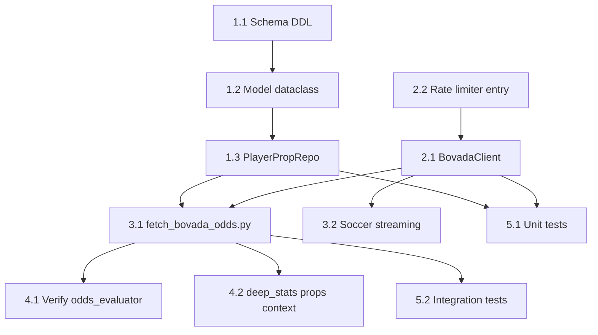

# Bovada Public Feed Integration — Implementation Plan

**Created:** 2026-05-22  
**Status:** Draft  
**Priority:** High — free, rich odds source with player props  

---

## Summary

Integrate Bovada's undocumented public JSON API (`https://www.bovada.lv/services/sports/event/v2/events/A/description/{sport}/{league}`) into the betting pipeline. All data stored DB-FIRST. Provides:

- Main market odds (ML, spread, totals) → existing `odds_history` table
- Player prop lines (points, rebounds, SOG, etc.) → new `player_prop_lines` table
- Period markets (1Q, 1H) → `odds_history` with market prefixes
- Auto-integration with odds_evaluator.py Source 0 (reads from `odds_history`)

---

## Architecture Overview

```
┌──────────────────────┐      ┌──────────────────────────┐
│ Bovada Public API    │      │ SQLite DB (betting.db)   │
│ (no auth required)   │──────│                          │
│                      │      │  odds_history            │
│ /basketball/nba      │      │  (bookmaker="bovada")    │
│ /hockey/nhl          │      │                          │
│ /tennis/atp          │      │  player_prop_lines  NEW  │
│ /soccer (42MB mega)  │      │  (player-level markets)  │
│ /volleyball          │      │                          │
│ /baseball/mlb        │      │  source_health           │
└──────────────────────┘      │  (tracks bovada health)  │
         │                    └──────────────────────────┘
         │                               │
         │                               ▼
         │                    ┌──────────────────────────┐
         │                    │ odds_evaluator.py        │
         │                    │ Source 0: DB read        │
         │                    │ → bovada auto-included   │
         │                    │                          │
         │                    │ deep_stats_report.py     │
         │                    │ → player prop context    │
         │                    └──────────────────────────┘
         │
    ┌────┴────────────────────────┐
    │ scripts/fetch_bovada_odds.py│
    │ • AgentOutput + --verbose   │
    │ • Writes DB via repos       │
    │ • JSON backup (optional)    │
    └─────────────────────────────┘
```

---

## Phase 1: Schema + Models + Repository (Foundation)

### Task 1.1: Add `player_prop_lines` table to schema.sql

**File:** `src/bet/db/schema.sql` (MODIFY — append)

```sql
-- =========================================================================
-- Bovada player prop lines (schema v11)
-- =========================================================================

CREATE TABLE IF NOT EXISTS player_prop_lines (
    id INTEGER PRIMARY KEY AUTOINCREMENT,
    fixture_id INTEGER NOT NULL REFERENCES fixtures(id) ON DELETE CASCADE,
    athlete_name TEXT NOT NULL,
    team_name TEXT,
    athlete_id INTEGER REFERENCES athletes(id) ON DELETE SET NULL,
    sport TEXT NOT NULL,
    market_type TEXT NOT NULL,  -- points, rebounds, assists, sog, goals, strikeouts, hits, etc.
    line REAL NOT NULL,         -- e.g. 26.5
    over_odds REAL,            -- decimal format
    under_odds REAL,           -- decimal format
    bookmaker TEXT NOT NULL DEFAULT 'bovada',
    period TEXT DEFAULT 'full', -- full, 1q, 2q, 1h, 2h, 1p, 2p, 3p
    is_live INTEGER NOT NULL DEFAULT 0,
    fetched_at TEXT NOT NULL,
    UNIQUE(fixture_id, athlete_name, market_type, line, period, bookmaker)
);

CREATE INDEX IF NOT EXISTS idx_player_props_fixture ON player_prop_lines(fixture_id);
CREATE INDEX IF NOT EXISTS idx_player_props_athlete ON player_prop_lines(athlete_name);
CREATE INDEX IF NOT EXISTS idx_player_props_sport ON player_prop_lines(sport);
CREATE INDEX IF NOT EXISTS idx_player_props_market ON player_prop_lines(market_type);
CREATE INDEX IF NOT EXISTS idx_player_props_fetched ON player_prop_lines(fetched_at);
```

**Definition of Done:**
- [ ] Table created successfully via `get_db()` connection
- [ ] Unique constraint prevents duplicate prop line inserts
- [ ] Foreign key to `fixtures` enforced
- [ ] Optional `athlete_id` link for resolved players

---

### Task 1.2: Add `PlayerPropLine` dataclass to models.py

**File:** `src/bet/db/models.py` (MODIFY — append)

```python
@dataclass
class PlayerPropLine:
    id: int | None
    fixture_id: int
    athlete_name: str
    team_name: str | None
    athlete_id: int | None
    sport: str
    market_type: str
    line: float
    over_odds: float | None = None
    under_odds: float | None = None
    bookmaker: str = "bovada"
    period: str = "full"
    is_live: bool = False
    fetched_at: str = ""
```

**Definition of Done:**
- [ ] Dataclass importable from `bet.db.models`
- [ ] All fields match schema columns
- [ ] Default values align with schema defaults

---

### Task 1.3: Add `PlayerPropRepo` to repositories.py

**File:** `src/bet/db/repositories.py` (MODIFY — append new class)

```python
class PlayerPropRepo:
    def __init__(self, conn: sqlite3.Connection):
        self.conn = conn

    def save(self, record: PlayerPropLine) -> None:
        """Insert or ignore player prop line (dedup via unique index)."""
        self.conn.execute(
            "INSERT OR IGNORE INTO player_prop_lines "
            "(fixture_id, athlete_name, team_name, athlete_id, sport, market_type, "
            "line, over_odds, under_odds, bookmaker, period, is_live, fetched_at) "
            "VALUES (?, ?, ?, ?, ?, ?, ?, ?, ?, ?, ?, ?, ?)",
            (
                record.fixture_id, record.athlete_name, record.team_name,
                record.athlete_id, record.sport, record.market_type,
                record.line, record.over_odds, record.under_odds,
                record.bookmaker, record.period, 1 if record.is_live else 0,
                record.fetched_at or _now(),
            ),
        )

    def save_batch(self, records: list[PlayerPropLine]) -> int:
        """Batch insert, returns count of inserted rows."""
        inserted = 0
        for r in records:
            cur = self.conn.execute(
                "INSERT OR IGNORE INTO player_prop_lines "
                "(fixture_id, athlete_name, team_name, athlete_id, sport, market_type, "
                "line, over_odds, under_odds, bookmaker, period, is_live, fetched_at) "
                "VALUES (?, ?, ?, ?, ?, ?, ?, ?, ?, ?, ?, ?, ?)",
                (
                    r.fixture_id, r.athlete_name, r.team_name,
                    r.athlete_id, r.sport, r.market_type,
                    r.line, r.over_odds, r.under_odds,
                    r.bookmaker, r.period, 1 if r.is_live else 0,
                    r.fetched_at or _now(),
                ),
            )
            inserted += cur.rowcount
        return inserted

    def get_for_fixture(self, fixture_id: int) -> list[PlayerPropLine]:
        """All prop lines for a fixture."""
        rows = self.conn.execute(
            "SELECT * FROM player_prop_lines WHERE fixture_id = ? ORDER BY market_type, athlete_name",
            (fixture_id,),
        ).fetchall()
        return [self._row_to_model(r) for r in rows]

    def get_for_athlete(self, athlete_name: str, sport: str) -> list[PlayerPropLine]:
        """All recent prop lines for a player (case-insensitive name match)."""
        rows = self.conn.execute(
            "SELECT * FROM player_prop_lines WHERE LOWER(athlete_name) = LOWER(?) AND sport = ? "
            "ORDER BY fetched_at DESC LIMIT 50",
            (athlete_name, sport),
        ).fetchall()
        return [self._row_to_model(r) for r in rows]

    def get_for_date(self, date: str) -> dict[int, list[PlayerPropLine]]:
        """All props for fixtures on a date, keyed by fixture_id."""
        rows = self.conn.execute(
            "SELECT pp.* FROM player_prop_lines pp "
            "JOIN fixtures f ON pp.fixture_id = f.id "
            "WHERE f.kickoff LIKE ? ORDER BY pp.fixture_id, pp.market_type",
            (f"{date}%",),
        ).fetchall()
        result: dict[int, list[PlayerPropLine]] = {}
        for r in rows:
            rec = self._row_to_model(r)
            result.setdefault(rec.fixture_id, []).append(rec)
        return result

    @staticmethod
    def _row_to_model(row: sqlite3.Row) -> PlayerPropLine:
        return PlayerPropLine(
            id=row["id"],
            fixture_id=row["fixture_id"],
            athlete_name=row["athlete_name"],
            team_name=row["team_name"],
            athlete_id=row["athlete_id"],
            sport=row["sport"],
            market_type=row["market_type"],
            line=row["line"],
            over_odds=row["over_odds"],
            under_odds=row["under_odds"],
            bookmaker=row["bookmaker"],
            period=row["period"] or "full",
            is_live=bool(row["is_live"]),
            fetched_at=row["fetched_at"] or "",
        )
```

**Definition of Done:**
- [ ] `PlayerPropRepo` importable from `bet.db.repositories`
- [ ] `save()` deduplicates via INSERT OR IGNORE
- [ ] `save_batch()` returns accurate inserted count
- [ ] `get_for_fixture()` returns typed `PlayerPropLine` list
- [ ] `PlayerPropLine` import added to repositories.py header

---

## Phase 2: BovadaClient API Client

### Task 2.1: Create `BovadaClient`

**File:** `src/bet/api_clients/bovada.py` (CREATE)

```python
"""Bovada public feed client — no authentication required.

Endpoint: https://www.bovada.lv/services/sports/event/v2/events/A/description/{sport}/{league}
Returns: JSON with events, displayGroups (market categories), markets, outcomes with odds.

NOT extending BaseAPIClient (no API key needed), but uses RateLimiter for politeness.
"""
```

**Key Design Decisions:**

| Decision | Choice | Rationale |
|----------|--------|-----------|
| Inheritance | Standalone class (no BaseAPIClient) | No API key, no auth headers, simpler |
| Rate limiting | RateLimiter("bovada", daily_limit=500) | Conservative — 11 endpoints, ~6 min full scan |
| Retry | 3 retries, exponential backoff (1s, 2s, 4s) | Match BaseAPIClient pattern |
| Timeout | 30s normal, 120s soccer mega-endpoint | Soccer is 42MB |
| User-Agent | Rotate between 3 common browser UAs | Reduce detection risk |
| Odds format | American → Decimal conversion inline | Pipeline uses decimal everywhere |
| Response parsing | Standard `requests.json()` for all except soccer | Soccer needs streaming |
| Health tracking | `_record_source_health("bovada", success)` | Integrate with source_health table |

**Sport/League Endpoint Map:**

```python
BOVADA_ENDPOINTS = {
    "basketball": [
        ("nba", "/basketball/nba"),
        ("wnba", "/basketball/wnba"),
        ("ncaab", "/basketball/college-basketball"),
    ],
    "hockey": [
        ("nhl", "/hockey/nhl"),
    ],
    "tennis": [
        ("atp", "/tennis/atp"),
        ("wta", "/tennis/wta"),
    ],
    "football": [
        # Soccer mega-endpoint — requires streaming parser
        ("all", "/soccer"),
    ],
    "volleyball": [
        ("all", "/volleyball"),
    ],
    "baseball": [
        ("mlb", "/baseball/mlb"),
    ],
}
```

**Public Methods:**

```python
class BovadaClient:
    def __init__(self, rate_limiter: RateLimiter):
        ...

    def get_events(self, sport: str) -> list[dict]:
        """Fetch all events for a sport. Returns raw parsed JSON groups."""
        ...

    def get_main_odds(self, sport: str) -> list[dict]:
        """Extract main market odds (ML, spread, totals) from events.
        Returns list of dicts ready for OddsRecord conversion."""
        ...

    def get_player_props(self, sport: str) -> list[dict]:
        """Extract player prop lines from events.
        Returns list of dicts ready for PlayerPropLine conversion."""
        ...

    def stream_soccer(self, competition_filter: set[str] | None = None) -> list[dict]:
        """Stream-parse the 42MB soccer endpoint.
        Filters to configured competitions only."""
        ...
```

**American → Decimal Conversion:**

```python
@staticmethod
def _american_to_decimal(american: str | int) -> float:
    """Convert American odds to decimal.
    +150 → 2.50, -110 → 1.909, EVEN → 2.00
    """
    if isinstance(american, str):
        if american.upper() == "EVEN":
            return 2.0
        american = int(american)
    if american > 0:
        return 1 + american / 100
    else:
        return 1 + 100 / abs(american)
```

**Definition of Done:**
- [ ] `BovadaClient` importable from `bet.api_clients.bovada`
- [ ] `get_events("basketball")` returns parsed JSON for all basketball endpoints
- [ ] `get_main_odds("hockey")` returns list with keys: `event_description`, `home`, `away`, `market`, `selection`, `odds_decimal`, `line`
- [ ] `get_player_props("basketball")` returns list with keys: `athlete_name`, `team`, `market_type`, `line`, `over_odds`, `under_odds`
- [ ] American→Decimal conversion tested: +150→2.50, -110→1.909, -200→1.50, +100→2.00
- [ ] Rate limiter enforced (max 1 req/30s = `RateLimiter("bovada", daily_limit=500)`)
- [ ] Source health recorded on success/failure
- [ ] 3 retry attempts with exponential backoff
- [ ] Geo-blocking handled gracefully (returns empty list + warning, not crash)

---

### Task 2.2: Add bovada to rate_limiter.py

**File:** `src/bet/api_clients/rate_limiter.py` (MODIFY)

Add to `API_DAILY_LIMITS`:
```python
"bovada": 500,  # Public API, no documented limit — conservative cap
```

**Definition of Done:**
- [ ] `RateLimiter("bovada")` respects 500 req/day limit
- [ ] Daily counter resets at midnight

---

## Phase 3: Fetch Script

### Task 3.1: Create `scripts/fetch_bovada_odds.py`

**File:** `scripts/fetch_bovada_odds.py` (CREATE)

**Pattern:** Follows `scripts/fetch_odds_api.py` — same structure, same output conventions.

```
Usage:
    python3 scripts/fetch_bovada_odds.py                          # fetch all sports
    python3 scripts/fetch_bovada_odds.py --sports basketball,hockey  # specific sports
    python3 scripts/fetch_bovada_odds.py --props-only             # only player props
    python3 scripts/fetch_bovada_odds.py --verbose                # agent-friendly output
```

**Script Flow:**

1. Parse args (`--sports`, `--props-only`, `--verbose`, `--date`)
2. Initialize `AgentOutput("bovada_odds")`
3. Initialize `BovadaClient(RateLimiter("bovada"))`
4. For each configured sport:
   a. Fetch events via `client.get_events(sport)`
   b. Match events to DB fixtures (fuzzy team name matching)
   c. Extract main odds → write to `odds_history` via `OddsRepo.save()`
   d. Extract player props → write to `player_prop_lines` via `PlayerPropRepo.save_batch()`
   e. Report progress via `AgentOutput.progress()`
5. Output `AGENT_SUMMARY:{json}` with metrics

**Fixture Matching Strategy:**

```python
def _match_to_fixture(home: str, away: str, sport_id: int, date: str, conn) -> int | None:
    """Match Bovada event to DB fixture via team name/alias lookup.

    1. Exact match on teams.name
    2. Fuzzy match on teams.aliases (JSON array)
    3. Fallback: LIKE %normalized_name%
    Returns fixture_id or None (skip if no match — don't create phantom fixtures).
    """
```

**Key Constraint:** NEVER create fixtures from Bovada data alone. Only write odds/props for events that already exist in DB (discovered by earlier pipeline steps). Unmatched events are logged as warnings.

**Definition of Done:**
- [ ] Script runs: `python3 scripts/fetch_bovada_odds.py --verbose`
- [ ] Main odds written to `odds_history` with `bookmaker="bovada"`
- [ ] Player props written to `player_prop_lines`
- [ ] `AGENT_SUMMARY` JSON emitted with: events_fetched, events_matched, odds_written, props_written, sports_processed
- [ ] Unmatched events logged (not crashed)
- [ ] `--sports` filter works correctly
- [ ] Source health recorded in DB
- [ ] No raw `sqlite3.connect()` — uses `get_db()` only

---

### Task 3.2: Soccer Streaming Handler

**File:** Within `src/bet/api_clients/bovada.py` — `stream_soccer()` method

**Strategy:** Use `requests` with `stream=True` + `ijson` for incremental parsing.

```python
def stream_soccer(self, competition_filter: set[str] | None = None) -> list[dict]:
    """Parse 42MB soccer endpoint incrementally.

    Uses ijson to parse event objects one-at-a-time without loading
    full 42MB into memory. Filters by competition name if provided.
    """
    import ijson  # lazy import — only needed for soccer

    resp = self.session.get(url, stream=True, timeout=120)
    events = []
    for group in ijson.items(resp.raw, 'item'):
        comp_name = group.get('description', '')
        if competition_filter and comp_name not in competition_filter:
            continue
        for event in group.get('events', []):
            events.append(self._parse_event(event, sport='football'))
    return events
```

**Dependency:** `ijson` package (add to `pyproject.toml` dependencies).

**Definition of Done:**
- [ ] Soccer endpoint parsed without loading 42MB into memory
- [ ] Competition filter reduces output to configured leagues only
- [ ] Memory usage stays under 200MB during parsing
- [ ] TTL cache: skip re-fetch if last fetch < 1 hour ago

---

## Phase 4: Odds Evaluator Integration

### Task 4.1: Verify auto-integration via Source 0

**File:** `scripts/odds_evaluator.py` (VERIFY — likely no changes needed)

Since `odds_evaluator.py` Source 0 reads ALL records from `odds_history` for a given date, Bovada data written with `bookmaker="bovada"` will be **automatically included** in EV calculations. The existing query:

```sql
SELECT ... FROM odds_history o
JOIN fixtures f ON o.fixture_id = f.id
WHERE date(o.fetched_at) = ?
```

...will pick up bovada records without modification.

**Verification Steps:**
1. Run `fetch_bovada_odds.py` for a date
2. Run `odds_evaluator.py` for the same date
3. Confirm bovada odds appear in the EV calculation output

**Definition of Done:**
- [ ] Bovada odds visible in odds_evaluator output without any code changes
- [ ] EV calculation correctly uses bovada decimal odds
- [ ] Bovada flagged as bookmaker in per-event odds display

---

### Task 4.2: Add player props context to deep_stats_report (future enhancement)

**File:** `scripts/deep_stats_report.py` (MODIFY — optional Phase 4 enhancement)

Add a section that reads `player_prop_lines` for each candidate fixture and includes market expectations as context:

```python
# In deep stats analysis per fixture:
props = PlayerPropRepo(conn).get_for_fixture(fixture_id)
if props:
    # Group by market_type, show lines as market expectations
    # e.g., "Bovada sets Jokic Points O/U at 26.5 (Over 1.87 / Under 1.93)"
```

This is **not required** for Phase 1-3 to be useful — odds_history integration alone provides value.

**Definition of Done:**
- [ ] Player prop lines displayed in deep stats output per candidate
- [ ] Props grouped by market_type with clear formatting
- [ ] Props serve as "market expectation" context for statistical analysis

---

## Phase 5: Tests

### Task 5.1: Unit tests for BovadaClient

**File:** `tests/test_bovada_client.py` (CREATE)

Test coverage:
- American → Decimal conversion (edge cases: EVEN, +100, -100, +250, -150)
- Event parsing (mock JSON response → structured output)
- Player prop extraction (NBA response → PlayerPropLine dicts)
- Main odds extraction (NHL response → OddsRecord dicts)
- Geo-block handling (403 → graceful empty return)
- Rate limiter integration (requests blocked after limit)

### Task 5.2: Integration tests for DB writes

**File:** `tests/test_bovada_db_integration.py` (CREATE)

Test coverage:
- `PlayerPropRepo.save()` → verify row in DB
- `PlayerPropRepo.save_batch()` → deduplication works
- `OddsRepo.save()` with bookmaker="bovada" → verify in odds_history
- Fixture matching logic → correct fixture_id resolution
- End-to-end: mock API response → DB write → DB read → correct data

**Definition of Done (both test files):**
- [ ] All tests pass with `pytest tests/test_bovada*.py`
- [ ] No external API calls (all mocked)
- [ ] In-memory SQLite for isolation (`:memory:` or tmp file)

---

## Dependency Graph



**Parallelizable tasks:**
- Phase 1 (schema/models/repo) and Task 2.2 (rate limiter entry) are independent
- Task 5.1 (unit tests) can start as soon as Phase 2 is complete
- Task 4.2 (deep_stats enrichment) is independent of Task 4.1 (verification)

---

## Risk Assessment

| Risk | Likelihood | Impact | Mitigation |
|------|-----------|--------|------------|
| **Geo-blocking** (non-US IP blocked) | Medium | High — entire integration fails | Test from VPN; fall back to writing props manually; detect 403 and skip gracefully |
| **Response format change** | Low (short-term) | Medium — parsing breaks | Pin response structure in tests; add schema validation; alert on unexpected structures |
| **Rate limiting / IP ban** | Low | High | Conservative 1 req/30s; rotate User-Agent; respect robots.txt spirit |
| **ToS violation** | Medium | Medium — could be C&D'd | Public endpoint, no auth circumvention; data used personally; no redistribution |
| **Soccer endpoint OOM** | Low | Low — only soccer affected | ijson streaming parser; memory cap; competition filter |
| **Fixture mismatch** (team names don't match DB) | High | Medium — props/odds orphaned | Fuzzy matching + alias system; log unmatched for manual review; never create phantom fixtures |
| **Stale data** (Bovada updates slowly) | Low | Low | fetched_at timestamp tracked; odds_evaluator uses latest per-bookmaker |

---

## Files Summary

| Action | Path | Phase |
|--------|------|-------|
| MODIFY | `src/bet/db/schema.sql` | 1.1 |
| MODIFY | `src/bet/db/models.py` | 1.2 |
| MODIFY | `src/bet/db/repositories.py` | 1.3 |
| CREATE | `src/bet/api_clients/bovada.py` | 2.1 |
| MODIFY | `src/bet/api_clients/rate_limiter.py` | 2.2 |
| CREATE | `scripts/fetch_bovada_odds.py` | 3.1 |
| MODIFY | `pyproject.toml` (add ijson dep) | 3.2 |
| VERIFY | `scripts/odds_evaluator.py` | 4.1 |
| MODIFY | `scripts/deep_stats_report.py` | 4.2 (optional) |
| CREATE | `tests/test_bovada_client.py` | 5.1 |
| CREATE | `tests/test_bovada_db_integration.py` | 5.2 |

---

## Implementation Notes

### Odds Format Conventions
- All odds stored in DB as **decimal** (e.g., 2.50, not +150)
- Conversion happens in BovadaClient before data reaches repos
- `odds_history.odds` = decimal; `player_prop_lines.over_odds/under_odds` = decimal

### Market Type Taxonomy (player_prop_lines.market_type)
| Sport | market_type values |
|-------|-------------------|
| Basketball | `points`, `rebounds`, `assists`, `threes`, `blocks`, `steals`, `pra`, `pr`, `pa`, `ra` |
| Hockey | `sog` (shots on goal), `goals`, `assists`, `points`, `blocks` |
| Tennis | `games`, `aces`, `sets` |
| Baseball | `strikeouts`, `hits`, `hr`, `rbi`, `runs`, `bases` |
| Football | `goals`, `sog`, `assists` |

### Market Names for odds_history.market
| Bovada displayGroup | maps to `odds_history.market` |
|--------------------|-------------------------------|
| Game Lines / Moneyline | `h2h` |
| Point Spread / Run Line | `spread` |
| Total (O/U) | `totals` |
| 1st Quarter Total | `totals_1q` |
| 1st Half Total | `totals_1h` |
| 1st Period ML | `h2h_1p` |

### Pipeline Integration Point
```
discover_events.py → fixtures exist in DB
    ↓
fetch_bovada_odds.py → writes odds for EXISTING fixtures only
    ↓
odds_evaluator.py → reads odds_history (bovada included automatically)
    ↓
deep_stats_report.py → reads player_prop_lines for context
```

`fetch_bovada_odds.py` should run AFTER `discover_events.py` (needs fixtures to match against) and BEFORE `odds_evaluator.py` / `deep_stats_report.py` (they consume the data).

Suggested pipeline position: **between S1 (scan/discover) and S3 (deep stats)**, alongside `fetch_odds_api.py`.
