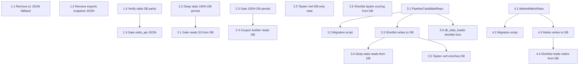

# DB-First Pipeline Migration Plan

## Executive Summary

Migrate the betting pipeline from JSON-file-based inter-step data transport to DB-first architecture. Currently, 3 JSON files have no DB equivalent (market matrix, shortlist, tipster enrichment), 6 JSON files have DB tables but scripts still read from JSON, and 1 has no downstream consumers.

**Goal:** Every pipeline script reads from DB as canonical source. JSON files become optional debug/human-review dumps — generated but never required.

**Approach:** 4 phases, each leaving the pipeline fully functional. Total: ~18 tasks across 4 phases.

---

## New DB Schema

### Table: `pipeline_candidates`

Central table replacing `{date}_s2_shortlist.json`. Stores scored, ranked candidates produced by `build_shortlist.py` and consumed by `deep_stats_report.py` and `tipster_xref.py`.

```sql
CREATE TABLE pipeline_candidates (
    id INTEGER PRIMARY KEY AUTOINCREMENT,
    fixture_id INTEGER NOT NULL REFERENCES fixtures(id),
    betting_date TEXT NOT NULL,
    rank INTEGER NOT NULL,
    score REAL NOT NULL DEFAULT 0.0,
    sport TEXT NOT NULL,
    competition TEXT,
    home_team TEXT NOT NULL,
    away_team TEXT NOT NULL,
    kickoff TEXT,
    data_tier TEXT NOT NULL DEFAULT 'FIXTURE_ONLY',
    comp_score INTEGER NOT NULL DEFAULT 3,
    n_odds_markets INTEGER NOT NULL DEFAULT 0,
    n_safety_markets INTEGER NOT NULL DEFAULT 0,
    odds_markets_json TEXT NOT NULL DEFAULT '[]',
    safety_markets_json TEXT NOT NULL DEFAULT '[]',
    fixture_verified INTEGER NOT NULL DEFAULT 0,
    verification_sources_json TEXT NOT NULL DEFAULT '[]',
    -- Tipster enrichment (populated by tipster_xref.py)
    tipster_count INTEGER DEFAULT 0,
    tipster_support_json TEXT,
    -- Metadata
    source TEXT NOT NULL DEFAULT 'build_shortlist',
    created_at TEXT NOT NULL,
    UNIQUE(fixture_id, betting_date)
);

CREATE INDEX idx_pipeline_candidates_date ON pipeline_candidates(betting_date);
CREATE INDEX idx_pipeline_candidates_date_rank ON pipeline_candidates(betting_date, rank);
CREATE INDEX idx_pipeline_candidates_sport ON pipeline_candidates(betting_date, sport);
```

### Table: `market_matrix_events`

Stores the full market matrix produced by `generate_market_matrix.py`. This is the richest pre-analysis view — every fixture with all discovered odds/safety markets attached.

```sql
CREATE TABLE market_matrix_events (
    id INTEGER PRIMARY KEY AUTOINCREMENT,
    fixture_id INTEGER NOT NULL REFERENCES fixtures(id),
    betting_date TEXT NOT NULL,
    sport TEXT NOT NULL,
    competition TEXT,
    home_team TEXT NOT NULL,
    away_team TEXT NOT NULL,
    kickoff TEXT,
    data_tier TEXT NOT NULL DEFAULT 'FIXTURE_ONLY',
    fixture_source TEXT,
    odds_markets_json TEXT NOT NULL DEFAULT '[]',
    safety_markets_json TEXT NOT NULL DEFAULT '[]',
    suggested_json TEXT,
    total_markets_available INTEGER NOT NULL DEFAULT 0,
    scores24_h2h_json TEXT,
    scores24_form_json TEXT,
    -- Metadata
    created_at TEXT NOT NULL,
    UNIQUE(fixture_id, betting_date)
);

CREATE INDEX idx_market_matrix_date ON market_matrix_events(betting_date);
CREATE INDEX idx_market_matrix_sport ON market_matrix_events(betting_date, sport);
CREATE INDEX idx_market_matrix_tier ON market_matrix_events(betting_date, data_tier);
```

### Table: `market_matrix_runs`

Metadata for each matrix generation run (replaces the top-level JSON keys like `total_fixtures`, `generated_at`, etc.).

```sql
CREATE TABLE market_matrix_runs (
    id INTEGER PRIMARY KEY AUTOINCREMENT,
    betting_date TEXT NOT NULL,
    generated_at TEXT NOT NULL,
    total_fixtures INTEGER NOT NULL DEFAULT 0,
    total_events_in_matrix INTEGER NOT NULL DEFAULT 0,
    events_with_odds INTEGER NOT NULL DEFAULT 0,
    events_with_safety_data INTEGER NOT NULL DEFAULT 0,
    sport_breakdown_json TEXT NOT NULL DEFAULT '{}',
    market_type_counts_json TEXT NOT NULL DEFAULT '{}',
    data_tier_breakdown_json TEXT NOT NULL DEFAULT '{}',
    UNIQUE(betting_date)
);
```

---

## Phase 1: Remove Dead JSON Reads

**Goal:** Eliminate JSON reads that have no downstream consumers or where DB is already canonical. Low risk, high cleanup value.

### Task 1.1 — Remove `s1_events.json` fallback from `db_data_loader.py`

- **File:** `scripts/db_data_loader.py`
- **Function:** `load_fixtures_from_db()`
- **Change:** The JSON fallback block (lines reading `fixtures_{date}.json`) is dead code — `discover_events.py` writes directly to DB. Remove the fallback, keep only DB path. Add a clear error message if DB is empty.
- **Dependency:** None
- **Definition of done:** `load_fixtures_from_db()` only reads from DB. Tests pass. No script relies on `fixtures_{date}.json` or `{date}_s1_events.json`.

### Task 1.2 — Remove `esports_odds_snapshot` JSON write/read diagnostic

- **File:** `scripts/fetch_esports_odds.py`
- **Function:** Main output section
- **Change:** `fetch_esports_odds.py` writes to `odds_history` table (bookmaker='bo3gg') AND dumps `{date}_esports_odds_snapshot.json` for diagnostics. Remove the JSON dump or gate it behind `--debug` flag. No script reads this JSON.
- **Dependency:** None
- **Definition of done:** JSON file no longer written by default. `--debug` flag optionally writes it. No downstream breakage.

### Task 1.3 — Gate `odds_api_snapshot.json` behind debug flag

- **File:** `scripts/fetch_odds_api.py`
- **Function:** Output section
- **Change:** `fetch_odds_api.py` writes to `odds_history` table AND dumps `odds_api_snapshot.json`. The `generate_market_matrix.py` already reads from DB via `load_odds_from_db()`. Gate JSON write behind `--debug`/`--json` flag.
- **Dependency:** Verify `load_odds_from_db()` covers all fields (Task 1.4)
- **Definition of done:** JSON no longer written by default. Pipeline still works because matrix reads from DB.

### Task 1.4 — Verify `load_odds_from_db()` field parity with JSON

- **File:** `scripts/db_data_loader.py`
- **Function:** `load_odds_from_db()`
- **Change:** Add integration test that: (1) loads odds from DB, (2) loads from JSON, (3) asserts same events returned with matching bookmaker/market/odds fields. Fix any gaps found.
- **Dependency:** None
- **Definition of done:** New test `test_odds_db_json_parity` passes. All fields present in JSON are queryable from DB.

---

## Phase 2: Promote DB to Canonical for Dual-Write Scripts

**Goal:** Scripts that already write to both DB and JSON switch their _read path_ to DB-first. JSON write is kept for debugging.

### Task 2.1 — `gate_checker.py`: Remove JSON fallback, use DB-only for S3 input

- **File:** `scripts/gate_checker.py`
- **Function:** `_load_s3_output()`
- **Change:** Currently uses `db_data_loader.load_s3_candidates_with_parity()` which merges JSON+DB. Change to: (1) Try DB via `AnalysisResultRepo.get_by_date()`, (2) If empty, fall back to JSON with deprecation warning. Remove parity logic that blocks on "mismatch". The DB is now canonical.
- **Dependency:** Task 2.2 (deep_stats must reliably write to DB)
- **Definition of done:** `_load_s3_output()` reads from `analysis_results` table first. JSON is fallback only. Test `test_gate_checker_uses_canonical_s3_loader` updated.

### Task 2.2 — `deep_stats_report.py`: Ensure 100% DB persistence

- **File:** `scripts/deep_stats_report.py`
- **Function:** Result persistence section (end of `analyze_candidate()`)
- **Change:** Verify every analysis result is saved via `AnalysisResultRepo.save()`. Currently saves to DB AND JSON. Confirm no silent failures (e.g., missing `fixture_id` skipping DB write). Add counter: "Persisted N/M to DB".
- **Dependency:** None
- **Definition of done:** Running deep_stats for any date produces `analysis_results` rows for every candidate processed. JSON still written in parallel.

### Task 2.3 — `gate_checker.py`: Ensure 100% DB persistence for gate output

- **File:** `scripts/gate_checker.py`
- **Function:** Result persistence (end of `main()`)
- **Change:** Verify all gate results (approved + extended + rejected) are saved via `GateResultRepo.bulk_save()`. Confirm counts match: "Persisted N/M to gate_results table".
- **Dependency:** None
- **Definition of done:** `gate_results` table has rows for every candidate that passed through gate. `coupon_builder.py` can read approved picks from DB.

### Task 2.4 — `coupon_builder.py`: Read gate results from DB

- **File:** `scripts/coupon_builder.py`
- **Function:** Input loading section
- **Change:** Replace JSON file read (`{date}_s7_gate_results.json`) with `GateResultRepo.get_approved()` + `GateResultRepo.get_extended()`. Keep JSON as `--input` override for debugging.
- **Dependency:** Task 2.3
- **Definition of done:** `coupon_builder.py` runs without any JSON file present (DB only). `--input` flag still works for manual override.

### Task 2.5 — `tipster_xref.py`: Read tipster data from DB only

- **File:** `scripts/tipster_xref.py`
- **Function:** `run_tipster_xref()` — tipster loading section
- **Change:** The script already loads from `TipsterRepo` first with JSON fallback. Remove JSON fallback path entirely. If `TipsterRepo.get_picks_by_date()` returns empty, treat as "no tipster data" (don't fall through to JSON).
- **Dependency:** None (tipster aggregation already writes to DB)
- **Definition of done:** No reference to `tipster_consensus.json` or `tipster_aggregation_{date}.json` in read path. JSON fallback removed.

### Task 2.6 — Remove `{date}_tipster_consensus.json` dependency from `build_shortlist.py`

- **File:** `scripts/build_shortlist.py`
- **Function:** `_load_tipster_events()` (used for bonus scoring)
- **Change:** This function likely reads tipster JSON for scoring. Replace with DB query: `TipsterRepo.get_consensus_by_date()` or direct SQL. Already partially done via `_load_tipster_events_from_db()`.
- **Dependency:** None
- **Definition of done:** `build_shortlist.py` does not read any tipster JSON file. Tipster bonus scoring uses DB.

---

## Phase 3: New `pipeline_candidates` Table + Shortlist Migration

**Goal:** Replace `{date}_s2_shortlist.json` as the canonical inter-step transport between `build_shortlist.py` → `deep_stats_report.py` / `tipster_xref.py`.

### Task 3.1 — [CREATE] `PipelineCandidateRepo` repository class

- **File:** `src/bet/db/repositories.py`
- **Function:** New class `PipelineCandidateRepo`
- **Change:** Add repository with methods:
  - `save_candidates(date, candidates: list[dict]) -> int` — bulk insert, clears existing for date
  - `get_by_date(date) -> list[dict]` — all candidates sorted by rank
  - `get_by_date_and_sport(date, sport) -> list[dict]`
  - `enrich_tipster(fixture_id, date, tipster_count, tipster_support_json)` — update tipster fields
  - `get_count(date) -> int`
  - `delete_by_date(date) -> int`
- **Dependency:** None
- **Definition of done:** Repository class with full CRUD. Unit test for each method.

### Task 3.2 — [CREATE] DB migration script for `pipeline_candidates` table

- **File:** `scripts/migrate_pipeline_candidates.py`
- **Function:** `create_table()`, `migrate_existing()`
- **Change:** Script that: (1) Creates `pipeline_candidates` table if not exists, (2) Optionally migrates existing `*_s2_shortlist.json` files into the table for historical data.
- **Dependency:** Task 3.1
- **Definition of done:** Running script creates table. Running with `--migrate` imports historical shortlists.

### Task 3.3 — [MODIFY] `build_shortlist.py`: Write candidates to DB

- **File:** `scripts/build_shortlist.py`
- **Function:** `write_shortlist_json()` — rename to `persist_shortlist()`
- **Change:** After scoring and ranking, call `PipelineCandidateRepo.save_candidates()`. Each candidate gets its `fixture_id` resolved via `FixtureRepo` (match by sport + home + away + date). JSON write kept in parallel for debug.
- **Dependency:** Task 3.1, Task 3.2
- **Definition of done:** `build_shortlist.py --date X` populates `pipeline_candidates` table. JSON still written. Downstream scripts can read from either.

### Task 3.4 — [MODIFY] `deep_stats_report.py`: Read candidates from DB

- **File:** `scripts/deep_stats_report.py`
- **Function:** `_load_candidates_from_shortlist()`, `generate_deep_stats()`
- **Change:** Add new loader `_load_candidates_from_pipeline_candidates(date)` that reads from `PipelineCandidateRepo.get_by_date()`. Make it the primary path when `--shortlist` is not specified. Fallback order: (1) explicit `--shortlist` path, (2) `pipeline_candidates` table, (3) `_load_candidates_from_db()` (fixtures).
- **Dependency:** Task 3.3
- **Definition of done:** `deep_stats_report.py --date X` works without any JSON file. Reads ranked candidates from DB with all scoring metadata intact.

### Task 3.5 — [MODIFY] `tipster_xref.py`: Enrich candidates in DB

- **File:** `scripts/tipster_xref.py`
- **Function:** `run_tipster_xref()` — shortlist enrichment section
- **Change:** Instead of reading/mutating/writing shortlist JSON, read candidates from `PipelineCandidateRepo.get_by_date()`, match against tipster picks, then call `PipelineCandidateRepo.enrich_tipster()` for each matched candidate. JSON write kept as debug dump.
- **Dependency:** Task 3.3, Task 3.4
- **Definition of done:** `tipster_xref.py --date X` updates `pipeline_candidates.tipster_count` and `tipster_support_json` columns. No JSON mutation required.

### Task 3.6 — [MODIFY] `db_data_loader.py`: Add `load_shortlist_from_db()`

- **File:** `scripts/db_data_loader.py`
- **Function:** New function `load_shortlist_from_db(date) -> list[dict]`
- **Change:** Provide a unified loader that returns shortlist candidates from `pipeline_candidates` table in the same dict format that `_load_candidates_from_shortlist()` returns today. Used by any script that needs the candidate list.
- **Dependency:** Task 3.1
- **Definition of done:** Function returns list of dicts compatible with existing shortlist JSON format. Used by deep_stats and tipster_xref.

---

## Phase 4: Market Matrix DB Persistence

**Goal:** Replace `market_matrix_{date}.json` with `market_matrix_events` table. This is the hardest phase because the matrix is large (500-1000+ events) and is the data source for `build_shortlist.py`.

### Task 4.1 — [CREATE] `MarketMatrixRepo` repository class

- **File:** `src/bet/db/repositories.py`
- **Function:** New class `MarketMatrixRepo`
- **Change:** Add repository with methods:
  - `save_run(date, metadata: dict)` — insert into `market_matrix_runs`
  - `save_events(date, events: list[dict]) -> int` — bulk insert into `market_matrix_events`, clears existing for date
  - `get_events_by_date(date) -> list[dict]` — all events for a date
  - `get_events_by_tier(date, tier) -> list[dict]` — filter by data_tier
  - `get_run_metadata(date) -> dict | None`
  - `get_count(date) -> int`
  - `delete_by_date(date) -> int`
- **Dependency:** None
- **Definition of done:** Repository class with full CRUD. Unit test for each method.

### Task 4.2 — [CREATE] DB migration script for market matrix tables

- **File:** `scripts/migrate_market_matrix.py`
- **Function:** `create_tables()`, `migrate_existing()`
- **Change:** Script that creates both `market_matrix_events` and `market_matrix_runs` tables. Optional migration of existing JSON files.
- **Dependency:** Task 4.1
- **Definition of done:** Tables created. Historical data importable.

### Task 4.3 — [MODIFY] `generate_market_matrix.py`: Write matrix to DB

- **File:** `scripts/generate_market_matrix.py`
- **Function:** After `generate_market_matrix()` returns, before/alongside `write_matrix_json()`
- **Change:** Resolve each event's `fixture_id` (via sport + home + away + kickoff), then call `MarketMatrixRepo.save_events()`. Save run metadata via `MarketMatrixRepo.save_run()`. Keep JSON write for debug.
- **Dependency:** Task 4.1, Task 4.2
- **Definition of done:** `generate_market_matrix.py --date X` populates both tables. JSON still written.

### Task 4.4 — [MODIFY] `build_shortlist.py`: Read matrix from DB

- **File:** `scripts/build_shortlist.py`
- **Function:** `build_shortlist()` — matrix loading section (line ~670)
- **Change:** Replace `json.loads(matrix_path.read_text())` with `MarketMatrixRepo.get_events_by_date()`. Wrap in same dict structure (`{"events": [...]}`) for compatibility with scoring logic. JSON fallback with deprecation warning.
- **Dependency:** Task 4.3
- **Definition of done:** `build_shortlist.py --date X` works without `market_matrix_{date}.json`. Reads from `market_matrix_events` table.

---

## Risk Mitigation

### Fallback Strategy (applies to ALL phases)

Every modified script follows this pattern during transition:

```python
def load_X(date: str) -> list[dict]:
    """Load X from DB (canonical), JSON fallback (deprecated)."""
    # 1. Try DB
    try:
        from bet.db.connection import get_db
        from bet.db.repositories import XRepo
        with get_db() as conn:
            repo = XRepo(conn)
            data = repo.get_by_date(date)
            if data:
                logger.info(f"Loaded {len(data)} from DB")
                return data
    except Exception as e:
        logger.warning(f"DB read failed: {e}")

    # 2. JSON fallback (DEPRECATED — remove after 2 weeks stable)
    json_path = DATA_DIR / f"{date}_x.json"
    if json_path.exists():
        logger.warning(f"DEPRECATED: falling back to JSON: {json_path}")
        return json.loads(json_path.read_text())

    return []
```

### Rollback

- JSON writes are kept throughout all phases
- If a DB read fails, the fallback path uses JSON
- Each phase can be reverted by setting `USE_JSON_FALLBACK=1` env var (add to each modified loader)
- No destructive changes to JSON files — they continue to be written

### Data Integrity Checks

After each phase, run:
```bash
python3 scripts/validate_phase.py --phase N --date YYYY-MM-DD
```

This script (to be created in Phase 1) verifies:
- DB row counts match expected (e.g., candidates in DB == candidates in JSON)
- Key fields are non-null
- Foreign keys are valid (fixture_id exists)

---

## Test Strategy

### New Tests Required

| Phase | Test File | Test Description |
|-------|-----------|-----------------|
| 1 | `tests/test_db_data_loader.py` | `test_load_fixtures_no_json_fallback` — DB-only path works |
| 1 | `tests/test_db_data_loader.py` | `test_odds_db_json_parity` — field completeness |
| 2 | `tests/test_gate_roundtrip_contract.py` | `test_gate_reads_from_db_without_json` |
| 2 | `tests/test_pipeline_modules.py` | `test_deep_stats_persists_all_to_db` |
| 3 | `tests/test_pipeline_candidates.py` | `test_candidate_repo_crud` — full CRUD |
| 3 | `tests/test_pipeline_candidates.py` | `test_shortlist_db_roundtrip` — write+read parity |
| 3 | `tests/test_pipeline_candidates.py` | `test_tipster_enrichment_updates_db` |
| 3 | `tests/test_pipeline_candidates.py` | `test_deep_stats_reads_from_candidates_table` |
| 4 | `tests/test_market_matrix_repo.py` | `test_matrix_repo_crud` — full CRUD |
| 4 | `tests/test_market_matrix_repo.py` | `test_matrix_db_json_field_parity` |
| 4 | `tests/test_build_shortlist.py` | `test_shortlist_reads_matrix_from_db` |

### Existing Tests to Update

| Test File | Change Needed |
|-----------|---------------|
| `tests/test_gate_roundtrip_contract.py` | Update `test_gate_checker_uses_canonical_s3_loader` — remove parity expectation, expect DB-first |
| `tests/test_build_shortlist.py` | Add DB fixture for matrix data instead of JSON file |
| `tests/test_pipeline_modules.py` | Update deep_stats tests to verify DB persistence metrics |
| `tests/test_pipeline_integration.py` | End-to-end test: matrix → shortlist → deep_stats → gate all via DB |

### Test Approach

All tests use an in-memory SQLite DB (`:memory:`) with schema applied via `conftest.py` fixture. No real filesystem JSON needed for unit tests.

```python
@pytest.fixture
def db_conn():
    """In-memory DB with full schema for testing."""
    conn = sqlite3.connect(":memory:")
    conn.row_factory = sqlite3.Row
    # Apply schema
    schema_path = Path(__file__).parent.parent / "src" / "bet" / "db" / "schema.sql"
    conn.executescript(schema_path.read_text())
    yield conn
    conn.close()
```

---

## Migration Script for Existing Data

```python
#!/usr/bin/env python3
"""Migrate existing JSON shortlists and market matrices into DB tables.

Usage:
    python3 scripts/migrate_json_to_db.py --all
    python3 scripts/migrate_json_to_db.py --shortlists --date 2026-05-20
    python3 scripts/migrate_json_to_db.py --matrices --date 2026-05-20
"""

# Pseudocode — actual implementation in Phase 3/4

def migrate_shortlists(date: str | None = None):
    """Import *_s2_shortlist.json files into pipeline_candidates table."""
    # 1. Find all shortlist JSON files
    # 2. For each: parse candidates, resolve fixture_ids, bulk insert
    # 3. Report: N files, M total candidates imported

def migrate_matrices(date: str | None = None):
    """Import market_matrix_*.json files into market_matrix_events table."""
    # 1. Find all matrix JSON files
    # 2. For each: parse events, resolve fixture_ids, bulk insert
    # 3. Report: N files, M total events imported
```

---

## Dependency Graph



---

## Implementation Order (Recommended)

1. **Phase 1** (1-2 days): Low-risk cleanup. All 4 tasks are independent.
2. **Phase 2** (2-3 days): Tasks 2.2 + 2.3 first (ensure writes), then 2.1 + 2.4 + 2.5 + 2.6.
3. **Phase 3** (3-4 days): Task 3.1 first (repo), then 3.2 + 3.6, then 3.3, then 3.4 + 3.5.
4. **Phase 4** (2-3 days): Task 4.1 first, then 4.2, then 4.3, then 4.4.

**Total estimated scope:** ~18 tasks, incremental, each leaving 866 tests green.

---

## Post-Migration Cleanup (Future Phase 5)

After 2 weeks of stable DB-first operation:

1. Remove all JSON fallback paths (replace with clear error: "Run script X first")
2. Remove `--json` / `--debug` JSON write flags (or keep only `--debug`)
3. Delete `db_data_loader.py` parity logic (`load_s3_candidates_with_parity`)
4. Remove `_load_candidates_from_shortlist()` from deep_stats (JSON path)
5. Archive/delete old JSON files from `betting/data/`
6. Update `agent-execution-protocol.instructions.md` to reflect DB-first reality

---

## Security Considerations

- All new SQL uses parameterized queries (`?` placeholders) — consistent with existing `repositories.py` pattern
- No raw `sqlite3.connect()` — always `from bet.db.connection import get_db`
- JSON columns serialized with `json.dumps()` on write, `json.loads()` on read — no eval/exec
- `fixture_id` foreign keys enforced via `REFERENCES fixtures(id)` + `PRAGMA foreign_keys = ON`
- Migration scripts are read-only on source JSON, write-only to DB — no destructive file operations

---

## Quality Assurance

- Each task has a clear "Definition of Done" that is verifiable by code review
- All new repository methods have unit tests with in-memory DB
- Integration tests verify end-to-end data flow: write → read → compare
- `validate_phase.py` provides automated regression checking per phase
- 866 existing tests must pass after each individual task (CI gate)
- No manual QA steps — all validation is automated and reproducible
