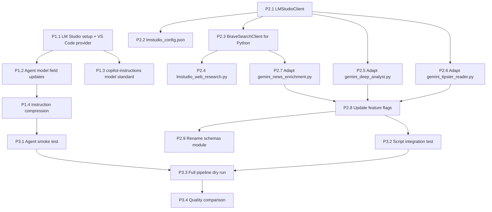

# LM Studio Migration Plan — Gemma 4 31B Local Inference

**Version:** 1.0  
**Created:** 2026-05-27  
**Target:** Replace all cloud AI dependencies (Gemini, GPT-5.4, Claude Opus 4.6) with local Gemma 4 31B via LM Studio  
**Machine:** MacBook Pro M4 Pro, 48GB RAM  
**Model:** google/gemma-4-31b GGUF Q4_K_M (19.89GB) — Vision, Tool Use, Reasoning, 128K context

---

## 1. Technical Context

### 1.1 Current AI Integration Points

| Layer | What | Model Used | Files |
|-------|------|-----------|-------|
| VS Code agents (10) | Copilot Chat model routing | GPT-5.4 (1×), Claude Opus 4.6 (9×) | `.github/agents/bet-*.agent.md` |
| Python — web research | Search grounding + synthesis | Gemini 2.5 Flash | `scripts/gemini_web_research.py` |
| Python — deep analyst | Second opinion on candidates | Gemini 2.5 Pro | `scripts/gemini_deep_analyst.py` |
| Python — tipster reader | URL reading + extraction | Gemini 2.5 Flash | `scripts/gemini_tipster_reader.py` |
| Python — news enrichment | Injury/news via search grounding | Gemini 2.5 Flash | `scripts/gemini_news_enrichment.py` |
| Python — feature flags | `--gemini` on deep_stats, `--use-gemini` on tipster_aggregator | — | `scripts/deep_stats_report.py`, `scripts/tipster_aggregator.py` |
| Config | API key, model settings, budgets | — | `config/gemini_config.json`, `config/api_keys.json` |
| Schemas | Pydantic response models | — | `src/bet/schemas/gemini_responses.py` |
| Client | GeminiClient (google-genai SDK) | — | `src/bet/api_clients/gemini_client.py` |

### 1.2 LM Studio Architecture

```
┌──────────────────────┐       ┌─────────────────────┐
│  Python Scripts       │       │  VS Code Copilot    │
│  (LMStudioClient)    │       │  (model: field)     │
└──────────┬───────────┘       └──────────┬──────────┘
           │ HTTP POST                     │ VS Code model provider
           ▼                               ▼
┌──────────────────────────────────────────────────────┐
│  LM Studio Server (localhost:1234)                   │
│  Model: gemma-4-31b-Q4_K_M                          │
│  OpenAI-compatible: /v1/chat/completions             │
│  Structured output: response_format + json_schema    │
│  128K context window                                 │
└──────────────────────────────────────────────────────┘
```

### 1.3 Search Grounding Replacement

Gemini's native search grounding → two-step pattern:
1. **Brave Search API** (`brave-search` MCP for agents, `httpx` for Python scripts) fetches live web results
2. **LM Studio** synthesizes results into structured analysis

This matches how agents already work (they have `brave-search/*` tools) — the Python scripts need the same pattern.

### 1.4 Performance Budget

| Metric | Estimate |
|--------|----------|
| Model RAM | ~20GB (Q4_K_M + KV cache) |
| OS + apps headroom | ~28GB available of 48GB |
| Inference speed (M4 Pro) | ~15-25 tok/s (31B Q4) |
| Typical prompt (deep analyst) | ~4K tokens in, ~2K out |
| Time per candidate | ~80-130s (vs. ~5-15s cloud) |
| Max concurrent requests | 1 (single GPU inference) |

---

## 2. Risk Assessment

| Risk | Severity | Mitigation |
|------|----------|------------|
| Slower inference (10× vs cloud) | MEDIUM | Reduce batch sizes; prioritize top-N candidates; async batching |
| Structured output compliance (31B vs frontier) | HIGH | Use strict `json_schema` response format; add retry + fallback parsing; validate all outputs with Pydantic |
| Context window pressure (128K shared across KV) | LOW | Current prompts are 4-8K; no issue |
| Model quality for betting domain | MEDIUM | Test against Gemini outputs for 20 candidates; measure agreement score |
| LM Studio server crashes under load | LOW | Health check before batch; auto-restart; graceful fallback |
| VS Code model provider config | LOW | Document exact setup steps; test with simple agent first |
| Memory pressure (model + VS Code + browser) | MEDIUM | Close non-essential apps; monitor with `memory_pressure` |
| Pipeline throughput regression | MEDIUM | Serial processing is fine (was already serial); total session time increases from ~20min to ~60min |

---

## 3. Dependencies



---

## 4. Implementation Phases

---

### Phase 1: Agent Layer Migration

**Goal:** All VS Code Copilot agents route to local Gemma 4 31B. Instructions compressed for 31B context efficiency.

---

#### P1.1 — LM Studio Setup & VS Code Model Provider [CONFIGURE]

**Tasks:**
- [ ] Install LM Studio, download `google/gemma-4-31b` GGUF Q4_K_M
- [ ] Configure LM Studio server: port 1234, max context 65536 (conservative for RAM), GPU layers = max
- [ ] Register LM Studio as VS Code language model provider via `chat.models` or GitHub Copilot's custom model endpoint settings
- [ ] Determine the exact model identifier string VS Code assigns (e.g., `lmstudio/gemma-4-31b` or `gemma-4-31b`)
- [ ] Test basic completion via VS Code Copilot Chat to confirm routing works

**Definition of done:** VS Code Copilot Chat responds using local Gemma 4 31B when the model is selected.

**Notes:**
- VS Code Copilot supports custom OpenAI-compatible endpoints via settings. The model identifier used in agent `model:` fields must match whatever VS Code registers.
- If VS Code Copilot doesn't support arbitrary model routing via `model:` field to local endpoints, the fallback is to configure LM Studio as the DEFAULT model provider and remove `model:` fields from agents entirely.

---

#### P1.2 — Agent Model Field Updates [MODIFY]

**Files:** All 10 `.github/agents/bet-*.agent.md`

**Tasks:**
- [ ] Replace `model: "GPT-5.4"` in `bet-orchestrator.agent.md` with the confirmed model identifier
- [ ] Replace `model: "Claude Opus 4.6"` in 9 remaining agent files with the same identifier
- [ ] Verify YAML frontmatter parses correctly (no quoting issues)

**Definition of done:** All 10 agent files have the new model identifier. `grep -r 'GPT-5.4\|Claude Opus 4.6' .github/agents/` returns zero matches.

---

#### P1.3 — Update Model Standard in copilot-instructions.md [MODIFY]

**File:** `.github/copilot-instructions.md`

**Tasks:**
- [ ] Change "Active Model Standard" section from `GPT-5.4` to the new local model name
- [ ] Update any prose referencing cloud model names

**Definition of done:** `grep -r 'GPT-5.4' .github/` returns zero matches (excluding plans/ and memories/).

---

#### P1.4 — Instruction Compression for 31B [MODIFY]

**Goal:** Reduce total instruction token load by ~30% while preserving all rules and methodology. 31B processes fewer tokens more carefully.

**Files and targets:**

| File | Current | Target | Strategy |
|------|---------|--------|----------|
| `agent-execution-protocol.instructions.md` | 222 lines | ~90 lines | Remove duplicated "NEVER" rules already stated positively; collapse fish shell table; remove meta-commentary |
| `analysis-methodology.instructions.md` | 1149 lines | ~900 lines | Remove repeated "statistical > outcome" prose (stated once is enough); compress DB table descriptions (keep table, shorten descriptions); remove changelog sections |
| `betting-artifacts.instructions.md` | 300 lines | ~200 lines | Collapse verbose formatting examples into minimal templates |
| `sport-analysis-protocols.instructions.md` | 437 lines | ~350 lines | Compress upset checklist prose; keep tables and thresholds verbatim |

**Compression rules:**
- [ ] Keep all HARD REJECT rules verbatim (safety-critical)
- [ ] Keep all formulas (EV, Kelly, safety score) verbatim
- [ ] Keep concrete examples (BAD vs GOOD output patterns)
- [ ] Keep tables/structured data
- [ ] Remove: meta-commentary explaining WHY a rule exists
- [ ] Remove: same rule stated 3+ times in different phrasings
- [ ] Remove: changelog/version history sections
- [ ] Remove: "NEVER do X" when there's already "ALWAYS do Y" covering the same behavior
- [ ] Collapse: verbose prose into bullet lists

**Definition of done:** 
- Total instruction lines reduced by ≥25%
- All HARD REJECT rules still present (grep for each rule ID: TENNIS_SETS_001, HANDBALL_001, etc.)
- All formula sections intact
- Agent boot sequence still works (sequentialthinking finds its 3 rules)

---

### Phase 2: Python Script Layer Migration

**Goal:** Replace GeminiClient with LMStudioClient. Replace Gemini search grounding with Brave Search + LMStudio synthesis. Keep all schemas and output formats identical.

---

#### P2.1 — Create LMStudioClient [CREATE]

**File:** `src/bet/api_clients/lmstudio_client.py`

**Design:**
```python
# Mirrors GeminiClient interface — drop-in replacement
# Uses OpenAI-compatible API at localhost:1234/v1/chat/completions

class LMStudioNotAvailableError(Exception): ...
class LMStudioError(Exception): ...

@dataclass
class LMStudioResponse:
    text: str
    parsed: Optional[Any] = None       # Pydantic model if response_schema provided
    usage: Dict[str, int] = field(default_factory=dict)
    model: str = ""
    latency_ms: int = 0

class LMStudioClient:
    def __init__(self):
        # Load config from config/lmstudio_config.json
        # Check server health: GET localhost:1234/v1/models
        ...
    
    def generate(self, prompt: str, system_prompt: str = "", 
                 response_schema: Optional[Type[BaseModel]] = None) -> LMStudioResponse:
        # POST /v1/chat/completions
        # If response_schema: use response_format={"type":"json_schema","json_schema":...}
        # Retry logic (server might be loading model)
        # Parse response, validate with Pydantic if schema provided
        ...
    
    def generate_with_context(self, prompt: str, context: List[str],
                              system_prompt: str = "",
                              response_schema: Optional[Type[BaseModel]] = None) -> LMStudioResponse:
        # Same as generate but prepends context (from Brave Search results) into prompt
        ...
    
    def health_check(self) -> bool:
        # GET /v1/models — returns True if server responds
        ...
```

**Tasks:**
- [ ] Create `src/bet/api_clients/lmstudio_client.py` with above interface
- [ ] Use `httpx` (already in project) for HTTP calls — no new dependencies
- [ ] Implement structured output via `response_format` with `json_schema` type
- [ ] Add retry logic: 3 retries with backoff for connection errors and malformed JSON
- [ ] Add Pydantic validation fallback: if JSON parsing fails, attempt regex extraction of JSON block
- [ ] Integrate with existing `RateLimiter` (use "lmstudio" key — no daily limit but track usage)
- [ ] Integrate with `_record_source_health()` from base_client
- [ ] Add `_track_usage()` method (tokens in/out, calls, latency — write to `.api_usage/lmstudio_{date}.json`)

**Definition of done:** 
- `LMStudioClient().health_check()` returns True when LM Studio is running
- `LMStudioClient().generate("Say hello", response_schema=SimpleModel)` returns valid parsed output
- Unit tests pass with mocked HTTP responses

---

#### P2.2 — Create lmstudio_config.json [CREATE]

**File:** `config/lmstudio_config.json`

**Content:**
```json
{
  "base_url": "http://localhost:1234/v1",
  "model": "gemma-4-31b-Q4_K_M",
  "max_tokens": 4096,
  "temperature": 0.3,
  "timeout_seconds": 180,
  "max_retries": 3,
  "retry_delay_seconds": 5.0,
  "max_context_tokens": 65536,
  "structured_output": true,
  "health_check_on_init": true,
  "usage_tracking": {
    "enabled": true,
    "log_dir": "betting/data/.api_usage"
  }
}
```

**Tasks:**
- [ ] Create config file
- [ ] Add `config/lmstudio_config.example.json` (same content, for version control)
- [ ] Add "lmstudio" entry to `config/api_keys.json` structure (no key needed — local, but field present for consistency)

**Definition of done:** `LMStudioClient()` loads config and connects without errors.

---

#### P2.3 — Brave Search Client for Python Scripts [CREATE]

**File:** `src/bet/api_clients/brave_search_client.py`

**Design:**
```python
# Wraps Brave Search API for use in Python scripts
# Replaces Gemini's native search grounding capability

class BraveSearchClient:
    def __init__(self):
        # Load BRAVE_API_KEY from config/api_keys.json
        ...
    
    def search(self, query: str, count: int = 5, freshness: str = "pw") -> List[SearchResult]:
        # GET https://api.search.brave.com/res/v1/web/search
        # Returns top N results with title, url, snippet
        ...
    
    def news_search(self, query: str, count: int = 5) -> List[NewsResult]:
        # GET https://api.search.brave.com/res/v1/news/search
        ...
    
    def search_and_summarize(self, query: str, lmstudio: LMStudioClient,
                             system_prompt: str = "") -> str:
        # Two-step: search → feed results to LMStudio for synthesis
        # This replaces Gemini's search_grounded_query() pattern
        ...
```

**Tasks:**
- [ ] Create `src/bet/api_clients/brave_search_client.py`
- [ ] Use existing `BRAVE_API_KEY` from `config/api_keys.json` (already present for MCP brave-search)
- [ ] Implement `search()` and `news_search()` methods
- [ ] Implement `search_and_summarize()` — the key replacement for Gemini search grounding
- [ ] Add rate limiting via existing `RateLimiter` (add "brave-search-api" entry)
- [ ] Integration with `_record_source_health()`

**Definition of done:** `BraveSearchClient().search("Arsenal injuries 2026")` returns structured results. `search_and_summarize()` produces synthesized text via LMStudio.

---

#### P2.4 — Create lmstudio_web_research.py [CREATE]

**File:** `scripts/lmstudio_web_research.py`

**Replaces:** `scripts/gemini_web_research.py`

**Tasks:**
- [ ] Create new script with same CLI interface: `--team`, `--sport`, `--need`, `--batch`, `--date`
- [ ] Replace `GeminiClient.search_grounded_query()` with `BraveSearchClient.search_and_summarize()`
- [ ] Keep same output schemas (`WebResearchResult`, `EventContextResult`)
- [ ] Keep same output file paths and JSON structure
- [ ] Preserve existing `RESEARCH_PROMPTS` templates (modify only to remove Gemini-specific instructions)
- [ ] Keep fallback behavior: if LMStudio unavailable → log warning, skip enrichment (don't crash)

**Definition of done:**
- `python3 scripts/lmstudio_web_research.py --team "Arsenal" --sport football --need injuries,form` produces valid `WebResearchResult` JSON
- Output format identical to `gemini_web_research.py` output

---

#### P2.5 — Adapt gemini_deep_analyst.py → lmstudio_deep_analyst.py [MODIFY]

**Strategy:** Rename file, swap client. Keep all prompts, schemas, and output formats.

**Tasks:**
- [ ] Copy `scripts/gemini_deep_analyst.py` → `scripts/lmstudio_deep_analyst.py`
- [ ] Replace `from bet.api_clients.gemini_client import GeminiClient` → `from bet.api_clients.lmstudio_client import LMStudioClient`
- [ ] Replace `GeminiClient()` instantiation with `LMStudioClient()`
- [ ] Replace `.generate()` / `.search_grounded_query()` calls with `LMStudioClient.generate()`
- [ ] Keep `CandidateDeepAnalysis` schema as response_schema parameter
- [ ] Keep `SYSTEM_PROMPT` and `compute_agreement_score()` unchanged
- [ ] Add `system_prompt` parameter to generate calls (LMStudio supports system messages natively)
- [ ] Keep old file for rollback (mark with `# DEPRECATED — use lmstudio_deep_analyst.py` header)

**Definition of done:**
- `python3 scripts/lmstudio_deep_analyst.py --date 2026-05-27 --event "Arsenal vs Chelsea"` produces valid `CandidateDeepAnalysis` JSON
- Output schema byte-for-byte compatible with old Gemini output

---

#### P2.6 — Adapt gemini_tipster_reader.py → lmstudio_tipster_reader.py [MODIFY]

**Tasks:**
- [ ] Copy `scripts/gemini_tipster_reader.py` → `scripts/lmstudio_tipster_reader.py`
- [ ] Swap client imports (GeminiClient → LMStudioClient)
- [ ] Replace Gemini URL reading with: fetch page HTML via `httpx` → feed to LMStudio for extraction
- [ ] Keep `TipsterPageResult` / `TipsterPickExtracted` schemas unchanged
- [ ] Keep `EXTRACTION_PROMPT_TEMPLATE` unchanged (or minimally adapt)
- [ ] Keep `DEFAULT_TIPSTER_SITES` list unchanged

**Note:** Gemini had native URL reading capability. LMStudio doesn't. The replacement pattern:
1. Fetch page HTML with `httpx` (or reuse existing BS4 fetchers from `tipster_aggregator.py`)
2. Truncate HTML to ~30K chars (fits in 128K context with headroom)
3. Feed to LMStudio with extraction prompt

**Definition of done:**
- `python3 scripts/lmstudio_tipster_reader.py --batch --date 2026-05-27` extracts picks from tipster sites
- Output format identical to Gemini version

---

#### P2.7 — Adapt gemini_news_enrichment.py → lmstudio_news_enrichment.py [MODIFY]

**Tasks:**
- [ ] Copy `scripts/gemini_news_enrichment.py` → `scripts/lmstudio_news_enrichment.py`
- [ ] Swap client: GeminiClient → LMStudioClient + BraveSearchClient
- [ ] Replace search grounding pattern: `BraveSearchClient.news_search()` → feed results to LMStudio → extract structured `NewsEnrichmentResult`
- [ ] Keep `NewsEnrichmentResult`, `InjuryReport` schemas unchanged
- [ ] Keep `NEWS_PROMPT_TEMPLATE` (adapt to include search results as context instead of relying on native search)

**Definition of done:**
- `python3 scripts/lmstudio_news_enrichment.py --team "Arsenal" --sport football --date 2026-05-27` produces valid `NewsEnrichmentResult` JSON
- Output format identical to Gemini version

---

#### P2.8 — Update Feature Flags and Integration Points [MODIFY]

**Files:** `scripts/deep_stats_report.py`, `scripts/tipster_aggregator.py`, `scripts/validate_phase.py`, `scripts/agent_protocol.py`

**Tasks:**
- [ ] `deep_stats_report.py`: Replace `--gemini` flag with `--lmstudio`
  - Change argparse definition
  - Change conditional import from `gemini_deep_analyst` → `lmstudio_deep_analyst`
  - Keep backward compat: `--gemini` still accepted but prints deprecation warning
- [ ] `tipster_aggregator.py`: Replace `--use-gemini` with `--use-lmstudio`
  - Change argparse definition
  - Change import and dispatch logic
  - Keep `--use-gemini` as deprecated alias
- [ ] `validate_phase.py`: Update hardcoded command strings that reference `--gemini`
- [ ] `agent_protocol.py`: Update STEP_AGENT_CONFIG references to Gemini scripts → LMStudio scripts
- [ ] Update any `# Feature flag:` comments in Gemini scripts

**Definition of done:**
- `python3 scripts/deep_stats_report.py --help` shows `--lmstudio` flag
- `python3 scripts/tipster_aggregator.py --help` shows `--use-lmstudio` flag
- `grep -r 'gemini' scripts/agent_protocol.py` returns only historical comments, not active code paths

---

#### P2.9 — Rename Schemas Module [MODIFY]

**File:** `src/bet/schemas/gemini_responses.py` → keep file, add alias

**Strategy:** Do NOT rename the file (would break many imports). Instead:
- [ ] Add `src/bet/schemas/llm_responses.py` that re-exports all schemas from `gemini_responses.py`
- [ ] New scripts import from `llm_responses.py`
- [ ] Old scripts continue working with `gemini_responses.py` (no breaking change)
- [ ] Add deprecation comment to `gemini_responses.py` header

**Definition of done:** Both `from bet.schemas.llm_responses import WebResearchResult` and `from bet.schemas.gemini_responses import WebResearchResult` work.

---

### Phase 3: Validation & Cutover

**Goal:** Verify end-to-end pipeline works with local model. Compare quality against cloud baselines.

---

#### P3.1 — Agent Smoke Test [VALIDATE]

**Tasks:**
- [ ] Open VS Code with LM Studio running
- [ ] Activate `bet-orchestrator` agent → verify it responds with analytical content
- [ ] Activate `bet-statistician` agent → feed it a sample deep_stats output → verify analysis quality
- [ ] Test tool calling: agent should still be able to call `run_in_terminal`, `read_file`, `brave-search` etc.
- [ ] Verify `sequentialthinking` boot sequence works (agent finds its 3 rules)
- [ ] Test subagent delegation from orchestrator → specialist

**Definition of done:** All 10 agents respond coherently. Tool calling works. Boot sequence completes.

---

#### P3.2 — Script Integration Tests [VALIDATE]

**Tasks:**
- [ ] Run `lmstudio_web_research.py` for 3 teams across 3 sports → verify output schemas
- [ ] Run `lmstudio_deep_analyst.py` for 5 candidates → verify `CandidateDeepAnalysis` output
- [ ] Run `lmstudio_tipster_reader.py --batch` → verify picks extracted from ≥3 sites
- [ ] Run `lmstudio_news_enrichment.py` for 5 teams → verify `NewsEnrichmentResult` output
- [ ] Run `deep_stats_report.py --lmstudio` for a real date → verify integration works end-to-end
- [ ] Compare Pydantic validation pass rate: target ≥90% first-attempt parse success

**Definition of done:** All scripts produce valid structured output. No crashes. Parse success ≥90%.

---

#### P3.3 — Full Pipeline Dry Run [VALIDATE]

**Tasks:**
- [ ] Run complete S0→S8 pipeline for one betting day with `--lmstudio` flags active
- [ ] Verify: shortlist generation, deep stats, gate check, coupon building all complete
- [ ] Measure: total pipeline time (expect 45-75 min vs ~20 min cloud)
- [ ] Verify: all JSON artifacts written correctly, DB tables populated
- [ ] Check: no hallucinated data in outputs (run coupon validation protocol)

**Definition of done:** Full pipeline completes without errors. Output quality passes manual review.

---

#### P3.4 — Quality Comparison [VALIDATE]

**Tasks:**
- [ ] Take 20 candidates from a recent session that used Gemini
- [ ] Re-run same candidates through LMStudio deep analyst
- [ ] Compare: market rankings, bear/bull cases, upset risk scores
- [ ] Calculate agreement score between Gemini and LMStudio outputs
- [ ] Identify any systematic gaps (e.g., LMStudio worse at esports context)
- [ ] Document findings and any prompt adjustments needed

**Definition of done:** Agreement score ≥70% on market recommendations. Any systematic gaps documented with mitigation plan.

---

#### P3.5 — Deprecation & Cleanup [MODIFY]

**Tasks (execute ONLY after P3.1-P3.4 pass):**
- [ ] Mark old Gemini scripts with `# DEPRECATED` header
- [ ] Remove `google-genai` from `pyproject.toml` dependencies (optional — keep for rollback)
- [ ] Update `README.md` with LM Studio setup instructions
- [ ] Update `config/api_keys.example.json` — remove Gemini key, note LM Studio needs no key
- [ ] Archive `config/gemini_config.json` → `config/gemini_config.json.bak`

**Definition of done:** Pipeline runs cleanly without any Gemini dependency. Rollback path documented.

---

## 5. Rollback Strategy

Every phase is independently reversible:

| Phase | Rollback |
|-------|----------|
| P1 (agents) | Revert model field to "Claude Opus 4.6" / "GPT-5.4" — single grep+sed |
| P2 (scripts) | Old Gemini scripts still exist with `--gemini` / `--use-gemini` flags working |
| P3 (validation) | No production change until all validation passes |

**Key invariant:** Old Gemini files are NEVER deleted during migration. They're marked deprecated. Full cleanup only after 2 weeks of successful local operation.

---

## 6. Instruction Compression Guide

### 6.1 agent-execution-protocol.instructions.md (222 → ~90 lines)

**Remove:**
- Fish shell table (5 rows) → collapse to 2-line rule: "Fish shell. No inline python, no bash loops, no heredocs."
- "THE ONE RULE" section keeps the one-liner but removes surrounding commentary
- Python environment section → 1 line: "Before first script: `configurePythonEnvironment` + `getPythonExecutableCommand`"
- Remove any version history or changelog

**Keep:**
- Boot sequence (4 items) — verbatim
- Self-audit (3 items) — verbatim  
- BAD vs GOOD output example — verbatim (critical for 31B)
- Anti-patterns list — reduce to top 5 (remove ones covered by positive rules)

### 6.2 analysis-methodology.instructions.md (1149 → ~900 lines)

**Remove:**
- "ULTIMATE RULE" restated in 3 different places → state once at top
- Verbose DB table descriptions → keep table name + 1-line purpose (the detailed field lists are in DB schema)
- Repeated "statistical > outcome" messaging after it's stated in §1
- Data architecture prose (keep the table, remove the paragraphs explaining it)

**Keep (verbatim):**
- All formulas (EV, Kelly, safety score, hit rate calculation)
- DB table reference table (names + 1-line descriptions)
- Safety score thresholds
- Market ranking protocol
- All worked examples

### 6.3 betting-artifacts.instructions.md (300 → ~200 lines)

**Remove:**
- Multiple examples of the same artifact format → keep 1 exemplar each
- Explanatory prose about why format matters
- Edge case formatting rules that duplicate general rules

**Keep:**
- Coupon format template
- Settlement report template
- Risk tier labels table
- Verdict wording requirements

### 6.4 sport-analysis-protocols.instructions.md (437 → ~350 lines)

**Remove:**
- Intro paragraphs per sport (jump straight to tables)
- "Remember to check..." reminders already in boot sequence

**Keep (verbatim):**
- All stat tables per sport (Football §3.1, Tennis §3.2, etc.)
- Upset risk thresholds
- Red flag conditions
- Market decision hierarchies

---

## 7. New File Templates

### 7.1 config/lmstudio_config.json

```json
{
  "base_url": "http://localhost:1234/v1",
  "model": "gemma-4-31b-Q4_K_M",
  "max_tokens": 4096,
  "temperature": 0.3,
  "timeout_seconds": 180,
  "max_retries": 3,
  "retry_delay_seconds": 5.0,
  "max_context_tokens": 65536,
  "structured_output": true,
  "health_check_on_init": true,
  "usage_tracking": {
    "enabled": true,
    "log_dir": "betting/data/.api_usage"
  }
}
```

### 7.2 LMStudioClient Key Methods

```python
def generate(self, prompt: str, system_prompt: str = "",
             response_schema: Optional[Type[BaseModel]] = None) -> LMStudioResponse:
    """Generate completion from LM Studio. 
    
    If response_schema provided, uses json_schema response_format 
    and validates output with Pydantic.
    """
    messages = []
    if system_prompt:
        messages.append({"role": "system", "content": system_prompt})
    messages.append({"role": "user", "content": prompt})
    
    body = {
        "model": self.model,
        "messages": messages,
        "max_tokens": self.max_tokens,
        "temperature": self.temperature,
    }
    
    if response_schema:
        body["response_format"] = {
            "type": "json_schema",
            "json_schema": {
                "name": response_schema.__name__,
                "schema": response_schema.model_json_schema()
            }
        }
    
    response = httpx.post(
        f"{self.base_url}/chat/completions",
        json=body,
        timeout=self.timeout
    )
    ...
```

---

## 8. Migration Timeline (Suggested)

| Day | Work |
|-----|------|
| 1 | P1.1 (LM Studio setup), P2.1 (LMStudioClient), P2.2 (config) |
| 2 | P2.3 (BraveSearchClient), P1.2 (agent model fields), P1.3 (model standard) |
| 3 | P2.4 (web research), P2.5 (deep analyst) |
| 4 | P2.6 (tipster reader), P2.7 (news enrichment) |
| 5 | P2.8 (feature flags), P2.9 (schema alias), P1.4 (instruction compression) |
| 6 | P3.1 (agent smoke), P3.2 (script tests) |
| 7 | P3.3 (full pipeline), P3.4 (quality comparison) |

---

## 9. Open Questions

1. **VS Code model routing**: Does the current VS Code Copilot version support routing agent `model:` fields to an OpenAI-compatible local endpoint? If not, alternative: use VS Code's `github.copilot.chat.models` setting or a compatible extension.
2. **Structured output reliability**: Gemma 4 31B Q4 — how reliable is `response_format: json_schema`? May need a JSON extraction fallback (regex `{...}` from response text).
3. **Concurrency**: Pipeline currently runs LLM calls serially (one candidate at a time). Is this acceptable with 10× slower inference, or should we batch differently?
4. **Vision capability**: Gemma 4 has vision. Should we leverage this for screenshot-based tipster reading (alternative to HTML parsing)?
5. **Model updates**: When Gemma 4 gets a better quantization or larger context, what's the upgrade path? (Answer: change `model` in `lmstudio_config.json` — zero code changes needed.)
