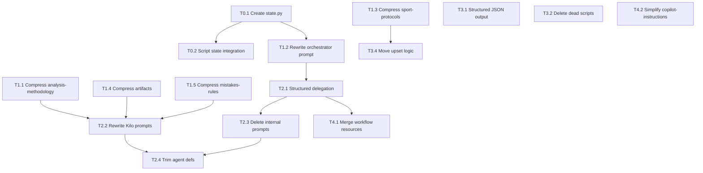

# Qwen 3.6-35B-A3B Pipeline Simplification Plan

**Created:** 2026-05-30  
**Updated:** 2026-05-31 (post-benchmark revision)  
**Target model:** Qwen 3.6-35B-A3B MoE (35B total, 3B active/token, 131K context, thinking=ON)  
**Goal:** Simplify pipeline for speed/reliability WITHOUT losing deep analytical quality  
**Status:** REVISED — benchmark confirmed model capabilities; architecture finalized

---

## Benchmark Results (2026-05-30)

| Test | Time | Tokens | Speed | Verdict |
|------|------|--------|-------|---------|
| Source Fusion (3 sources → analysis) | 60.8s | 3687 | 60.7 t/s | ✅ PASS |
| Bear Case (adversarial thinking) | 68.3s | 4096 | 60.0 t/s | ✅ PASS |
| Narrative Depth (coupon reasoning) | 69.7s | 4096 | 58.7 t/s | ✅ PASS |

**Key finding:** Thinking mode (`<think>` blocks) makes 3B-active sufficient for deep reasoning. Model correctly fuses stats+tipster+context, writes multi-paragraph Polish analysis, and produces ruthless bear cases with probability estimates.

---

## Architecture: 2-Phase State-Based Pipeline

```
PHASE 1: DATA (S0→S2.9)              PHASE 2: ANALYSIS+BUILD (S3→S10)
┌─────────────────────────┐           ┌─────────────────────────────────┐
│ Scripts collect data:   │           │ Model REASONS about data:       │
│ - discover events       │  state.   │ - fuses sources                 │
│ - build shortlist       │  json     │ - writes bear cases             │
│ - fetch tipsters        │ ────────► │ - picks best markets            │
│ - enrich data           │  (~30     │ - composes coupon narrative     │
│ - compute L10/L5/H2H    │  lines)   │ Scripts VALIDATE model output:  │
│ ALL arithmetic by code  │           │ - check EV math                 │
│ ALL scraping by code    │           │ - verify line coverage           │
└─────────────────────────┘           └─────────────────────────────────┘
                   ↕                                    ↕
              betting.db                           betting.db
           (unlimited rows)                     (gate_results etc)
```

### state.json (~30-50 lines)

Bridge between phases. Contains ONLY decisions/flags/position — NOT candidate data:

```json
{
  "date": "2026-05-30",
  "phase": "ANALYSIS_BUILD",
  "position": "S3",
  "data_summary": {
    "candidates_total": 45,
    "by_sport": {"football": 15, "basketball": 12, "tennis": 8, "volleyball": 5, "hockey": 3, "cs2": 2},
    "with_tipster_support": 18,
    "data_tier_full": 32
  },
  "decisions": ["skip_esports_no_tipster_data", "focus_corners_high_hit_rate"],
  "flags": {"tipster_fetch_partial": true, "odds_stale_3h": false},
  "completed_steps": ["S0", "S1", "S1e", "S2", "S2.3", "S2.5"]
}
```

Candidates live in DB (unlimited). State.json is a POINTER + SUMMARY — never >50 lines.

---

## Design Principles (revised post-benchmark)

| # | Principle | Rationale |
|---|-----------|-----------|
| 1 | SCRIPTS = data + compute + arithmetic | Scripts never narrate or reason |
| 2 | MODEL = reasoning + fusion + narrative + bear-cases | Model never computes averages |
| 3 | STRUCTURED INPUT to model | Scripts pre-format JSON; model doesn't parse raw stdout |
| 4 | state.json = session continuity | Anti-drift between calls; context-reset-safe |
| 5 | ONE instruction file ≤200 lines | Thinking mode allows slightly more than initially feared |
| 6 | EXAMPLES > rules | 1 concrete good/bad example > 5 abstract rules |
| 7 | TABLES over prose | MoE processes structured data more reliably |
| 8 | No nested loads | No "load X which references Y which loads Z" |

---

## Current State (measured 2026-05-30)

| Artifact | Lines | Target | Notes |
|----------|-------|--------|-------|
| `analysis-methodology.instructions.md` | 1149 | ~200 | Heavy compression still needed |
| `orchestrate-betting-day.prompt.md` | 563 | ~250 | Rewrite for 2-phase architecture |
| `sport-analysis-protocols.instructions.md` | 437 | ~180 | Tables only, no prose |
| `agent-execution-protocol.instructions.md` | 79 | ~60 | Minor trim |
| `betting-artifacts.instructions.md` | 208 | ~130 | Remove script-generated formats |
| `betting-mistakes-rules.instructions.md` | 207 | ~110 | Pure table format |
| Kilo prompts (10 files) | 1375 total | ~700 | Keep analytical depth |
| Internal prompts (13 files) | 731 total | 0 or ~200 | Likely DELETE |
| Dead scripts (20+ files) | ~2000 est. | 0 | DELETE immediately |

**Total prompt/instruction surface per session:** ~2100 lines → target ~800 lines

---

## TIER 0: Pipeline State Architecture [NEW]

**Risk:** LOW — new file, no existing code affected  
**Dependency:** None — do first, everything else references it

### T0.1 — Create `src/bet/pipeline/state.py` [CREATE]

Pipeline state management: read/write state.json, validate transitions.

```python
@dataclass
class PipelineState:
    date: str
    phase: Literal["DATA", "ANALYSIS_BUILD"]  # 2-phase: DATA (S0-S2.9), ANALYSIS_BUILD (S3-S10)
    position: str  # e.g. "S3"
    data_summary: dict
    decisions: list[str]
    flags: dict[str, bool]
    completed_steps: list[str]

    @classmethod
    def load(cls, date: str) -> "PipelineState": ...
    def save(self) -> None: ...
    def advance(self, step: str, summary: dict) -> None: ...
    def can_proceed(self, next_step: str) -> bool: ...
```

**Location:** `betting/data/{date}_state.json`  
**Size:** Always ≤50 lines of JSON

**Definition of Done:**
- [ ] `PipelineState` class with load/save/advance/can_proceed
- [ ] Scripts call `state.advance()` after successful execution
- [ ] Orchestrator reads state on session start to detect resume point
- [ ] Unit test covers: fresh start, resume mid-session, phase transition

### T0.2 — Script integration: emit state update after each step [MODIFY]

Add `state.advance(step, summary)` call to each pipeline script's success path.
Combined with T3.3 (which is MERGED here — T3.3 no longer exists as separate task).

**Standard emit pattern (add to each script's main block):**
```python
from bet.pipeline.state import PipelineState

# ... script logic ...

state = PipelineState.load(args.date)
state.advance(step="S3", summary={
    "candidates_in": len(candidates),
    "candidates_out": len(results),
    "output_file": output_path,
    "issues": issues_list
})
print(f"AGENT_SUMMARY:{json.dumps(state.data_summary)}", flush=True)
```

**Canonical 14 pipeline scripts to integrate:**
1. `settle_on_finish.py` (S0)
2. `discover_events.py` (S1) — NOTE: needs NEW AgentOutput integration
3. `build_shortlist.py` (S1e)
4. `tipster_xref.py` (S2)
5. `tipster_aggregator.py` (S2)
6. `run_scrapers.py` (S2.3)
7. `data_enrichment_agent.py` (S2.5-S2.9)
8. `ingest_scan_stats.py` (S2.7)
9. `deep_stats_report.py` (S3)
10. `odds_evaluator.py` (S4)
11. `fetch_odds_multi.py` (S4)
12. `context_checks.py` (S5)
13. `upset_risk.py` (S6)
14. `gate_checker.py` (S7)
15. `coupon_builder.py` (S8)

**Definition of Done:**
- [ ] All 15 pipeline scripts call `state.advance()` on success
- [ ] `discover_events.py` gets NEW AgentOutput integration (currently missing)
- [ ] state.json is always up-to-date after any script completes
- [ ] Orchestrator's first action = `PipelineState.load(today)` to determine position

---

## TIER 1: Instruction Compression

**Risk:** LOW — purely documentation changes, no script logic affected  
**Dependency:** T0 done first (state.json architecture informs what stays/goes)  
**Rollback:** `git checkout` the instruction files

### T1.1 — Compress `analysis-methodology.instructions.md` [MODIFY]

**Current:** 1149 lines  
**Target:** ~200 lines  
**Approach:**

Remove (VERIFIED handled by scripts):
- §1.7 Exotic League Protocol → `build_shortlist.py` comp_score logic
- §1.8 Fixture Verification Gate → `build_shortlist.py` fixture_verified flag
- §SCAN.7-9 protections → `discover_events.py` dedup
- §0.2a Betclic history block → `analyze_betclic_learning.py`
- DB table descriptions (60+ lines) → `db_data_loader.py` has full schema
- Gateway module listing → internal to scripts
- Sport file caches → scripts auto-load

Keep (compressed to tables + short prose):
- ULTIMATE RULE (5 lines)
- DB-first principle + state.json reference (10 lines)
- Sport Tiers table (10 lines)
- Step pipeline table S0→S10 with script + agent role per step (40 lines)
- Hallucination prevention rules (15 lines)
- Core constraints: statistical > outcome, EV > 0, never invent, L10 hit-rate > avg (20 lines)
- R14 data quality (5 lines)
- Model responsibility boundary: "scripts compute, model reasons" (10 lines)

**Definition of Done:**
- [ ] File is ≤200 lines
- [ ] All removed content is verifiably handled by scripts
- [ ] Pipeline step table includes script + agent responsibility column
- [ ] "Model responsibility" section clearly delineates script vs model roles

---

### T1.2 — Rewrite `orchestrate-betting-day.prompt.md` for 2-phase architecture [MODIFY]

**Current:** 563 lines (single monolithic flow)  
**Target:** ~250 lines (2-phase + state.json integration)

**New structure:**
```
# Orchestrate Betting Day (2-Phase Pipeline)

## INPUTS: date, session_type (fresh|resume|rerun)

## PHASE 1: DATA COLLECTION (S0→S2.9)
[table: step | script | success_condition | state_update]
- Model role: MONITOR only — run scripts, check AGENT_SUMMARY, advance state
- No analytical decisions in Phase 1

## PHASE 2: ANALYSIS + BUILD (S3→S10)  
[table: step | script_input | model_task | output]
- Model role: REASON — fuse sources, write narratives, challenge picks, compose coupons
- Scripts provide structured JSON → model analyzes → scripts validate math

## STATE MANAGEMENT
- On start: load state.json → determine position
- Between phases: optional context reset (fresh window for ANALYSIS)
- On each step: advance state after success

## TOP 3 FAILURE MODES (proven)
1. Wrong shortlist file → coverage check
2. Tipster key mismatch → data flow verification  
3. Model drift after 10+ calls → state.json prevents

## 1 GOOD/BAD SESSION EXAMPLE (10 lines each)
```

**Remove:**
- Delegation Protocol template (agents self-orient from their own prompts)
- Script→DB Data Flow table (state.json replaces)
- Known Bugs (encode in scripts)
- Infrastructure Modules listing
- RERUN/RESCAN verbose procedures (state.json handles resume)
- LM Studio / model flags section (obsolete)
- Per-step verbose command details (compact table)

**Definition of Done:**
- [ ] File is ≤250 lines
- [ ] 2-phase structure clearly delineated
- [ ] state.json read/write pattern documented with example
- [ ] Model responsibility per phase explicitly stated
- [ ] TOP 3 failure modes preserved

---

### T1.3 — Compress `sport-analysis-protocols.instructions.md` [MODIFY]

**Current:** 437 lines  
**Target:** ~180 lines  
**Approach:**

- Convert all prose to pure tables per sport
- Each sport: Required Stats Table + Bettable Markets Table + Red Flags (5 bullets max)
- Remove verbose "how to interpret" prose and example calculations
- Keep upset risk THRESHOLDS here (model needs them for reasoning) but remove checklist LOGIC (goes to `upset_risk.py`)

Structure per sport (~20 lines each × 8 sports = 160 lines + 20 header):
```
## Football (§3.1)
| Required Stat | Source | Purpose |
| L10 goals/fouls/corners/cards | team_form DB | Base rates |
...
| Bettable Market | Min Safety | Notes |
| total_goals O/U | 6 | Need L10 coverage ≥60% |
...
Red flags: ① Relegation match ② Manager sacked <7 days ③ 3+ key injuries
```

**Definition of Done:**
- [ ] File is ≤180 lines
- [ ] Each sport section is ≤22 lines
- [ ] All 8 sports covered (5 core + 3 esports)
- [ ] Upset risk thresholds preserved (model uses for bear case reasoning)
- [ ] Checklist logic moved to `upset_risk.py`

---

### T1.4 — Compress `betting-artifacts.instructions.md` [MODIFY]

**Current:** 208 lines  
**Target:** ~120 lines  
**Approach:**

- Remove format examples longer than 3 lines (scripts generate format)
- Keep: artifact type table, field definitions, wording rules
- Remove: full coupon template (coupon_builder.py generates)

**Definition of Done:**
- [ ] File is ≤120 lines
- [ ] All artifact types still defined
- [ ] Wording rules (conditional language, etc.) preserved

---

### T1.5 — Compress `betting-mistakes-rules.instructions.md` [MODIFY]

**Current:** 207 lines  
**Target:** ~100 lines  
**Approach:**

- Convert verbose mistake descriptions to single-line rules
- Format: `| Market | Sport | Rule | Source Date |`
- Remove narrative explanations of WHY each rule exists (keep just the rule)

**Definition of Done:**
- [ ] File is ≤100 lines
- [ ] All hard-reject rules preserved as table rows
- [ ] Gate checker script still references rules correctly

---

## TIER 2: Agent & Prompt Simplification

**Risk:** MEDIUM — changes how agents receive context; must test each agent solo  
**Dependency:** T0 + T1 done first  
**Rollback:** Git branch; Kilo prompts are independent files

### Agent Philosophy (revised post-benchmark)

Agents are NOT mere validators. The benchmark proved the model can:
- **FUSE** multiple sources into coherent analysis (Test 1: Source Fusion)
- **CHALLENGE** picks with ruthless adversarial reasoning (Test 2: Bear Case)
- **NARRATE** deep per-pick reasoning with data citations (Test 3: Narrative)

Therefore agents KEEP their analytical role. What changes:
- Scripts provide STRUCTURED JSON input (not raw stdout)
- Agents don't parse terminal output — they receive pre-formatted data
- Agents write original analysis ON TOP of computed data
- Scripts validate agent output (math checks, format checks)

### T2.1 — Replace paste-internal-prompt with structured delegation [MODIFY]

**Current:** Orchestrator reads 317-line `bet-deep-stats.prompt.md` and pastes into subagent  
**Target:** Orchestrator sends concise task + state reference; agent loads own skills

**New delegation contract:**
```json
{
  "step": "S3",
  "date": "2026-05-30",
  "data_file": "betting/data/2026-05-30_s3_structured.json",
  "state_ref": "betting/data/2026-05-30_state.json",
  "task": "For each candidate: fuse stats+tipster reasoning, identify best market, write bear case. Flag picks where hit_rate < 60%.",
  "output_format": "per-pick analysis with: MECHANIZM, DANE, RYZYKO, WERDYKT"
}
```

Agent then:
1. Loads own Kilo prompt (role + output format)
2. Auto-loads instructions (via `instructions:` array)
3. Reads the data_file (structured JSON from script)
4. Produces analytical output in standard format

**Definition of Done:**
- [ ] No orchestrator prompt contains "paste the internal prompt" language
- [ ] Delegation uses structured payload (step + data_file + task + output_format)
- [ ] Each specialist agent operates with just its Kilo prompt + auto-loaded instructions + data file
- [ ] Model's REASONING role preserved: fuse sources, bear cases, narrative writing

---

### T2.2 — Rewrite Kilo prompts for middle-ground role [MODIFY]

**Files:** 10 files in `.kilo/prompts/`  
**Current avg:** 138 lines | **Target avg:** 70 lines

**Key change:** Agents are ANALYSTS, not validators. Each prompt must:
- Define WHAT analytical contribution this agent makes (not just "check output")
- Specify INPUT format (structured JSON from scripts)
- Specify OUTPUT format (what the model writes)
- List 3-5 UNIQUE rules not found in shared instructions

**Structure per agent (~70 lines):**
```
## ROLE (3 lines)
You are bet-statistician. You REASON about statistical data prepared by scripts.
Your unique value: connecting L10 patterns to market opportunities that scripts can't see.

## INPUT (5 lines)  
You receive: structured JSON with per-candidate stats, tipster opinions, context.
Location: {data_file from delegation payload}

## YOUR ANALYTICAL TASK (10 lines)
For each candidate:
1. FUSE all sources (stats + tipster + context) into unified narrative
2. Identify the MECHANISM (why will this market hit?)
3. Write BEAR CASE (what could go wrong, with probability estimate)
4. Rate: P(hit), EV tier, risk tier

## OUTPUT FORMAT (15 lines with example)
## KEY RULES (5 bullets)
## GOOD/BAD EXAMPLE (20 lines)
```

**Definition of Done:**
- [ ] Each Kilo prompt is 60-100 lines (avg ~70, max 100 for orchestrator)
- [ ] Each prompt has clear ANALYTICAL TASK (not just "validate")
- [ ] No rule duplicated from auto-loaded instructions
- [ ] Total Kilo surface ≤800 lines (from 1375)
- [ ] Each agent produces original analysis (not just PASS/FAIL)

---

### T2.3 — Delete or convert internal prompts [DELETE/MODIFY]

**Current:** 13 files, 731 lines total  
**Target:** DELETE all 13 — agents are self-sufficient with revised Kilo prompts

**Justification:** T2.1 eliminates paste pattern. T2.2 gives agents full context. Internal prompts become dead code.

**Content routing for `bet-deep-stats.prompt.md` (317 lines):**
- Thresholds + safety score rules → T1.1 (compressed `analysis-methodology.instructions.md`)
- Checklist logic (if/else scoring) → T3.4 (`upset_risk.py` + `deep_stats_report.py`)
- Role + output format + examples → T2.2 (`bet-statistician` Kilo prompt, ~70 lines)

**Files to DELETE:**
- All 12 short files (32-43 lines each) — `bet-scan.prompt.md` through `bet-settle.prompt.md`
- `bet-deep-stats.prompt.md` (317 lines) — its content absorbed into T2.2's bet-statistician prompt

**Definition of Done:**
- [ ] All 13 internal prompt files deleted
- [ ] No remaining file references any deleted internal prompt
- [ ] Orchestrator prompt has no "load internal prompt" language
- [ ] Each agent produces valid output solo (verified per T2.2)

---

### T2.4 — Trim agent definitions [MODIFY]

**Files:** 10 files in `.github/agents/` and `.kilo/prompts/`  
**Current:** 644 lines total | **Target:** ~500 lines

**Approach:**
- Remove references to deleted internal prompts
- Remove duplicated constraints from auto-loaded instructions
- Add: `data_input:` section describing what JSON structure each agent receives
- Keep: role, skills, instructions array, tools, collaboration boundaries

**Definition of Done:**
- [ ] No agent references deleted files
- [ ] Each agent has explicit `data_input` documentation
- [ ] All `instructions:` arrays point to valid files

---

## TIER 3: Script Improvements

**Risk:** MEDIUM — code changes affect pipeline output  
**Dependency:** T0 defines state format; T2 defines what agents expect  
**Rollback:** Git branch; scripts are independently testable

### T3.1 — Scripts emit structured JSON for agents [MODIFY]

**Current:** Scripts print AGENT_SUMMARY to stdout; agent parses terminal output  
**Target:** Scripts write `{date}_s{N}_structured.json` — pre-formatted for model consumption

**Key principle:** Scripts do ALL computation. Model receives FINISHED data:
- ✅ Script calculates L10 average, hit rate, trend → model receives the numbers
- ✅ Script fetches and formats tipster reasoning → model receives the text
- ✅ Script computes EV and Kelly → model receives the values
- ❌ Model NEVER computes averages from raw arrays
- ❌ Model NEVER parses raw scraper HTML

**Structured output per step:**

| Step | Output file | Content |
|------|-------------|---------|
| S1e | `{date}_shortlist.json` | candidates with fixture_id, teams, sport, data_tier |
| S2 | `{date}_tipster_data.json` | per-candidate: tipster picks with reasoning text |
| S3 | `{date}_deep_stats.json` | per-candidate: L10/L5/H2H arrays, averages, hit rates, safety scores |
| S4 | `{date}_odds_ev.json` | per-candidate per-market: odds, EV, Kelly, line value |
| S5-S6 | `{date}_context.json` | per-candidate: injuries, motivation, upset risk flags |
| S7 | `{date}_gate_input.json` | per-candidate: merged all-source summary for model gate decision |

**S7 gate_input.json example (what model receives):**
```json
{
  "candidate_id": 12345,
  "event": "Crystal Palace vs Rayo Vallecano",
  "sport": "football",
  "best_market": {
    "name": "total_cards",
    "line": 5.5,
    "direction": "OVER",
    "odds": 1.68,
    "safety_score": 7.5,
    "ev": 0.12
  },
  "stats": {
    "home_cards_l10_avg": 2.8,
    "away_cards_l10_avg": 3.2,
    "combined_avg": 6.0,
    "hit_rate_o5.5": "8/10 (80%)",
    "trend": "stable"
  },
  "tipster": {
    "source": "ZawodTyper",
    "tipster_name": "Jan Kowalski",
    "accuracy": "54%",
    "reasoning": "Fizyczny styl Rayo, emocje finału europejskiego"
  },
  "context": {
    "referee": "Vinčić (avg 4.2 cards/match)",
    "motivation": "First European final for both clubs",
    "injuries": "None reported"
  }
}
```

Model then REASONS about this pre-computed data — it doesn't compute anything.

**Definition of Done:**
- [ ] All pipeline scripts (S1e-S7) write structured JSON to `betting/data/`
- [ ] JSON structure matches what agents expect (from T2.2 INPUT sections)
- [ ] All arithmetic done by scripts (averages, hit rates, EV, Kelly)
- [ ] Model receives structured data for reasoning, not raw arrays

---

### T3.2 — Delete dead scripts [DELETE]

**20+ files to remove:**

```
scripts/_bench_server.py    scripts/_bench_data.py     scripts/_bench_model.py
scripts/_check_coverage.py  scripts/_check_esports_db.py
scripts/_edge_finder.py     scripts/_source_fusion.py
scripts/_test_bo3gg_matches.py  scripts/_test_bo3gg.py
scripts/_test_cs2_detail.py     scripts/_test_vlr.py
scripts/_tmp_benchmark.py   scripts/_tmp_coverage.py
scripts/_tmp_deep_inspect.py    scripts/_tmp_deep_team_stats.py
scripts/_tmp_focused_stats.py   scripts/_tmp_hit_rates.py
scripts/_tmp_night_filter.py    scripts/_tmp_night_scan.py
scripts/_tmp_reasoning_test.py  scripts/_tmp_validate_output.py
scripts/_validate_kilo_config.py
```

**Pre-delete:** Grep all pipeline scripts for imports/references. Expected: zero references.

**Definition of Done:**
- [ ] All dead files deleted
- [ ] No remaining file imports or references any deleted file
- [ ] Pipeline runs S0-S8 without import errors

---

### T3.3 — Integrate state.json updates into script success paths [MODIFY]

**Combined with T0.2.** Each pipeline script:
1. On success: calls `PipelineState.advance(step, summary)`
2. Writes structured JSON output file
3. Emits `AGENT_SUMMARY:{json}` to stdout (for orchestrator monitoring)

**Standard emit pattern (add to each script's main block):**
```python
from bet.pipeline.state import PipelineState

# ... script logic ...

state = PipelineState.load(args.date)
state.advance(step="S3", summary={
    "candidates_in": len(candidates),
    "candidates_out": len(results),
    "output_file": output_path,
    "issues": issues_list
})
print(f"AGENT_SUMMARY:{json.dumps(state.data_summary)}")
```

**Definition of Done:**
- [ ] All 14 pipeline scripts call `state.advance()` on success
- [ ] state.json always reflects current pipeline position
- [ ] Orchestrator reads state on resume → knows exactly where to continue

---

### T3.4 — Move upset risk logic from instruction prose to script [MODIFY]

**Current:** `sport-analysis-protocols.instructions.md` has 50+ lines of checklists  
**Target:** `upset_risk.py` implements threshold checks; instruction keeps THRESHOLDS (model uses for reasoning) but not LOGIC

**What moves to script:** If/else logic, scoring, aggregation
**What stays in instruction:** Threshold values + sport-specific red flags (model uses for bear case writing)

**Definition of Done:**
- [ ] `upset_risk.py` encodes all checklist logic as code
- [ ] Script outputs `upset_risk_level` per candidate in structured JSON
- [ ] Instruction file keeps threshold reference table (model needs for reasoning)
- [ ] Instruction does NOT have procedural "if X then check Y" logic

---

## TIER 4: Workflow & Top-Level Simplification

**Risk:** LOW — workflow resources are loaded on-demand  
**Dependency:** T2.1 must be done first  
**Rollback:** Git restore

### T4.1 — Merge workflow resources into single SKILL.md [MODIFY/DELETE]

**Current:** 7 resource files (329 lines) + SKILL.md (50 lines)  
**Target:** Single `SKILL.md` (~100 lines) with essential mechanics inlined

**Files to DELETE after merge:**
- `resources/async-wait-overlap.md` — over-engineered
- `resources/stage-context-packs.md` — replaced by state.json
- `resources/handoff-contracts.md` — replaced by T2.1 delegation payload
- `resources/resume-stop-gates.md` → inline into SKILL.md (5 lines)
- `resources/routing-matrix.md` → inline into SKILL.md (10 lines)
- `resources/execution-spine.md` → inline into SKILL.md (10 lines)
- `resources/pipeline-state-protocol.md` → replaced by T0 state.py (30→10 lines)

**New SKILL.md structure (~100 lines):**
```
# Bet Orchestrating Workflows
## Execution Spine (10 lines)
## Routing: Step → Script → Agent (10 lines)
## Resume Protocol (state.json based — 10 lines)
## Delegation Payload Contract (from T2.1 — 10 lines)
## Phase Transition Rules (DATA → ANALYSIS — 10 lines)
## Stop Gates: when to halt pipeline (5 lines)
```

**Definition of Done:**
- [ ] Single SKILL.md ≤100 lines
- [ ] `resources/` directory deleted
- [ ] state.json is the canonical state mechanism (not checkpoint.md)
- [ ] Orchestrator skill load still works

---

### T4.2 — Simplify `copilot-instructions.md` [MODIFY]

**Current:** Repeats constraints found elsewhere  
**Target:** Reduce by ~25% — keep ONLY repo-wide rules not found in any other file

**Remove:**
- Active Model Standard verbose details (keep 3-line reference)
- Workflow Boundary definitions (agents know from own files)
- Session Expectations section (absorbed into orchestrator prompt)

**Keep:**
- Ownership Model table
- Canonical Owners table
- Repo-Wide Constraints (bookmaker, timezone, scope, coupon model)
- Required Canonical Loads list (agents need to know what to load)
- Memory Boundary

**Definition of Done:**
- [ ] `copilot-instructions.md` reduced by ~25%
- [ ] No unique constraint lost
- [ ] state.json referenced as pipeline state mechanism

---

## Dependency Graph



**Fully independent (do anytime):**
- T3.2 (delete dead scripts)
- T0.1 (create state.py)
- T1.1-T1.5 (all compressions — can run in parallel)

---

## Implementation Order

| Phase | Tasks | Effort | Notes |
|-------|-------|--------|-------|
| **A** | T3.2 (delete dead scripts) | 15 min | Zero risk, immediate cleanup |
| **B** | T0.1 (create state.py) | 1 hour | Foundation for everything |
| **C** | T1.1-T1.5 (all compressions) | 3-4 hours | Parallel, low risk |
| **D** | T3.1 (structured JSON output) | 3-4 hours | Scripts serve agents |
| **E** | T2.1-T2.4 (agent simplification) | 2-3 hours | Needs C + D done |
| **F** | T0.2 (state integration into scripts) | 1-2 hours | Needs B + D done |
| **G** | T4.1 + T4.2 (workflow + docs) | 1 hour | Cleanup |
| **H** | T3.4 (upset logic migration) | 1 hour | Needs C done |
| **I** | End-to-end pipeline test | 2 hours | Full S0-S10 run |

---

## Risk Assessment

| Tier | Risk | Primary Concern | Mitigation |
|------|------|-----------------|------------|
| T0 | LOW | state.json schema changes mid-implementation | Pin schema in state.py; version field |
| T1 | LOW | Compressed instruction misses edge case | Test each agent with compressed file |
| T2 | MEDIUM | Agents can't self-orient without pasted prompts | Test each agent solo before connecting |
| T3 | MEDIUM | Structured JSON misses data model needs | Define schema in T2.2 INPUT sections first |
| T4 | LOW | Merged skill misses routing edge case | On-demand load; test with full session |

**Highest risk:** T3.1 (structured JSON). If the JSON structure doesn't match what agents need, everything downstream breaks. **Mitigation:** Define the schema from agent perspective (T2.2 INPUT sections) BEFORE implementing script output.

---

## Rollback Strategy

| Scope | Method |
|-------|--------|
| Single file | `git checkout HEAD -- path/to/file` |
| Entire tier | `git stash` before starting tier |
| Full plan | Branch `qwen-simplification`; `git checkout main` to abort |
| Mid-session | state.json preserves position; resume from last good step |

**Pre-implementation:** Create `qwen-simplification` branch. All work on branch. Merge only after successful full pipeline run.

---

## Success Criteria

1. **Pipeline produces valid coupon** with per-pick narrative (MECHANIZM, DANE, TIPSTER, RYZYKO, WERDYKT)
2. **Total instruction surface ≤800 lines** loaded per session (from ~2100)
3. **Each agent produces original analysis** — fusion, bear cases, narrative (not just PASS/FAIL)
4. **state.json enables session resume** — context reset between phases doesn't lose progress
5. **All arithmetic by scripts** — model never computes averages, hit rates, or EV
6. **~3 min per analytical step** — 4K tokens @ 60 tok/s ≈ 67s generation + overhead
7. **Zero dead code** — no `_tmp_`, `_test_`, `_bench_` files
8. **Agent regression check** — each rewritten agent tested against S3 structured JSON sample, must produce MECHANIZM/DANE/RYZYKO/WERDYKT sections

---

## Out of Scope

- Changing pipeline step order (S0-S10 unchanged)
- Rewriting script core logic (only adding structured output + state integration)
- Changing bookmaker or sport coverage
- Modifying DB schema
- Dashboard changes
- Model switching (stays on Qwen 3.6-35B-A3B)
