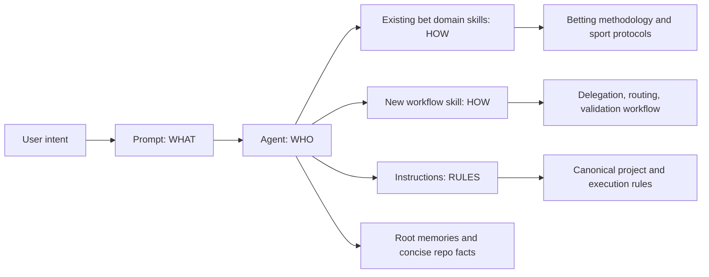

# Copilot Customization Refactor - Implementation Plan

## Task Details

| Field | Value |
| --- | --- |
| Jira ID | N/A |
| Title | Refactor the bet Copilot customization layer |
| Description | Refactor `bet/.github/` so the active Copilot customization surface follows a clear ownership model inspired by `copilot-collections`: agent = WHO, skill = HOW, prompt = WHAT, instructions = RULES. Preserve existing bet domain skills and methodology instructions as canonical sources, replace stale model references with the exact literal `GPT-5.4`, remove active `.bak` artifacts, slim `.github/memories`, and add explicit cross-reference cleanup and validation. |
| Priority | High |
| Related Research | [copilot-customization-refactor.research.md](./copilot-customization-refactor.research.md) |

## Proposed Solution

Refactor the active customization tree around a single source-of-truth map instead of shortening files in place. The main structural change is to move reusable workflow mechanics out of agents and prompts and into a small, bet-specific workflow skill package, while preserving the existing bet domain skills and methodology instructions as the canonical HOW and RULES layers for betting analysis. Active agents then become concise role definitions with tool access, collaboration boundaries, and canonical references; prompts follow an explicit disposition matrix instead of a blanket slimming rule; internal prompts become thin handoff frames unless they are intentionally retained as autonomous or audit utilities; instructions remain the only always-applied policy layer.

### Workflow Ownership Boundary

The refactor must make the workflow ownership split explicit and enforceable so duplication is removed rather than merely moved.

| Surface | Keeps After Refactor | Must Not Keep After Refactor |
| --- | --- | --- |
| `bet/.github/copilot-instructions.md` | Project constitution: immutable repo-wide betting constraints, canonical source map, exact `GPT-5.4` requirement, memory boundary, and high-level ownership statement for agent/skill/prompt/instruction roles. | Step-by-step phase order, script catalogs, delegation matrices, handoff contracts, large prompt-specific routing logic, or repeated execution boilerplate. |
| `bet/.github/instructions/agent-execution-protocol.instructions.md` | Always-applied agent execution law: shell/tool hygiene, inspect-run-think-validate-return loop, evidence bar, verdict schema, anti-patterns, boot/self-audit expectations. | Daily workflow phase order, per-step script inventories, prompt-specific inputs, domain methodology summaries, or router/delegation maps. |
| `bet/.github/skills/bet-orchestrating-workflows/` | Reusable on-demand workflow mechanics shared across prompts/agents: execution spines, delegation maps, resume/stop gates, prompt routing matrix, and shared handoff contracts. | Repo-wide constitution rules, always-applied execution law, domain betting methodology, or artifact-formatting schema tables already owned elsewhere. |

Anti-duplication rule for implementation: content only moves into the workflow skill if it is both reusable across 2 or more prompts/agents and not meant to be always-on. If the content is unique to one workflow entry point or one audit utility, it stays local to that prompt instead of being relocated into the skill.

### Prompt Disposition Matrix

The active prompt surface contains 19 files. The refactor should not slim them uniformly; each prompt gets an explicit target class and retention policy.

#### User Prompt Surface

| Prompt | Target Class | Keep Substantive Task Detail? | Target Outcome |
| --- | --- | --- | --- |
| `orchestrate-betting-day.prompt.md` | Autonomous workflow prompt | Yes | Keep the daily orchestration flow, phase gates, resume/stop semantics, and required inputs unique to full-session execution. Remove shared execution boilerplate, script catalogs, delegation tables, and repeated rule text to canonical owners. |
| `ask-betting.prompt.md` | Thin router | No | Keep intent routing, direct-answer vs delegate boundaries, and response-shape guidance. Remove large domain maps, repeated data-source catalogs, and workflow manuals that belong in skills or instructions. |
| `scan-day.prompt.md` | Autonomous workflow prompt | Yes | Keep the scan-only workflow stages and scan success gates specific to that entry point. Remove generic execution protocol and repeated source-policy text. |
| `settle-day.prompt.md` | Autonomous workflow prompt | Yes | Keep the settlement-only workflow scope, required inputs, and expected outputs specific to quick settlement. Do not let it regrow the full S0 manual from other files. |
| `audit-scraping-pipeline.prompt.md` | Engineering/audit utility | Yes | Keep the subsystem audit checklist and output format because that checklist is the utility. Remove unrelated global workflow doctrine. |
| `test-run-then-delegate.prompt.md` | Engineering/audit utility | Yes | Keep the focused experiment/test procedure and expected observations. Remove broader orchestration guidance that is already canonical elsewhere. |

#### Internal Prompt Surface

| Prompt | Target Class | Keep Substantive Task Detail? | Target Outcome |
| --- | --- | --- | --- |
| `bet-scan.prompt.md` | Thin router | No | Keep only handoff scope, required input artifacts, minimum metrics, and return contract for the scanner specialist. |
| `bet-shortlist.prompt.md` | Thin router | No | Keep shortlist-specific scope, expected artifacts, and acceptance signals only. |
| `bet-tipsters.prompt.md` | Thin router | No | Keep tipster-analysis scope, required evidence, and return contract only. |
| `bet-enrich.prompt.md` | Thin router | No | Keep enrichment-quality scope, required metrics, and gap-report contract only. |
| `bet-deep-stats.prompt.md` | Thin router | No | Keep per-candidate analytical scope, expected artifacts, and references to canonical stats/sport skills only. |
| `bet-odds-ev.prompt.md` | Thin router | No | Keep pricing-analysis scope, expected calculations, and output contract only. |
| `bet-context-upset.prompt.md` | Thin router | No | Keep context-risk scope and expected risk-output contract only. |
| `bet-gate.prompt.md` | Thin router | No | Keep final-judgment scope and verdict contract only. |
| `bet-portfolio.prompt.md` | Thin router | No | Keep portfolio-analysis scope, required outputs, and references to `bet-building-coupons` only. |
| `bet-settle.prompt.md` | Thin router | No | Keep settlement-analysis scope and output contract only. |
| `bet-db-quality.prompt.md` | Engineering/audit utility | Yes | Keep the DB census and gap-analysis checklist because it is a focused audit utility rather than a reusable router. |
| `bet-validate.prompt.md` | Engineering/audit utility | Yes | Keep the final validation checklist and reporting outputs because they are the utility itself. |
| `bet-time-sensitive.prompt.md` | Autonomous workflow prompt | Yes | Keep the late-breaking verification sequence, timing semantics, and decision matrix unique to pre-placement rechecks. Remove repeated execution law and generic memory boilerplate. |

### Canonical Formatting Owner

The formatting overlap is resolved in the plan itself:

- `bet/.github/instructions/betting-artifacts.instructions.md` becomes the canonical formatting rules owner for artifact paths, required sections, section order, Polish market descriptions, CSV headers, field conventions, versioning, and mandatory wording.
- `bet/.github/skills/bet-formatting-artifacts/SKILL.md` becomes a slim companion skill that explains when formatting guidance should be loaded and how it works with `bet-building-coupons` and `bet-settling-results`, but it no longer duplicates the full schema tables, translation dictionaries, or ledger/header rules.

This plan does not propose wholesale business-logic changes to Python scripts or the betting pipeline itself. The only code outside `bet/.github/` that should be added is a narrow validation test for `.github` artifact integrity, because the refactor needs an automated way to catch stale models, broken references, and accidental reintroduction of `.bak` files. The refactor should borrow `copilot-collections` structure and progressive-disclosure patterns without adopting `tsh-` prefixes or blindly cloning reference templates.

## Current Implementation Analysis

### Already Implemented

- Project-level customization entry point - `bet/.github/copilot-instructions.md` - central workspace policy surface already exists and can be slimmed instead of replaced.
- Execution rule source - `bet/.github/instructions/agent-execution-protocol.instructions.md` - canonical place for always-applied execution behavior already exists.
- Domain methodology - `bet/.github/instructions/analysis-methodology.instructions.md` - canonical betting-analysis rules already exist and should remain authoritative.
- Sport-specific methodology - `bet/.github/instructions/sport-analysis-protocols.instructions.md` - canonical sport protocol layer already exists and should remain authoritative.
- Mistake-driven guardrails - `bet/.github/instructions/betting-mistakes-rules.instructions.md` - existing reject-rule source already exists and should be preserved where applicable.
- Artifact-formatting surface - `bet/.github/instructions/betting-artifacts.instructions.md` and `bet/.github/skills/bet-formatting-artifacts/SKILL.md` - both exist, but ownership currently overlaps.
- Bet domain skills - `bet/.github/skills/bet-*/SKILL.md` - the repo already has reusable HOW layers for statistics, sports, odds, coupons, formatting, sources, database access, and settlement.
- Active agent set - `bet/.github/agents/bet-*.agent.md` - the role surface exists, but it is overloaded and must be slimmed rather than recreated.
- Active prompt set - `bet/.github/prompts/*.prompt.md` and `bet/.github/internal-prompts/*.prompt.md` - the trigger and handoff surfaces already exist and should be refactored in place.
- Root memory layer - `bet/memories/repo/*.md` and `bet/memories/session/` - the repo already has a proper memory surface outside `.github`, which makes aggressive slimming of `.github/memories` feasible.
- Reference customization patterns - `copilot-collections/.github/agents/tsh-copilot-engineer.agent.md`, `copilot-collections/.github/agents/tsh-copilot-orchestrator.agent.md`, and related skills - reusable separation-of-concerns and progressive-disclosure patterns already exist for comparison.

### To Be Modified

- Project constitution - `bet/.github/copilot-instructions.md` - reduce duplication, define the canonical ownership map, and standardize the active model literal.
- Orchestrator agent - `bet/.github/agents/bet-orchestrator.agent.md` - remove embedded workflow manuals, replace stale `Claude Opus 4.6 (Copilot)` with `GPT-5.4`, and keep only orchestrator identity, tools, collaboration, and references.
- Specialist agents - `bet/.github/agents/bet-scanner.agent.md`, `bet/.github/agents/bet-enricher.agent.md`, `bet/.github/agents/bet-statistician.agent.md`, `bet/.github/agents/bet-scout.agent.md`, `bet/.github/agents/bet-valuator.agent.md`, `bet/.github/agents/bet-challenger.agent.md`, `bet/.github/agents/bet-builder.agent.md`, `bet/.github/agents/bet-settler.agent.md`, `bet/.github/agents/bet-db-analyst.agent.md` - trim repeated workflow detail and retain only role-specific guidance.
- User prompts - `bet/.github/prompts/orchestrate-betting-day.prompt.md`, `bet/.github/prompts/ask-betting.prompt.md`, `bet/.github/prompts/scan-day.prompt.md`, `bet/.github/prompts/settle-day.prompt.md`, `bet/.github/prompts/audit-scraping-pipeline.prompt.md`, `bet/.github/prompts/test-run-then-delegate.prompt.md` - simplify to entry triggers and workflow intent definitions.
- Internal prompts - `bet/.github/internal-prompts/*.prompt.md` - remove repeated instruction text, memory boilerplate, and large methodology blocks; keep only handoff framing and output contracts.
- Formatting ownership surface - `bet/.github/instructions/betting-artifacts.instructions.md` remains the primary formatting-rules owner, while `bet/.github/skills/bet-formatting-artifacts/SKILL.md` is reduced to complementary activation guidance and references.
- Embedded memory surface - `bet/.github/memories/*.md` and `bet/.github/memories/repo/*.md` - collapse duplicated permanent rules and keep only concise repo-local facts if still needed.
- Cross-file references - `bet/.github/**/*.md` - update frontmatter arrays, prompt links, memory paths, and inline file references after ownership changes.
- Backup artifacts - `bet/.github/**/*.bak` - remove from the active customization tree.

### To Be Created

- Workflow skill package - `bet/.github/skills/bet-orchestrating-workflows/` - a bet-specific HOW layer for reusable orchestration, delegation, routing, and validation mechanics currently duplicated across prompts and agents.
- Supporting workflow resource files - under `bet/.github/skills/bet-orchestrating-workflows/` - on-demand reference material for execution spine, delegation matrix, or routing rules if the main `SKILL.md` would otherwise become oversized.
- Customization integrity test - `bet/tests/test_copilot_customizations.py` or equivalent targeted pytest module - automated checks for active model literals, missing references, and forbidden `.bak` artifacts.

## Open Questions

| # | Question | Answer | Status |
| --- | --- | --- | --- |
| 1 | What exact model literal should replace stale model references? | Use the exact literal `GPT-5.4`. | ✅ Resolved |
| 2 | Should the refactor adopt `tsh-` naming from `copilot-collections`? | No. Preserve existing `bet-` naming and only reuse structural patterns. | ✅ Resolved |
| 3 | Should existing bet domain skills and methodology instructions be replaced? | No. Keep them as canonical sources wherever they already own the domain workflow or rules. | ✅ Resolved |
| 4 | Should `.github/memories` be deleted entirely? | No. Slim it aggressively so it contains only concise repo facts not already owned by instructions, skills, or root memory. | ✅ Resolved |
| 5 | Should the refactor copy `copilot-collections` syntax verbatim? | No. Reuse the ownership model and progressive-disclosure pattern, but avoid gratuitous template churn when simpler edits achieve the same boundary clarity. | ✅ Resolved |
| 6 | Which file becomes the canonical owner of formatting rules? | `bet/.github/instructions/betting-artifacts.instructions.md` is the canonical formatting-rules owner; the formatting skill becomes a slim companion. | ✅ Resolved |

## Technical Context

Project conventions, coding standards, and patterns discovered during planning. Downstream agents MUST read this section instead of re-discovering the same context.

### Project Instructions

- `bet/.github/copilot-instructions.md` is the project-level policy surface for the betting workspace. After the refactor it remains the constitution only: repo-wide constraints, canonical-source ownership, exact model requirement, and memory boundary. It should stop owning workflow phase order, delegation maps, and large prompt/task manuals.
- `bet/.github/instructions/agent-execution-protocol.instructions.md` is the correct always-applied rule source for active bet agents. After the refactor it remains the execution-rules owner only: tool/shell rules, evidence standards, verdict contract, and anti-patterns. It should stop owning workflow step order, prompt-specific routing, and script inventories.
- The new workflow skill becomes the only owner of reusable on-demand workflow mechanics shared across prompts and agents: execution spines, delegation maps, prompt routing matrices, and handoff contracts. It should not absorb constitution-level rules or always-on execution law.
- `bet/.github/instructions/analysis-methodology.instructions.md` and `bet/.github/instructions/sport-analysis-protocols.instructions.md` are canonical domain rules. They already own core betting methodology and sport-specific analytical standards and should not be re-embedded elsewhere.
- `bet/.github/instructions/betting-artifacts.instructions.md` is the canonical formatting-rules owner. `bet/.github/skills/bet-formatting-artifacts/SKILL.md` should be reduced to activation-time guidance and references rather than remaining a second rulebook.
- `copilot-collections/.github/instructions/naming-conventions.instructions.md` is reference material only. It proves that naming discipline is part of the architecture, but its `tsh-` prefix rule does not apply to bet.

### Architecture & Patterns

- This is a multi-root workspace, but the implementation scope is the `bet` repository only. `copilot-collections` is a reference repo, not the modification target.
- The active customization tree is organized into `bet/.github/agents/`, `bet/.github/prompts/`, `bet/.github/internal-prompts/`, `bet/.github/instructions/`, `bet/.github/skills/`, and `bet/.github/memories/`.
- Existing naming uses the `bet-` namespace for agents, prompts, and skills. Preserve this convention; do not introduce `tsh-` prefixes or rename unrelated artifacts.
- The desired ownership split is explicit and non-negotiable for this refactor: agents define WHO, skills define HOW, prompts define WHAT, instructions define RULES. Within that model, `copilot-instructions.md` owns the constitution, `agent-execution-protocol.instructions.md` owns always-on execution law, and the new workflow skill owns reusable on-demand workflow mechanics. Memory files should contain factual recall only and must not compete with rules or workflows.
- `copilot-collections` demonstrates the correct structural pattern: role-focused agents, lightweight prompts, reusable skills, and progressive disclosure. Reuse the pattern, not necessarily the exact XML tagging or file layout when that would create avoidable churn.
- Cross-reference integrity depends on multiple surfaces moving together: YAML frontmatter fields such as `agent`, `agents`, `skills`, `instructions`, `model`, and `handoffs.prompt`, plus inline markdown references to prompts, instructions, and memories.
- `.bak` files under `bet/.github/` are effectively active noise because file search surfaces them alongside real artifacts. They must be removed from the active tree rather than left in place.

### Tech Stack

- The customization layer itself is Markdown with YAML frontmatter under `.github/`.
- The repository runtime is Python 3.11, defined in `bet/pyproject.toml`, with `pytest` available for targeted validation. Relevant dependencies include `pydantic`, `sqlalchemy`, `playwright`, and `google-genai`, but the refactor should not modify application logic that uses them.
- The repo also contains a Next.js dashboard (`dashboard/package.json` with Next 16, React 19, TypeScript, ESLint), but dashboard code is out of scope for this task.
- The required active model literal for bet customization artifacts is `GPT-5.4` exactly. The refactor should treat any active deviation from that string as a failure.
- Root memory already exists outside `.github` under `bet/memories/repo/` and `bet/memories/session/`. This matters because `.github/memories` is not the primary memory system and can therefore be reduced safely.

### Code Style & Standards

- Keep edits scoped to the customization layer. Do not plan Python business-logic changes outside `.github` unless they are narrow validation tests for the refactor.
- Preserve current bet artifact names and directory structure unless a new skill package or validation test is explicitly required by the refactor.
- Prefer concise, high-signal activation bodies. Large script catalogs, step-by-step manuals, and duplicated rule tables should move to skills or supporting resource files instead of remaining in agents or prompts.
- Avoid contradictory sources of truth. If an instruction or skill is declared canonical for a concern, agents and prompts should reference it rather than paraphrase it.
- Keep frontmatter parseable and internally consistent. The refactor touches many Markdown files, but it should not invent new frontmatter conventions unless clearly necessary.
- Preserve the project rule that Betclic should not be scraped and secrets should not be embedded into prompts or instructions while trimming content.

### Testing Patterns

- Existing fast validation entry point: `.venv/bin/python -m pytest tests/ -q --tb=no -x`.
- The refactor should add a focused test target for customization integrity, for example `.venv/bin/python -m pytest tests/test_copilot_customizations.py -q`, so validation stays narrow and does not exercise betting business logic.
- Fast text audits should complement pytest, not replace it. Useful checks include filesystem and grep-style assertions such as no active `.bak` files and no active `Claude Opus 4.6` references under `.github`.
- No dedicated `.github` artifact validator was found in the current repo, so the new validation should be filesystem-based and independent of DB state.
- Because the change surface is Markdown-heavy, review quality depends on both automated invariant checks and a final customization-focused artifact review.

### Database Patterns

- No schema, migration, or DB access changes are in scope for this task.
- Several customization artifacts currently describe DB-first pipeline behavior and table names. Those references remain valid domain context, but the refactor should ensure that such details live in canonical skills and instructions rather than being repeated in prompts and agents.
- Validation for this refactor should not require a live DB, live pipeline execution, or bookmaker access.

### Additional Context

- `bet/.github/agents/bet-orchestrator.agent.md` still contains an active `Claude Opus 4.6 (Copilot)` model field, while the other active specialist agents already use `GPT-5.4`.
- The active `.bak` artifacts currently present are `bet/.github/agents/bet-orchestrator.agent.md.bak`, `bet/.github/prompts/orchestrate-betting-day.prompt.md.bak`, and `bet/.github/instructions/agent-execution-protocol.instructions.md.bak`.
- Current duplication is concentrated in four places: the orchestrator agent, the orchestrate/ask prompts, several specialist agents, and the internal prompt set. The same execution rules, memory instructions, and methodology summaries appear across all four.
- The active prompt surface is 19 files total: 6 top-level prompts and 13 internal prompts. They do not all serve the same role, which is why the refactor needs a prompt disposition matrix instead of a blanket slimming rule.
- Agent frontmatter already uses `handoffs:` in multiple active agent files, so handoff references need to be part of the integrity test rather than treated as incidental prose.
- `.github/memories/repo/` currently contains only concise local notes (`project-structure.md`, `workflow.md`), while root `/memories/repo/` is the primary long-lived memory system.
- Grep across active `.github` artifacts shows many prose memory-path references, including repeated references to `/memories/repo/pipeline-lessons-learned.md`, which is not part of the current root repo-memory set. The refactor must either replace these references with real files or remove them; the integrity test should catch stale prose paths.
- The refactor should explicitly call out cross-reference cleanup because many files mention other files by name in prose, not only in frontmatter. Those inline references can silently drift if the cleanup is incomplete.

## Implementation Plan

### Phase 1: Re-establish Ownership Boundaries

#### Task 1.1 - [MODIFY] Reframe `copilot-instructions.md` as the customization constitution

**Description**: Update `bet/.github/copilot-instructions.md` so it defines the project-level customization contract, canonical source map, exact model requirement, and non-negotiable conventions without duplicating workflow manuals already owned elsewhere.

**Definition of Done**:

- [x] `bet/.github/copilot-instructions.md` explicitly documents the ownership split: agent = WHO, skill = HOW, prompt = WHAT, instructions = RULES.
- [x] The file preserves repo-wide bet-specific constraints and canonical source references while removing duplicated phase order, delegation maps, script catalogs, and prompt-specific routing content.
- [x] The file standardizes the active model requirement to the exact literal `GPT-5.4` and states the intended boundary for `.github/memories`.

#### Task 1.2 - [MODIFY] Re-scope `agent-execution-protocol.instructions.md` to execution law only

**Description**: Update `bet/.github/instructions/agent-execution-protocol.instructions.md` so it remains the single always-applied execution-rules owner for active agents, while explicitly shedding workflow sequencing and prompt-specific operational content.

**Definition of Done**:

- [x] The file keeps shell/tool rules, inspect-run-think-validate-return behavior, verdict/output contract, evidence thresholds, boot/self-audit steps, and anti-patterns.
- [x] The file no longer owns workflow phase order, script inventory tables, prompt routing logic, or handoff-specific operational details that belong in prompts or the workflow skill.
- [x] Agents and prompts reference this instruction for execution behavior instead of paraphrasing it.

#### Task 1.3 - [CREATE] Add a reusable bet workflow skill package for orchestration mechanics

**Description**: Create a new skill package under `bet/.github/skills/` that owns reusable workflow HOW content currently duplicated across the orchestrator agent, user prompts, and internal prompts. This skill should cover delegation mechanics, execution-spine references, routing logic, and validation flow, while deferring betting methodology back to existing canonical domain skills and instructions.

**Definition of Done**:

- [x] A new bet-namespaced skill package exists and is scoped to reusable workflow mechanics rather than betting-domain rules.
- [x] The skill owns only shared, on-demand content: execution spines, delegation matrices, routing rules, resume/stop gates, and shared handoff contracts.
- [x] The skill does not restate constitution-level rules from `copilot-instructions.md`, always-applied execution rules from `agent-execution-protocol.instructions.md`, or canonical domain rules from existing bet skills/instructions.
- [x] The skill body stays concise enough for activation-tier use, with supporting resource files created if needed for progressive disclosure.
- [x] Single-prompt-only task detail remains in the prompt itself rather than being blindly relocated into the workflow skill.

### Phase 2: Refactor the Agent Layer Around WHO

#### Task 2.1 - [MODIFY] Slim the orchestrator agent to role, tool, and collaboration boundaries

**Description**: Refactor `bet/.github/agents/bet-orchestrator.agent.md` so it remains the authority for orchestration identity and collaboration, but stops embedding the full execution playbook, large script tables, and repeated prompt content.

**Definition of Done**:

- [x] `bet-orchestrator.agent.md` uses `GPT-5.4` exactly.
- [x] The file retains orchestrator responsibilities, delegation boundaries, tool access, and references to canonical skills and instructions.
- [x] Full workflow detail, step-by-step execution spine, and repeated domain explanations are moved out of the agent body.

#### Task 2.2 - [MODIFY] Slim specialist agents to role-specific guidance only

**Description**: Apply the same separation-of-concerns cleanup across the active specialist agents so each one describes the specialist, required tools, domain skills, and collaboration expectations without carrying large workflow manuals or repeated memory instructions.

**Definition of Done**:

- [x] Each active specialist agent retains only role-specific guidance, tool configuration, collaboration rules, and canonical references.
- [x] Repeated script-by-script instructions, duplicated execution protocol text, and large methodology blocks are removed from specialist agent bodies.
- [x] The specialist agents still load the correct existing bet domain skills and instructions after the cleanup.

### Phase 3: Refactor the Prompt Layer Around WHAT

#### Task 3.1 - [MODIFY] Apply the disposition matrix to top-level user prompts

**Description**: Refactor active user prompts according to the explicit disposition matrix, preserving substantive task detail only in prompts that are intentionally autonomous workflows or engineering/audit utilities.

**Definition of Done**:

- [x] `orchestrate-betting-day.prompt.md`, `scan-day.prompt.md`, and `settle-day.prompt.md` are treated as autonomous workflow prompts and keep only the workflow-specific sequencing and gates unique to their entry points.
- [x] `ask-betting.prompt.md` becomes a true thin router with only routing boundaries, required inputs, and synthesis rules.
- [x] `audit-scraping-pipeline.prompt.md` and `test-run-then-delegate.prompt.md` remain engineering/audit utilities and keep only the checklists or experiment details that make them useful.
- [x] User prompts no longer duplicate the execution protocol, script catalogs, or canonical domain/memory boilerplate already owned elsewhere.
- [x] All `agent:` frontmatter references remain valid after the refactor.

#### Task 3.2 - [MODIFY] Apply the disposition matrix to internal prompts

**Description**: Refactor `bet/.github/internal-prompts/*.prompt.md` according to the explicit disposition matrix so thin-router prompts become real handoff frames, while the small set of utility/autonomous internal prompts retain only the task detail unique to them.

**Definition of Done**:

- [x] Thin-router internal prompts (`bet-scan`, `bet-shortlist`, `bet-tipsters`, `bet-enrich`, `bet-deep-stats`, `bet-odds-ev`, `bet-context-upset`, `bet-gate`, `bet-portfolio`, `bet-settle`) keep only handoff scope, required artifacts, minimum evidence expectations, and return contract.
- [x] Engineering/audit utility internal prompts (`bet-db-quality`, `bet-validate`) keep the substantive audit/validation checklists unique to those tasks but remove repeated execution-law text and generic memory boilerplate.
- [x] `bet-time-sensitive.prompt.md` remains an autonomous workflow prompt for late-breaking verification and keeps only the timing-sensitive sequence unique to that workflow.
- [x] Internal prompts no longer duplicate `agent-execution-protocol.instructions.md` or large sections of betting methodology.

### Phase 4: Normalize Rule Ownership and Memory Scope

#### Task 4.1 - [MODIFY] Consolidate canonical rule ownership across execution and domain rule surfaces

**Description**: Update the instruction and skill surfaces so each concern has one explicit owner. Preserve domain methodology instructions and bet domain skills as canonical, and keep execution behavior owned only by the execution protocol rather than by prompts or agents.

**Definition of Done**:

- [x] `agent-execution-protocol.instructions.md` remains the primary execution-rules owner and is no longer shadowed by agent or prompt copies.
- [x] `analysis-methodology.instructions.md`, `sport-analysis-protocols.instructions.md`, and the existing bet domain skills remain canonical domain sources.

#### Task 4.2 - [MODIFY] Resolve formatting ownership in favor of the formatting instruction

**Description**: Normalize the formatting surface so `betting-artifacts.instructions.md` is the declared canonical formatting-rules owner and `bet-formatting-artifacts/SKILL.md` becomes a slim companion skill rather than a second rules document.

**Definition of Done**:

- [x] `bet/.github/instructions/betting-artifacts.instructions.md` is the explicit primary owner for artifact paths, required sections, section order, Polish descriptions, CSV headers, field conventions, and versioning rules.
- [x] `bet/.github/skills/bet-formatting-artifacts/SKILL.md` is reduced to activation guidance, collaboration pointers, and concise examples that reference the canonical instruction instead of restating it.
- [x] Full translation tables, ledger/header definitions, and section-order rules are no longer duplicated in the skill body.

#### Task 4.3 - [MODIFY] Slim `.github/memories` to concise repo facts only

**Description**: Refactor or remove `.github/memories/*.md` and `.github/memories/repo/*.md` content so the active customization tree no longer stores duplicated permanent rules already owned by instructions, skills, or root memory.

**Definition of Done**:

- [x] `.github/memories` contains only concise repo-local facts still needed by active customization artifacts.
- [x] Duplicated rule documents and workflow manuals are deleted or collapsed into short factual notes.
- [x] Remaining memory references in active prompts and agents resolve to intentional files and no longer compete with root memory.

### Phase 5: Cross-reference Cleanup and Stale Artifact Removal

#### Task 5.1 - [MODIFY] Remove active backup artifacts and stale model references

**Description**: Clean the active `.github` tree so stale backup files and stale model references stop polluting search, edits, and activation behavior.

**Definition of Done**:

- [x] No `.bak` files remain under `bet/.github/`.
- [x] No active `Claude Opus 4.6` references remain under `bet/.github/`.
- [x] All active agent `model` fields use the exact literal `GPT-5.4`.

#### Task 5.2 - [MODIFY] Repair frontmatter and inline cross references after the refactor

**Description**: Perform an explicit cross-reference pass across the entire active customization tree so that frontmatter arrays, handoff references, memory paths, and inline file mentions all match the refactored structure.

**Definition of Done**:

- [x] All active `agent`, `agents`, `skills`, `instructions`, and `handoffs.prompt` references point to real artifacts.
- [x] Inline markdown references in prompts, agents, and instructions do not point to deleted files, stale `.bak` files, or removed memory documents.
- [x] Search-based verification shows no stale references to superseded artifacts inside the active `.github` tree.

### Phase 6: Add Focused Validation for the Customization Layer

#### Task 6.1 - [CREATE] Add automated artifact-integrity tests for `.github`

**Description**: Create a narrow pytest module that validates the key invariants of the active customization tree using filesystem and regex-based checks, without touching betting business logic or live data.

**Definition of Done**:

- [x] The new test module asserts that no active `.bak` files exist anywhere under `bet/.github/`.
- [x] The new test module regex-checks active agent frontmatter so every `model:` literal is exactly `GPT-5.4` and no stale active model literals remain.
- [x] The new test module extracts `agent:` references from prompt files and validates that each referenced `bet-*.agent.md` file exists.
- [x] The new test module extracts `agents:` arrays and validates that every listed agent exists as an active agent file.
- [x] The new test module extracts `instructions:` references and validates that each referenced instruction file exists.
- [x] The new test module extracts `skills:` references and validates that each referenced workspace-local skill resolves to `SKILL.md`.
- [x] The new test module extracts `handoffs:` references from agent frontmatter and validates that referenced prompt files exist.
- [x] The new test module scans prose memory-path references matching `/memories/repo/`, `/memories/session/`, and `.github/memories/` and fails on stale paths after the memory cleanup.
- [x] The test remains read-only and independent of DB state, live scripts, or betting artifacts outside the customization tree.

#### Task 6.2 - [REUSE] Run focused validation and customization review after refactoring

**Description**: Validate the refactor with the narrow pytest target and fast text audits, then run a customization-focused review pass so separation-of-concerns regressions are caught before the work is considered complete.

**Definition of Done**:

- [x] The targeted pytest module for customization integrity passes.
- [x] Fast text audits confirm no active `.bak` files and no active `Claude Opus 4.6` references remain under `bet/.github/`.
- [x] A final customization artifact review is completed with findings addressed or explicitly documented.

## Security Considerations

- Preserve existing constraints around not scraping Betclic and not embedding secrets while trimming or relocating instructions.
- Remove stale backup artifacts because they can preserve obsolete tool policies, model declarations, or operational guidance that conflicts with the active tree.
- Keep validation filesystem-based and read-only with respect to betting data; the refactor should not require live pipeline execution or bookmaker access.
- Avoid creating new prompt or instruction content that broadens tool access beyond what each agent role actually needs.

## Quality Assurance

Acceptance criteria checklist to verify the implementation meets the defined requirements:

- [x] The active customization surface in `bet/.github/` follows a clear ownership split: agents = WHO, skills = HOW, prompts = WHAT, instructions = RULES.
- [x] The workflow ownership boundary is explicit and enforced: `copilot-instructions.md` owns the constitution, `agent-execution-protocol.instructions.md` owns always-on execution law, and the workflow skill owns reusable on-demand workflow mechanics.
- [x] The prompt surface follows the explicit disposition matrix, with substantive detail retained only in designated autonomous workflow prompts and engineering/audit utilities.
- [x] Existing bet domain skills and methodology instructions remain the canonical domain sources after the refactor.
- [x] `bet/.github/instructions/betting-artifacts.instructions.md` is the canonical formatting owner and the formatting skill no longer duplicates its full rule tables.
- [x] All active agent model declarations use the exact literal `GPT-5.4`, and active `.bak` artifacts are removed from `bet/.github/`.
- [x] `.github/memories` no longer duplicates permanent rules already owned by instructions, skills, or root memory.
- [x] Automated customization-integrity validation covers filesystem/regex invariants for `agent`, `agents`, `instructions`, `skills`, `handoffs`, exact model literals, forbidden `.bak` files, and prose memory-path references.

## Improvements (Out of Scope)

- Full migration of all bet customization artifacts to the exact XML-heavy syntax used in `copilot-collections`.
- CI wiring changes beyond ensuring the new targeted pytest module can be run locally and by existing test runners.
- Rewriting betting Python scripts, database models, or coupon logic beyond any narrow validation code needed for this refactor.
- Removing `.github/memories` entirely if the slimmed factual layer remains useful after the refactor.

## Changelog

| Date | Change Description |
| --- | --- |
| 2026-05-26 | Initial plan created |
| 2026-05-26 | Revised plan with explicit workflow ownership boundary, prompt disposition matrix, canonical formatting owner, and exact integrity-test invariants |
| 2026-05-26 11:55 | Implemented constitution/workflow split, added bet-orchestrating-workflows skill, removed active .bak artifacts, slimmed .github/memories, and cleaned stale memory/model references |
| 2026-05-26 12:48 | Added tests/test_copilot_customizations.py and validated .github integrity invariants with targeted pytest and text audits |
| 2026-05-26 13:34 | Populated bet-orchestrating-workflows with execution/routing/gate/handoff resources, slimmed ask-betting and orchestrate-betting-day to thin routers, and extended customization integrity coverage for session-memory paths, block-YAML agent arrays, and handoff prompt references |
| 2026-05-26 13:45 | Slimmed specialist agents and the full internal prompt surface to role/handoff-only definitions, then revalidated the .github integrity suite |
| 2026-05-26 14:09 | Fixed prompt routing/frontmatter regressions, restored checklist depth for audit utilities, extended integrity tests for workflow-resource body refs, and closed the final review with no blocking findings |