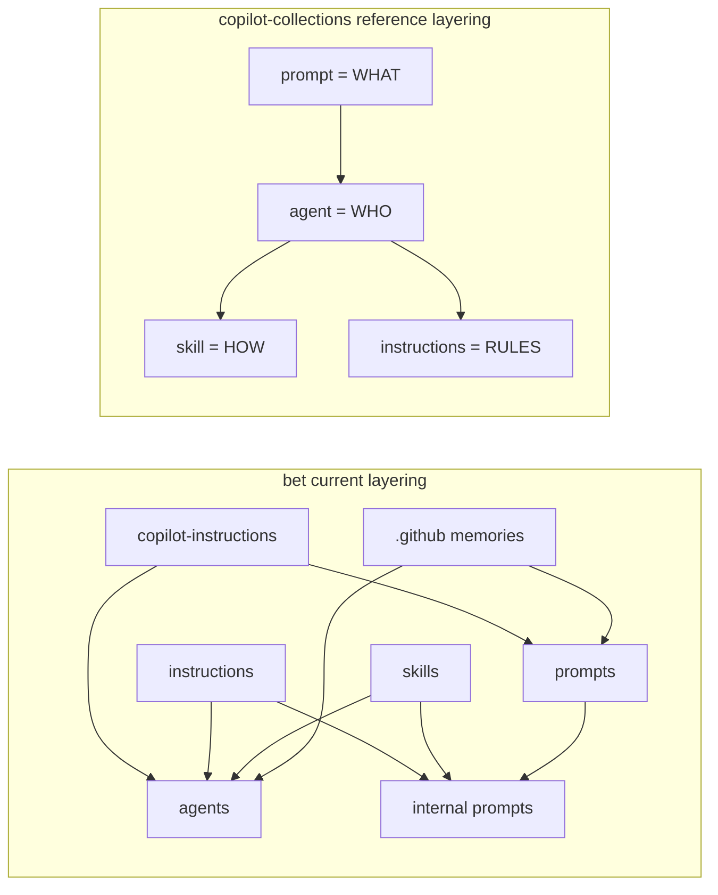

# Copilot Customization Refactor - Analysis Result

## Task Details

| Field | Value |
|---|---|
| Jira ID | N/A |
| Title | Research refactor of the bet Copilot customization layer |
| Description | Analyze the Copilot customization layer in `.github/` for the bet workspace, compare it with patterns from `copilot-collections`, determine why the current bet customizations are too large and poorly organized, define what should change across agents, prompts, instructions, skills, memories, and related artifacts, and capture the explicit requirement to replace remaining `Claude Opus 4.6` references with `GPT-5.4 Xhigh`. |
| Priority | High |
| Reporter | User request |
| Created Date | 2026-05-26 |
| Due Date | N/A |
| Labels | copilot-customization, research, refactor |
| Estimated Effort | N/A |

## Business Impact

The bet customization layer is the control plane for the betting workflow. When agents, prompts, instructions, skills, and memory files all repeat the same rules in slightly different ways, the model spends context budget re-reading overlap instead of following a clear responsibility boundary. A refactor matters because it should improve role clarity, reduce instruction collisions, lower token pressure, make agent delegation more reliable, and align model routing with the current GPT-5.4 baseline instead of leaving stale Claude-specific assignments in the active tree.

## Gathered Information

### Knowledge Base & Task Management Tools

- No Jira issue, Confluence page, Figma file, or PDF source was provided for this task.
- The primary workflow source for this research was `copilot-collections/.github/internal-prompts/tsh-research.prompt.md`.
- The research structure was taken from `copilot-collections/.github/skills/tsh-task-analysing/research.example.md`.
- Codebase-analysis heuristics were taken from `copilot-collections/.github/skills/tsh-task-analysing/SKILL.md` and `copilot-collections/.github/skills/tsh-codebase-analysing/SKILL.md`.
- No Atlassian lookup was performed because no task IDs, page IDs, or links were provided.

### Codebase

#### Current-state comparison

| Area | bet | copilot-collections | Research takeaway |
|---|---|---|---|
| Agents | 10 active `bet-*.agent.md` files plus a live `.bak` copy of the orchestrator | A larger agent set, but each agent is more role-focused | bet has fewer agents, but each one carries far more mixed responsibility per file |
| User prompts | 7 prompts, including large workflow prompts such as `orchestrate-betting-day.prompt.md` and `ask-betting.prompt.md` | Multiple short workflow prompts that mostly route to the appropriate agent | bet prompts often act like operating manuals rather than triggers |
| Internal prompts | 13 `bet-*.prompt.md` handoff prompts | A comparable internal-prompt surface | bet internal prompts are large and frequently restate agent and instruction content |
| Instructions | 6 `.instructions.md` files plus project-level `copilot-instructions.md` | 1 `.instructions.md` file in `.github/`, with stronger reliance on skills and agent boundaries | bet uses instructions heavily, but the same rules also appear elsewhere |
| Skills | 8 domain skills already exist for statistics, sport protocols, odds, coupons, formatting, sources, DB, settlement | Large skill catalog with explicit separation of concerns and progressive disclosure guidance | bet already has the right domain skill categories, so much of the refactor is consolidation rather than invention |
| Memories | `.github/memories/` plus `.github/memories/repo/` exist inside the customization tree | No equivalent `.github/memories/` layer in the reference repo | bet keeps additional rule text inside the active `.github` tree, increasing duplication and search noise |
| Backup artifacts | 3 `.bak` files live inside `.github/agents`, `.github/prompts`, and `.github/instructions` | No live backup artifacts in the scanned `.github` tree | old copies remain visible to search and to future edits, which raises the chance of stale references surviving |
| Model declarations | Most specialist bet agents use `GPT-5.4`, but the active orchestrator still uses `Claude Opus 4.6 (Copilot)` | Collections moved core Copilot engineering orchestration from `Claude Opus 4.6` to `GPT-5.4` | bet still has stale model assignments and should standardize them deliberately |

#### Concrete pain points in bet

- The active orchestrator agent is overloaded. `bet-orchestrator.agent.md` includes role definition, DB architecture, script catalog, delegation matrix, presentation rules, intent routing, and self-audit rules in one activation body.
- The main orchestration prompt is also overloaded. `orchestrate-betting-day.prompt.md` extends past line 437 and embeds a full step-by-step operating procedure, command catalog, gates, prompt-injection payload format for subagents, and failure retrospectives.
- Specialist agents are too large for their role. `bet-statistician.agent.md` extends past line 478 and mixes persona, tool rules, DB reference material, statistical formulas, runtime anomaly handling, and output QA into one file.
- Internal prompts duplicate the same responsibilities again. `bet-deep-stats.prompt.md` extends past line 274 while restating rules that already exist in the specialist agent, in `agent-execution-protocol.instructions.md`, in project-level instructions, and in the domain skills.
- Execution behavior is repeated in too many places. The same ideas appear across `copilot-instructions.md`, `agent-execution-protocol.instructions.md`, orchestrator prompts, specialist agents, internal prompts, and `.github/memories/` files: `sequentialthinking`, `runSubagent`, script-output parsing, analysis-only behavior, and anti-script-runner language.
- Domain methodology is already present in skills and instructions, but agents and prompts still re-embed it. For example, `bet-analyzing-statistics/SKILL.md`, `analysis-methodology.instructions.md`, and `sport-analysis-protocols.instructions.md` already hold the statistical methodology, yet `bet-statistician.agent.md` and `bet-deep-stats.prompt.md` repeat large portions of it.
- Formatting guidance is also duplicated. `bet-formatting-artifacts/SKILL.md` and `betting-artifacts.instructions.md` both define artifact structure, Polish market descriptions, versioning, and output formatting expectations.
- `.github/memories/core-rules.md` and `.github/memories/repo/workflow.md` restate permanent rules that already exist in project instructions and user memory. This makes it unclear which layer is authoritative and increases context competition.
- `ask-betting.prompt.md` behaves more like a small routing system specification than a prompt trigger. It defines tool requirements, execution protocol, delegation syntax, agent maps, and data-source priority tables instead of staying focused on prompt intent.
- Obsolete files remain in the live customization tree. The `.bak` files preserve superseded content, including stale model references, and are likely to pollute searches and future comparisons.

#### Conventions from copilot-collections worth reusing

- Strong separation of concerns. `tsh-copilot-engineer.agent.md` explicitly defines: agent = WHO, skill = HOW, prompt = WHAT, instructions = RULES. This should become the primary design lens for the bet refactor.
- Orchestrator discipline. `tsh-copilot-orchestrator.agent.md` keeps the orchestrator centered on decomposition, delegation, validation, and synthesis instead of embedding the full execution playbook.
- Progressive disclosure. `tsh-creating-skills/SKILL.md` explicitly recommends keeping activation bodies concise and splitting large bodies into referenced resources when they approach 500 lines.
- Review criteria for customization quality already exist. `tsh-copilot-artifact-reviewer.agent.md` gives a usable checklist for token efficiency, structural correctness, separation of concerns, and tool appropriateness.
- Prompts stay closer to workflow entry points. `tsh-research.prompt.md` and `tsh-implement.prompt.md` are focused on what workflow to trigger and what skills/templates to load, not on restating the whole system design.
- Naming and cross-reference discipline is explicit. `naming-conventions.instructions.md` shows how the reference repo uses file naming as part of the system contract. bet does not need the `tsh-` prefix, but it should preserve equally strict naming consistency for `bet-` artifacts.
- Model routing changes are documented at the product level. The `copilot-collections` changelog shows deliberate migration away from `Claude Opus 4.6` toward `GPT-5.4` for orchestration and Copilot-engineering roles, which is the closest relevant model-routing precedent found during this research.

#### Scope boundaries

- In scope for the refactor research: `bet/.github/**`, comparison against `copilot-collections/.github/**`, and the project-level instruction surfaces already attached to this workspace.
- In scope conceptually: agents, prompts, internal prompts, instructions, skills, `.github/memories`, backup artifacts, naming and model conventions, and cross-reference hygiene.
- Out of scope for this research: rewriting betting business logic in Python scripts, changing DB schema, changing coupon algorithms, or designing the exact migration sequence.
- Out of scope for this research: adopting the `tsh-` namespace. The comparable reusable convention is structural discipline, not the literal prefix.

#### Risks to carry into planning

- A refactor that only shortens files without reassigning ownership will preserve the same ambiguity under smaller filenames.
- If duplicated rule text is removed without naming a single canonical source for each concern, the next iteration will drift again.
- If `.bak` files stay in the active `.github` tree, search results and future edits will continue to surface stale content.
- If model declarations are standardized inconsistently across agents and prompts, orchestration behavior will remain unpredictable.
- If the refactor changes filenames or artifact boundaries without a cross-reference pass, prompts, handoffs, and documentation links will silently break.

#### Implementation goals that planning should target

- Reduce activation-tier size in bet customizations by moving workflow detail and reference material out of agents and prompts when a skill or instruction already owns it.
- Make each artifact type own one concern clearly:
  - Agents: role, responsibilities, tool access, delegation boundaries.
  - Skills: domain workflows, checklists, reusable methodology, templates.
  - Prompts: workflow entry points and routing.
  - Instructions: project rules and always-applied conventions.
- Keep `analysis-methodology.instructions.md`, `sport-analysis-protocols.instructions.md`, and the existing `bet-*` skills as canonical domain sources, then remove duplicated copies from agents and prompts.
- Simplify the orchestrator so it coordinates rather than tries to be the full execution manual.
- Simplify specialist agents so they describe the specialist, not the full sport or math playbook.
- Tighten internal prompts so they supply handoff context and task framing rather than re-teaching the entire specialization.
- Decide whether `.github/memories/` is still needed inside the active customization tree; if retained, restrict it to concise, factual repo memory rather than rule duplication.
- Remove or archive `.bak` artifacts outside the active customization surface.
- Standardize model declarations and explicitly replace remaining `Claude Opus 4.6` references in bet with `GPT-5.4 Xhigh` per the user requirement, while confirming the exact literal string to use.

### Relevant Links

Any relevant links to documentation, designs, or other resources:
- `bet/.github/copilot-instructions.md` - project-level policy surface for the betting workspace
- `bet/.github/agents/bet-orchestrator.agent.md` - overloaded orchestration agent and remaining active `Claude Opus 4.6` reference
- `bet/.github/prompts/orchestrate-betting-day.prompt.md` - oversized workflow prompt that duplicates orchestration behavior
- `bet/.github/prompts/ask-betting.prompt.md` - router prompt that also embeds execution-system behavior
- `bet/.github/instructions/agent-execution-protocol.instructions.md` - canonical execution rules that are duplicated elsewhere
- `bet/.github/instructions/analysis-methodology.instructions.md` - canonical methodology layer for betting analysis
- `bet/.github/instructions/sport-analysis-protocols.instructions.md` - canonical sport-specific reference layer
- `bet/.github/instructions/betting-artifacts.instructions.md` - formatting and artifact-output rules that overlap with the formatting skill
- `bet/.github/skills/bet-analyzing-statistics/SKILL.md` - existing domain workflow that should remain the canonical HOW layer for S3
- `bet/.github/skills/bet-building-coupons/SKILL.md` - existing coupon workflow that should remain the canonical HOW layer for S8
- `bet/.github/skills/bet-formatting-artifacts/SKILL.md` - existing artifact-formatting workflow overlapping with instruction content
- `bet/.github/memories/core-rules.md` - duplicated permanent-rule memory inside the active `.github` surface
- `bet/.github/memories/repo/workflow.md` - duplicated workflow memory inside the active `.github` surface
- `copilot-collections/.github/agents/tsh-copilot-orchestrator.agent.md` - reference orchestrator pattern centered on delegation and context economy
- `copilot-collections/.github/agents/tsh-copilot-engineer.agent.md` - reference definition of customization-layer separation of concerns
- `copilot-collections/.github/agents/tsh-copilot-artifact-reviewer.agent.md` - reusable review criteria for artifact quality
- `copilot-collections/.github/internal-prompts/tsh-research.prompt.md` - workflow source used for this research
- `copilot-collections/.github/skills/tsh-creating-skills/SKILL.md` - progressive disclosure and activation-size guidance
- `copilot-collections/.github/instructions/naming-conventions.instructions.md` - naming-discipline reference
- `copilot-collections/CHANGELOG.md` - evidence of deliberate migration from `Claude Opus 4.6` to `GPT-5.4` in comparable Copilot customization roles

### Relevant Charts & Diagrams

## Current Implementation Status

### Existing Components

List of existing components, functions, or features related to this task:
- `bet/.github/copilot-instructions.md` - project-level instruction surface - needs modification
- `bet/.github/agents/bet-orchestrator.agent.md` - orchestration agent - needs modification
- `bet/.github/agents/bet-statistician.agent.md` - representative oversized specialist agent - needs modification
- `bet/.github/agents/bet-scanner.agent.md` and other `bet-*.agent.md` files - specialist agent set - needs modification
- `bet/.github/prompts/orchestrate-betting-day.prompt.md` - orchestration trigger prompt - needs modification
- `bet/.github/prompts/ask-betting.prompt.md` - question-routing prompt - needs modification
- `bet/.github/internal-prompts/*.prompt.md` - per-step handoff prompts - needs modification
- `bet/.github/instructions/agent-execution-protocol.instructions.md` - canonical execution rule source - can be reused
- `bet/.github/instructions/analysis-methodology.instructions.md` - canonical analysis methodology - can be reused
- `bet/.github/instructions/sport-analysis-protocols.instructions.md` - canonical sport reference - can be reused
- `bet/.github/instructions/betting-artifacts.instructions.md` - artifact-formatting instruction layer - needs modification
- `bet/.github/skills/bet-analyzing-statistics/` - deep-statistics domain skill - can be reused
- `bet/.github/skills/bet-building-coupons/` - coupon-construction domain skill - can be reused
- `bet/.github/skills/bet-formatting-artifacts/` - artifact-formatting skill - can be reused
- `bet/.github/memories/` - embedded rule and workflow memory - needs modification
- `bet/.github/**/*.bak` - backup artifacts in active tree - needs modification
- `copilot-collections/.github/agents/tsh-copilot-orchestrator.agent.md` - reference orchestration pattern - can be reused
- `copilot-collections/.github/agents/tsh-copilot-engineer.agent.md` - reference separation-of-concerns pattern - can be reused
- `copilot-collections/.github/agents/tsh-copilot-artifact-reviewer.agent.md` - reference review criteria - can be reused
- `copilot-collections/.github/skills/tsh-creating-skills/` - reference progressive-disclosure guidance - can be reused

### Key Files and Directories

- `.github/agents/` - primary source of role-definition overload in bet
- `.github/prompts/` - main user-facing workflows; several prompts are carrying too much operational detail
- `.github/internal-prompts/` - handoff layer that currently duplicates both agent and instruction content
- `.github/instructions/` - canonical rule sources that should be preserved but slimmed to true always-on rules
- `.github/skills/` - already-valuable domain workflow layer that should become the primary reusable HOW surface
- `.github/memories/` - repo-embedded memory surface that currently duplicates rule content
- `.github/copilot-instructions.md` - project-level instruction entry point and likely highest-priority policy layer
- `copilot-collections/.github/agents/` - reference set for concise role-focused agent structure
- `copilot-collections/.github/prompts/` - reference set for lighter workflow-entry prompts
- `copilot-collections/.github/internal-prompts/` - reference set for targeted internal workflow prompts
- `copilot-collections/.github/skills/` - reference set for reusable workflow and template storage
- `copilot-collections/.github/instructions/` - reference set for narrow instruction ownership

## Gap Analysis

All missing information and gaps in task description, together with provided answers.

### Question 1
#### What does "match the collections style" mean for the target model string?
The closest collections precedent found in the scanned repository is a migration from `Claude Opus 4.6` to `GPT-5.4` for orchestration and Copilot-engineering roles, documented in `copilot-collections/CHANGELOG.md`. The literal string `GPT-5.4 Xhigh` was not found in the scanned `copilot-collections/.github/**` files. This means planning can safely assume that stale Claude references must be removed, but the exact frontmatter literal for the new model should be confirmed before implementation.

### Question 2
#### Should backup and duplicated memory artifacts remain inside the active `.github` tree after the refactor?
This is currently unresolved. The active bet customization tree includes `.bak` files and `.github/memories/` content that duplicate rules already stored in instructions and external memory surfaces. Planning should treat cleanup or relocation of these artifacts as an explicit decision, because keeping them in place will continue to create search noise, stale references, and unclear ownership of the source of truth.