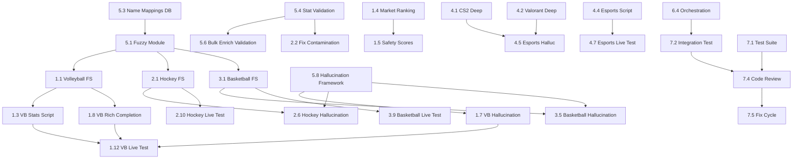

# Multi-Sport Pipeline Deep Fix — Implementation Plan

## Summary

Fix enrichment pipelines for 5 sports (volleyball, hockey, basketball, CS2, valorant) following the proven tennis fix pattern. The core pathology is identical across underperforming sports: fake L10 data (n=1 entries), missing dedicated enrichment scripts, no per-match stat arrays, and broken gate pass rates.

**Reference:** Tennis fix (2026-05-26) delivered Flashscore embedded feed rewrite, Sackmann per-match stats, Elo ratings, H2H warmup, DB migration, market ranking fix, safety score integration, and orchestration wiring — all live-tested.

## Priority Matrix

| Sport | Severity | Fix Priority | ROI | Volume |
|-------|----------|-------------|-----|--------|
| 🏐 Volleyball | CRITICAL | P1 | HIGH (45%→65% target) | 410 fix/30d |
| 🏒 Hockey | MODERATE | P2 | HIGH (58% already, coverage gap) | 488 fix/30d |
| 🏀 Basketball | GOOD | P3 | MEDIUM (55%, just needs coverage) | 3,965 fix/30d |
| 🎮 CS2 | LIMITED | P4 | MEDIUM (0% hit rate, needs map data) | 28 fix/30d |
| 🎮 Valorant | LIMITED | P5 | LOW (limited markets on Betclic) | 34 fix/30d |
| 🎮 Dota 2 | MINIMAL | P6 (SKIP) | LOW (16 fixtures/month) | 16 fix/30d |

## Technical Context

### Proven Pattern (Tennis Fix — COMPLETE checklist, ALL items must be replicated)
1. Dedicated enrichment script per sport → stores REAL per-match L10 arrays
2. Flashscore embedded feed (`~AA÷` format) → game-level totals per match
3. API client per-match extraction → detailed stats (serve%, etc.)
4. Fuzzy name matching (rapidfuzz) between sources
5. Market ranking weights adjusted per sport
6. Safety score sport-specific adjustments
7. Orchestration step wired into pipeline (S2.x)
8. Agent instructions updated (enricher, statistician, orchestrator)
9. **`deep_stats_report.py`** — per-sport hallucination risk detection + surface/context block
10. **`_helpers/{sport}_rich_completion.py`** — rich completion helper with sport-specific logic
11. **`build_shortlist.py`** — COMP_TIER_KEYWORDS updated for sport's leagues/tournaments
12. **`analysis-methodology.instructions.md`** — hallucination prevention rule per sport
13. **Unit tests** — `tests/test_{sport}_rich_completion.py` + enrichment integration tests
14. **`flashscore_bulk_enrich.py`** — sport-specific validation (value ranges, stat key filtering)
15. **Gate checker** — data_tier + comp_score propagation for per-sport gate awareness
16. **Discovery coordinator** — team name cache optimization (performance)

### Key Infrastructure
- Flashscore enricher already has volleyball (id=12), hockey (id=4), basketball (id=3) in `SPORT_IDS_FS`
- API-Sports clients exist for volleyball, hockey, basketball (api-sports.io, shared key)
- Sofascore client exists (multi-sport)
- `data_enrichment_agent.py` is the generic agent producing fake n=1 data → needs bypass for dedicated scripts
- Gate checker uses `best_safety_score` — needs per-sport threshold awareness

### Database Schema
```sql
team_form: id, team_id, sport_id, stat_key, l10_values (JSON array), l5_values, 
           l10_avg, l5_avg, h2h_values, h2h_opponent_id, trend, updated_at, source
```

---

## Phase 1: Volleyball Deep Fix 🏐 [CRITICAL]

**Goal:** From 5% coverage / 0 gate passes → 50%+ coverage / volleyball appearing in coupons

### [x] Task 1.1: Volleyball Flashscore Embedded Feed Enrichment
- **Type:** `[CREATE]`
- **File:** `scripts/enrich_volleyball_flashscore.py`
- **Agent:** `tsh-software-engineer`
- **Complexity:** L
- **What:** Create dedicated volleyball enrichment script using Flashscore embedded feed (same `~AA÷` parsing as tennis). Extract per-match: total_points, sets played, sets won, aces, blocks from results page. Build REAL L10 arrays (10 values per stat per team).
- **Stats to extract from embedded feed:**
  - `total_points` (sum of all set scores for both teams)
  - `sets_won` / `total_sets` (from AG/AH fields in feed)
  - Per-set scores (BA-BJ fields → derive points_per_set)
- **Pattern:** Follow `enrich_tennis_flashscore.py` structure exactly:
  - Read today's volleyball fixtures from DB
  - For each team: fetch Flashscore results page via entity search
  - Parse embedded `~AA÷` feed for last 10 matches
  - Store L10 arrays in team_form with source='flashscore-volleyball'
  - AGENT_SUMMARY output for orchestrator
- **Fuzzy matching:** Use rapidfuzz to match DB team names → Flashscore entity names (threshold 75)
- **Acceptance:** Running script produces ≥10 teams with L10 arrays of length ≥5

### [x] Task 1.2: API-Volleyball Per-Match Extraction
- **Type:** `[MODIFY]`
- **File:** `src/bet/api_clients/api_volleyball.py`
- **Agent:** `tsh-software-engineer`
- **Complexity:** M
- **What:** Add `get_match_stats(game_id)` method that returns per-match stats (aces, blocks, points, service_errors, reception_pct). Ensure `get_fixtures()` + `get_match_stats()` can produce L10 arrays by fetching last 10 games per team.
- **Depends on:** API-Sports volleyball key being configured in `config/api_keys.json`
- **Acceptance:** `get_match_stats()` returns structured dict for a real volleyball match

### [x] Task 1.3: Volleyball Enrichment Pipeline Script
- **Type:** `[CREATE]`
- **File:** `scripts/enrich_volleyball_stats.py`  
- **Agent:** `tsh-software-engineer`
- **Complexity:** M
- **What:** Pipeline script that combines:
  1. Flashscore embedded feed (total_points, sets per match)
  2. API-Volleyball (aces, blocks, hitting_pct — if key available)
  3. Sofascore fallback (already has 3 entries, needs bulk run)
  - Writes to team_form with proper L10 arrays
  - Follows fallback chain: api-volleyball → flashscore-volleyball → sofascore → enrichment-agent
- **Acceptance:** Script enriches ≥30 teams with ≥3 stat keys each

### [x] Task 1.4: Volleyball Market Ranking Weights
- **Type:** `[MODIFY]`
- **File:** `src/bet/stats/market_ranking.py`
- **Agent:** `tsh-software-engineer`
- **Complexity:** S
- **What:** Add/adjust volleyball-specific market weights:
  - `total_points` (sets total) → +2.0 (most bettable market)
  - `sets_won` → +1.5 (handicap market)
  - `aces` → +1.0
  - `match_winner` → 0 (default, no boost)
- **Betclic market reference:** "Suma Setów" (60% hit), "Wynik meczu" (67% hit)
- **Acceptance:** `compute_safety_scores.py` produces different rankings for volleyball than before

### [x] Task 1.5: Volleyball Safety Score Integration
- **Type:** `[MODIFY]`
- **File:** `scripts/compute_safety_scores.py`
- **Agent:** `tsh-software-engineer`
- **Complexity:** S
- **What:** Add volleyball-specific safety adjustments:
  - League tier boost for top leagues (SuperLega, PlusLiga, Ligue A) 
  - Data quality penalty for n=1 L10 entries (detect and flag)
  - H2H availability boost
- **Acceptance:** Volleyball events with real L10 data score higher than fake n=1 events

### [x] Task 1.6: Wire Volleyball into Orchestration
- **Type:** `[MODIFY]`
- **Files:** `orchestrate-betting-day.prompt.md`, `bet-enricher.agent.md`, `bet-orchestrator.agent.md`
- **Agent:** `tsh-software-engineer`
- **Complexity:** S
- **What:** Add step S2.7 (Volleyball Deep Enrichment) to pipeline:
  - `enrich_volleyball_flashscore.py` → Flashscore per-match data
  - `enrich_volleyball_stats.py` → API-Volleyball + Sofascore fallback
  - Update enricher agent with volleyball-specific instructions
  - Update orchestrator script table + delegation map
- **Acceptance:** Orchestrator prompt includes volleyball enrichment step

### [x] Task 1.7: Volleyball Hallucination Prevention in deep_stats_report
- **Type:** `[MODIFY]`
- **File:** `scripts/deep_stats_report.py`
- **Agent:** `tsh-software-engineer`
- **Complexity:** M
- **What:** Add volleyball-specific block (same pattern as tennis hallucination prevention):
  - Detect hallucination_risk based on data quality score
  - List real_data_keys vs empty_keys for volleyball candidates
  - Add `⚠️ THIN DATA` warning when L10 entries have n<3 values
  - Propagate data_tier and comp_score to analysis output
  - Add volleyball-specific context: league tier, home/away split if available
- **Pattern:** Follow exact tennis implementation in `analyze_candidate()` function
- **Acceptance:** Volleyball candidates with n=1 data show THIN DATA warning

### [x] Task 1.8: Volleyball Rich Completion Helper
- **Type:** `[CREATE]`
- **File:** `scripts/_helpers/volleyball_rich_completion.py`
- **Agent:** `tsh-software-engineer`
- **Complexity:** M
- **What:** Sport-specific rich completion helper (follows `tennis_rich_completion.py` pattern):
  - `try_volleyball_rich_completion(team_name, sport_id)` → fetches + stores deep stats
  - Source priority: API-Volleyball → Flashscore embedded → Sofascore
  - Stat keys: total_points, sets_won, aces, blocks, points_per_set, errors
  - Value range validation (volleyball total_points typically 140-220)
  - Store in team_form with source='volleyball-rich-completion'
- **Acceptance:** Helper produces L10 arrays with n≥5 for known teams

### [x] Task 1.9: Volleyball Competition Tiers in build_shortlist
- **Type:** `[MODIFY]`
- **File:** `scripts/build_shortlist.py`
- **Agent:** `tsh-software-engineer`
- **Complexity:** S
- **What:** Add volleyball-specific COMP_TIER_KEYWORDS entries:
  ```python
  "volleyball": [
      (10, ["champions league", "club world championship", "world championship"]),
      (9, ["superlega", "plusliga", "ligue a", "bundesliga"]),
      (8, ["superliga", "serie a1", "division 1", "efeler ligi"]),
      (7, ["v-league", "serie a2", "1. liga", "extraliga"]),
  ]
  ```
- **Acceptance:** Polish PlusLiga, Italian SuperLega score 9, minor leagues score ≤6

### [x] Task 1.10: Volleyball Unit Tests
- **Type:** `[CREATE]`
- **File:** `tests/test_volleyball_enrichment.py`
- **Agent:** `tsh-software-engineer`
- **Complexity:** M
- **What:** Unit tests covering:
  - Flashscore embedded feed parsing for volleyball (mock HTML)
  - L10 array building (validates n≥5, rejects n=1)
  - Value range validation (total_points 80-280, aces 0-15, blocks 0-20)
  - Fuzzy matching for volleyball team names
  - Rich completion fallback chain
- **Acceptance:** ≥10 test cases, all passing

### [x] Task 1.11: Analysis Methodology — Volleyball Hallucination Rule
- **Type:** `[MODIFY]`
- **File:** `.github/instructions/analysis-methodology.instructions.md`
- **Agent:** `tsh-software-engineer`
- **Complexity:** S
- **What:** Add volleyball hallucination prevention section (same pattern as tennis):
  - "When volleyball candidate has hallucination_risk=HIGH: ONLY analyze total_points O/U and sets O/U"
  - "DO NOT invent aces, blocks, or hitting % numbers without L10 backing"
  - "If only total_points exists, limit to: Total Points O/U, Sets O/U, Match Winner"
- **Acceptance:** Instruction file contains volleyball-specific guidance

### [x] Task 1.12: Live Test — Volleyball Pipeline
- **Type:** `[REUSE]`
- **Agent:** Manual (run scripts, verify DB)
- **Complexity:** M
- **What:** 
  1. Run `enrich_volleyball_flashscore.py --verbose` → verify L10 arrays in team_form
  2. Verify Flashscore entity resolution for known volleyball teams (Perugia, Zawiercie, Jastrzębski)
  3. Query DB: confirm L10 entries have n≥5 values
  4. Run `compute_safety_scores.py` for a volleyball fixture → verify score output
  5. Run `deep_stats_report.py` for a volleyball candidate → verify hallucination warning
- **Acceptance:** ≥10 teams enriched with real L10 data, safety scores produced

---

## Phase 2: Hockey Enrichment Expansion 🏒

**Goal:** From 23% coverage (NHL-only) → 50%+ coverage (include European leagues)

### [x] Task 2.1: Hockey Flashscore Embedded Feed Enrichment
- **Type:** `[CREATE]`
- **File:** `scripts/enrich_hockey_flashscore.py`
- **Agent:** `tsh-software-engineer`
- **Complexity:** L
- **What:** Dedicated hockey enrichment via Flashscore embedded feed for European leagues NOT covered by ESPN/MoneyPuck. Extract per-match: goals, shots (if available from score detail), period scores. Focus on leagues: KHL, SHL, Liiga, DEL, Czech Extraliga, Slovak Extraliga.
- **Stats from embedded feed:**
  - `goals` (final score per match)
  - `goals_p1`, `goals_p2`, `goals_p3` (period scores from embedded feed)
  - `total_goals` (game total = home + away)
- **Fuzzy matching:** rapidfuzz for team name resolution (threshold 75)
- **Acceptance:** ≥30 European hockey teams enriched with L10 goal arrays

### [x] Task 2.2: Fix Hockey Data Contamination
- **Type:** `[MODIFY]`
- **File:** `scripts/data_enrichment_agent.py` (or dedicated cleanup script)
- **Agent:** `tsh-software-engineer`
- **Complexity:** S
- **What:** 
  1. Identify and DELETE team_form entries where hockey teams have football stats (corners, possession, tackles)
  2. Add validation in enrichment pipeline: reject stat_keys incompatible with sport (e.g., `corners` for hockey)
  3. Create `scripts/db_migrations/fix_hockey_contamination.py` to clean existing bad data
- **Stat key blocklist per sport:**
  - Hockey: reject corners, possession, tackles, offsides, free_kicks
  - Volleyball: reject corners, shots_on_target, possession
- **Acceptance:** No hockey teams have football-only stats in team_form

### [x] Task 2.3: Hockey MoneyPuck Integration Enhancement
- **Type:** `[MODIFY]`
- **File:** `src/bet/api_clients/moneypuck_client.py`
- **Agent:** `tsh-software-engineer`
- **Complexity:** M
- **What:** Ensure MoneyPuck per-game data feeds L10 arrays properly (currently only 9 teams):
  - Verify `get_team_games()` returns per-game stats (xG, shots, corsi, fenwick)
  - Map MoneyPuck game-level data → team_form L10 arrays
  - Add season game log fetching for all 32 NHL teams
- **Acceptance:** All 32 NHL teams have MoneyPuck L10 arrays for shots, xG, corsi

### [x] Task 2.4: Hockey Market Ranking + Safety Adjustments
- **Type:** `[MODIFY]`
- **Files:** `src/bet/stats/market_ranking.py`, `scripts/compute_safety_scores.py`
- **Agent:** `tsh-software-engineer`
- **Complexity:** S
- **What:** 
  - Market ranking: `total_goals` → +2.0, `shots` → +1.5, `pim` → +1.0
  - Safety: NHL vs European league tier difference, playoff vs regular season boost
  - Betclic reference: "Liczba goli" (67% hit rate)
- **Acceptance:** Hockey events get differentiated market rankings

### [x] Task 2.5: Wire Hockey into Orchestration
- **Type:** `[MODIFY]`
- **Files:** `orchestrate-betting-day.prompt.md`, `bet-enricher.agent.md`, `bet-orchestrator.agent.md`
- **Agent:** `tsh-software-engineer`
- **Complexity:** S
- **What:** Add step S2.8 (Hockey Deep Enrichment):
  - `enrich_hockey_flashscore.py` → European leagues per-match
  - Verify ESPN-hockey coverage for today's NHL games
  - Orchestrator delegates hockey enrichment to bet-enricher
- **Acceptance:** Orchestrator prompt includes hockey enrichment step

### [x] Task 2.6: Hockey Hallucination Prevention + Rich Completion
- **Type:** `[MODIFY]` + `[CREATE]`
- **Files:** `scripts/deep_stats_report.py`, `scripts/_helpers/hockey_rich_completion.py`
- **Agent:** `tsh-software-engineer`
- **Complexity:** M
- **What:**
  - Add hockey-specific hallucination detection in deep_stats_report (same pattern as tennis/volleyball)
  - Create `_helpers/hockey_rich_completion.py` with source priority: ESPN-hockey → MoneyPuck → Flashscore → API-Hockey
  - Value ranges: goals 0-10, shots 20-50, PIM 0-30, hits 15-50
  - When data thin: limit analysis to Total Goals O/U, Shots O/U
- **Acceptance:** Hockey candidates with thin data show appropriate warnings

### [x] Task 2.7: Hockey Competition Tiers in build_shortlist
- **Type:** `[MODIFY]`
- **File:** `scripts/build_shortlist.py`
- **Agent:** `tsh-software-engineer`
- **Complexity:** S
- **What:** Add hockey COMP_TIER_KEYWORDS:
  ```python
  "hockey": [
      (10, ["stanley cup", "nhl playoffs"]),
      (9, ["nhl", "khl"]),
      (8, ["shl", "liiga", "del", "national league", "czech extraliga"]),
      (7, ["ahl", "hockeyallsvenskan", "mestis", "del2", "ice hockey league"]),
  ]
  ```
- **Acceptance:** NHL/KHL score 9, European top leagues score 8

### [x] Task 2.8: Hockey Unit Tests
- **Type:** `[CREATE]`
- **File:** `tests/test_hockey_enrichment.py`
- **Agent:** `tsh-software-engineer`
- **Complexity:** M
- **What:** Unit tests: Flashscore embedded feed parsing for hockey, contamination detection, L10 building, value range validation, MoneyPuck data mapping
- **Acceptance:** ≥8 test cases, all passing

### [x] Task 2.9: Analysis Methodology — Hockey Hallucination Rule
- **Type:** `[MODIFY]`
- **File:** `.github/instructions/analysis-methodology.instructions.md`
- **Agent:** `tsh-software-engineer`
- **Complexity:** S
- **What:** Add hockey hallucination prevention (like tennis/volleyball sections)
- **Acceptance:** Instruction file contains hockey-specific thin-data guidance

### [x] Task 2.10: Live Test — Hockey Pipeline
- **Type:** `[REUSE]`
- **Agent:** Manual
- **Complexity:** M
- **What:**
  1. Run `enrich_hockey_flashscore.py --verbose` → check European team L10
  2. Verify MoneyPuck NHL data (if NHL season active)
  3. Confirm no contaminated data remains
  4. Run safety scores for hockey fixture
  5. Run deep_stats_report for hockey candidate → verify hallucination warnings
- **Acceptance:** European hockey teams have real L10 goal data

---

## Phase 3: Basketball Coverage Gap 🏀

**Goal:** From 31% → 60%+ enrichment coverage, especially for European leagues

### [x] Task 3.1: Basketball Flashscore Embedded Feed Enrichment
- **Type:** `[CREATE]`
- **File:** `scripts/enrich_basketball_flashscore.py`
- **Agent:** `tsh-software-engineer`
- **Complexity:** L
- **What:** Dedicated basketball enrichment via Flashscore embedded feed. Extract per-match: total_points (game score), quarter scores, period breakdown. Target: European leagues (Euroleague, national leagues) not covered by ESPN.
- **Stats from embedded feed:**
  - `points` (final team score per match)
  - `total_points` (game total = home + away)
  - `points_q1` through `points_q4` (quarter scores)
- **Fuzzy matching:** rapidfuzz for team name matching (threshold 75)
- **Acceptance:** ≥50 European basketball teams with L10 point arrays

### [x] Task 3.2: Sofascore Basketball Enhancement
- **Type:** `[MODIFY]`
- **File:** `src/bet/api_clients/sofascore.py`
- **Agent:** `tsh-software-engineer`
- **Complexity:** M
- **What:** Sofascore already provides 170 teams/75 keys but coverage is spotty. Ensure:
  - Per-match stats extraction (not just aggregates)
  - L10 array building from last 10 matches
  - Coverage for top European leagues (Euroleague, Liga ACB, Serie A basket, BBL)
- **Acceptance:** Sofascore-sourced basketball entries have L10 arrays with n≥5

### [x] Task 3.3: Basketball Market Ranking + Safety
- **Type:** `[MODIFY]`
- **Files:** `src/bet/stats/market_ranking.py`, `scripts/compute_safety_scores.py`
- **Agent:** `tsh-software-engineer`
- **Complexity:** S
- **What:**
  - Market ranking: `total_points` → +2.0, `rebounds` → +1.0, `fouls` → +1.0
  - Safety: NBA vs European league data availability adjustment
  - Betclic reference: "Suma punktów" (50% hit), "Przewaga 18pkt" (100% hit)
- **Acceptance:** Basketball market ranking reflects stat market priority

### [x] Task 3.4: Wire Basketball into Orchestration
- **Type:** `[MODIFY]`
- **Files:** `orchestrate-betting-day.prompt.md`, `bet-enricher.agent.md`
- **Agent:** `tsh-software-engineer`
- **Complexity:** S
- **What:** Add S2.9 step for basketball deep enrichment (Flashscore EU + Sofascore)
- **Acceptance:** Orchestrator includes basketball enrichment step

### [x] Task 3.5: Basketball Hallucination Prevention + Rich Completion
- **Type:** `[MODIFY]` + `[CREATE]`
- **Files:** `scripts/deep_stats_report.py`, `scripts/_helpers/basketball_rich_completion.py`
- **Agent:** `tsh-software-engineer`
- **Complexity:** M
- **What:**
  - Add basketball hallucination detection in deep_stats_report
  - Create `_helpers/basketball_rich_completion.py`: ESPN → Sofascore → Flashscore → API-Basketball
  - Value ranges: NBA points 85-140/team, Euroleague 60-100, rebounds 30-60, assists 15-35
  - League-specific ranges (NBA scoring ~110avg vs Euroleague ~80avg)
- **Acceptance:** Basketball candidates with thin data get appropriate warnings

### [x] Task 3.6: Basketball Competition Tiers in build_shortlist
- **Type:** `[MODIFY]`
- **File:** `scripts/build_shortlist.py`
- **Agent:** `tsh-software-engineer`
- **Complexity:** S
- **What:** Add/verify basketball COMP_TIER_KEYWORDS:
  ```python
  "basketball": [
      (10, ["nba playoffs", "nba finals", "euroleague final four"]),
      (9, ["nba", "euroleague"]),
      (8, ["eurocup", "acb", "serie a basket", "bbl", "lnb pro a", "beko bbl"]),
      (7, ["nbl", "aba league", "vtb league", "plk", "basket league"]),
  ]
  ```
- **Acceptance:** NBA/Euroleague score 9, national leagues score 7-8

### [x] Task 3.7: Basketball Unit Tests
- **Type:** `[CREATE]`
- **File:** `tests/test_basketball_enrichment.py`
- **Agent:** `tsh-software-engineer`
- **Complexity:** M
- **What:** Unit tests: Flashscore embedded feed parsing for basketball, quarter score extraction, L10 building, value ranges, Sofascore integration
- **Acceptance:** ≥8 test cases, all passing

### [x] Task 3.8: Analysis Methodology — Basketball Hallucination Rule
- **Type:** `[MODIFY]`
- **File:** `.github/instructions/analysis-methodology.instructions.md`
- **Agent:** `tsh-software-engineer`
- **Complexity:** S
- **What:** Basketball thin-data rule: "If only total_points available, limit to Total Points O/U and Handicap"
- **Acceptance:** Instruction file contains basketball-specific guidance

### [x] Task 3.9: Live Test — Basketball Pipeline
- **Type:** `[REUSE]`
- **Agent:** Manual
- **Complexity:** M
- **What:** Run enrichment, verify L10 arrays, check European coverage, test deep_stats hallucination warnings
- **Acceptance:** ≥50 EU basketball teams enriched with real per-game data

---

## Phase 4: Esports Pipeline Hardening 🎮

**Goal:** Add map-level data for CS2/Valorant, improve match history depth

### [x] Task 4.1: CS2 Match History Deep Extraction
- **Type:** `[MODIFY]`
- **File:** `src/bet/scrapers/bo3gg.py`
- **Agent:** `tsh-software-engineer`
- **Complexity:** M
- **What:** Enhance bo3.gg scraper to extract per-match data:
  - Map scores (e.g., Mirage 16-12, Inferno 14-16)
  - Map win rate per team per map pool
  - Recent match results with opponent + score + maps
  - Build L10 arrays: `total_rounds`, `maps_won`, `rounds_won_avg` per match
- **Acceptance:** CS2 teams have L10 arrays with ≥5 match entries

### [x] Task 4.2: Valorant VLR.gg Deep Stats
- **Type:** `[MODIFY]`
- **File:** `src/bet/scrapers/vlr.py`
- **Agent:** `tsh-software-engineer`
- **Complexity:** M
- **What:** Enhance VLR.gg scraper for per-match data:
  - Map scores per match
  - Map pool preferences
  - Recent form (W/L sequence with opponents)
  - Round differentials per match
- **Acceptance:** Valorant teams have match-level L10 arrays

### [x] Task 4.3: Esports Market Ranking + Safety
- **Type:** `[MODIFY]`
- **Files:** `src/bet/stats/market_ranking.py`, `scripts/compute_safety_scores.py`
- **Agent:** `tsh-software-engineer`
- **Complexity:** S
- **What:**
  - CS2/Valorant: `map_handicap` → +2.0, `total_rounds` → +1.5, `match_winner` → 0
  - Safety: roster change detection (if roster_size changed), team ranking proximity
  - Flag: 0% CS2 hit rate → investigate whether market selection is wrong (not data quality)
- **Acceptance:** Esports events get meaningful market differentiation

### [x] Task 4.4: Esports Enrichment Script Update
- **Type:** `[MODIFY]`
- **File:** `scripts/enrich_esports_stats.py`
- **Agent:** `tsh-software-engineer`
- **Complexity:** M
- **What:** Update to use enhanced bo3gg/vlr scrapers. Store per-match L10 arrays instead of aggregate-only stats. Add map-pool data to team_form as JSON stat_keys.
- **Acceptance:** Running script produces per-match L10 data for CS2+Valorant teams

### [x] Task 4.5: Esports Hallucination Prevention + Competition Tiers
- **Type:** `[MODIFY]`
- **Files:** `scripts/deep_stats_report.py`, `scripts/build_shortlist.py`, `.github/instructions/analysis-methodology.instructions.md`
- **Agent:** `tsh-software-engineer`
- **Complexity:** M
- **What:**
  - deep_stats_report: Add esports hallucination detection (if win_rate_l10 is only stat → flag THIN)
  - build_shortlist: Add/verify esports COMP_TIER_KEYWORDS:
    ```python
    "cs2": [(10, ["major"]), (9, ["esl pro league", "blast premier"]), (8, ["iem", "dreamhack"]), (7, ["cct", "elisa"])],
    "valorant": [(10, ["champions"]), (9, ["masters"]), (8, ["challengers", "game changers"]), (7, ["ascension"])],
    ```
  - analysis-methodology: "Esports with only win_rate: limit to Match Winner only. DO NOT invent round/map numbers."
- **Acceptance:** Esports candidates correctly flagged when data is thin

### [x] Task 4.6: Esports Unit Tests
- **Type:** `[CREATE]`
- **File:** `tests/test_esports_enrichment.py`
- **Agent:** `tsh-software-engineer`
- **Complexity:** M
- **What:** Unit tests: bo3.gg per-match parsing, VLR.gg match extraction, L10 building for esports, map pool data structure
- **Acceptance:** ≥6 test cases, all passing

### [x] Task 4.7: Live Test — Esports Pipeline
- **Type:** `[REUSE]`
- **Agent:** Manual
- **Complexity:** S
- **What:** Run `enrich_esports_stats.py --verbose`, verify L10 arrays, check map data
- **Acceptance:** CS2 and Valorant teams have real match-level data

---

## Phase 5: Cross-Sport Infrastructure 🔧

**Goal:** Prevent future data quality regressions, unify shared logic

### [x] Task 5.1: Unified Fuzzy Matching Module
- **Type:** `[CREATE]`
- **File:** `src/bet/utils/fuzzy_match.py`
- **Agent:** `tsh-software-engineer`
- **Complexity:** M
- **What:** Single module used by ALL enrichment scripts for team/player name matching:
  - `match_team(db_name, source_name, sport) → (score, matched_name)`
  - `resolve_flashscore_entity(team_name, sport) → entity_id` (wraps existing logic)
  - Sport-specific normalization (remove "FC", "SK", country suffixes)
  - Configurable threshold per sport (tennis: 80, football: 75, esports: 85)
  - Caching: store resolved mappings in DB table `name_mappings`
- **Acceptance:** All enrichment scripts import from this module; no duplicated fuzzy logic

### [x] Task 5.2: Data Quality Audit Script
- **Type:** `[CREATE]`
- **File:** `scripts/audit_data_quality.py`
- **Agent:** `tsh-software-engineer`
- **Complexity:** M
- **What:** Script that detects and reports:
  - Fake L10 entries (n=1 or n=0 arrays masquerading as L10)
  - Sport/stat_key mismatches (corners in hockey, possession in volleyball)
  - Stale data (updated_at > 7 days for active teams)
  - Source concentration risk (>90% from single source)
  - Per-sport coverage % vs fixture count
  - Outputs: AGENT_SUMMARY with per-sport health score
- **Acceptance:** Running script identifies all known issues from assessment

### [x] Task 5.3: Name Mappings DB Table
- **Type:** `[CREATE]`
- **File:** `scripts/db_migrations/add_name_mappings.py`
- **Agent:** `tsh-software-engineer`
- **Complexity:** S
- **What:** Create table:
  ```sql
  CREATE TABLE IF NOT EXISTS name_mappings (
    id INTEGER PRIMARY KEY,
    sport TEXT NOT NULL,
    source TEXT NOT NULL,
    db_team_id INTEGER REFERENCES teams(id),
    source_name TEXT NOT NULL,
    db_name TEXT NOT NULL,
    match_score REAL,
    verified BOOLEAN DEFAULT 0,
    created_at TIMESTAMP DEFAULT CURRENT_TIMESTAMP,
    UNIQUE(sport, source, source_name)
  );
  ```
- **Acceptance:** Migration runs without errors, table created

### [x] Task 5.4: Stat Key Validation Layer
- **Type:** `[CREATE]`
- **File:** `src/bet/stats/stat_validation.py`
- **Agent:** `tsh-software-engineer`
- **Complexity:** S
- **What:** Define allowed stat_keys per sport. Any enrichment write that violates is rejected:
  ```python
  VALID_STATS = {
    "football": {"corners", "fouls", "yellow_cards", "shots_on_target", "goals", ...},
    "hockey": {"goals", "shots", "pim", "hits", "blocks", "faceoffs_won", "powerplay_goals", ...},
    "volleyball": {"total_points", "sets_won", "aces", "blocks", "points", ...},
    "basketball": {"points", "rebounds", "assists", "fouls", "steals", "blocks", "turnovers", ...},
    ...
  }
  ```
- **Acceptance:** Contaminated writes are blocked; audit script shows 0 violations

### [x] Task 5.5: Enrichment Coverage Monitor
- **Type:** `[MODIFY]`
- **File:** `scripts/source_health.py`
- **Agent:** `tsh-software-engineer`
- **Complexity:** S
- **What:** Add per-sport enrichment coverage to existing source_health script:
  - "volleyball: 5% coverage (CRITICAL)" 
  - "hockey: 23% coverage (WARNING)"
  - Include in AGENT_SUMMARY for orchestrator visibility
- **Acceptance:** source_health.py reports per-sport coverage percentages

### [x] Task 5.6: Flashscore Bulk Enrich — Per-Sport Validation
- **Type:** `[MODIFY]`
- **File:** `scripts/flashscore_bulk_enrich.py`
- **Agent:** `tsh-software-engineer`
- **Complexity:** S
- **What:** Add per-sport value range validation before storing data (prevents garbage data):
  - Import SPORT_VALUE_RANGES from `bet.stats.value_ranges`
  - Reject values outside plausible ranges (e.g., volleyball total_points < 50 or > 300)
  - Log rejected values for debugging
  - Ensure sport-specific stat keys are filtered through stat_validation
- **Acceptance:** Bulk enrichment produces only validated data

### [x] Task 5.7: Gate Checker — Per-Sport Data Tier Awareness
- **Type:** `[MODIFY]`
- **File:** `scripts/gate_checker.py`
- **Agent:** `tsh-software-engineer`
- **Complexity:** S
- **What:** Propagate data_tier and comp_score through gate evaluation:
  - Add gate check #19 (ODDS-SAFETY GAP) already done
  - Ensure APPROVED candidates carry data_tier label (FULL/PARTIAL/MINIMAL)
  - Per-sport gate thresholds: volleyball/esports can pass with lower gate_score if data_tier=FULL
  - Output in gate_results: data_tier, comp_score columns
- **Acceptance:** Gate results table shows data_tier for all candidates

### [x] Task 5.8: Deep Stats Report — Generic Per-Sport Hallucination Framework
- **Type:** `[MODIFY]`
- **File:** `scripts/deep_stats_report.py`
- **Agent:** `tsh-software-engineer`
- **Complexity:** M
- **What:** Generalize the tennis hallucination detection into a sport-agnostic framework:
  - Move from `if sport == "tennis": ...` to config-driven approach
  - Define per-sport: required_keys, thin_data_threshold, thin_data_markets_allowed
  - Use SPORT_STAT_KEYS from market_ranking to determine real vs empty keys
  - Add L10 length check: `n < 3 → hallucination_risk=HIGH` regardless of sport
  - This replaces individual sport blocks in Tasks 1.7, 2.6, 3.5 with a SINGLE framework
- **Note:** Tasks 1.7, 2.6, 3.5 configure the framework; this task CREATES it
- **Acceptance:** Any sport with thin data automatically gets hallucination warnings

---

## Phase 6: Agent + Orchestration Updates 🤖

**Goal:** All agents aware of new enrichment capabilities, pipeline wired end-to-end

### [x] Task 6.1: Update bet-statistician Agent
- **Type:** `[MODIFY]`
- **File:** `.github/agents/bet-statistician.agent.md`
- **Agent:** `tsh-software-engineer`
- **Complexity:** M
- **What:** Add per-sport stat table sections (like tennis section added today):
  - Volleyball: total_points, sets ranges, aces/blocks expected values
  - Hockey: goals per game ranges, shots, PIM by league tier
  - Basketball: total points ranges by league (NBA ~220, Euroleague ~155)
  - Esports: rounds won avg, map win rates expected ranges
  - Add hallucination prevention rules: "If L10 has n<3 values → flag INSUFFICIENT DATA"
- **Acceptance:** Agent md contains sport-specific guidance for all 6 sports

### [x] Task 6.2: Update bet-enricher Agent
- **Type:** `[MODIFY]`
- **File:** `.github/agents/bet-enricher.agent.md`
- **Agent:** `tsh-software-engineer`
- **Complexity:** S
- **What:** Add enrichment steps for volleyball (S2.7), hockey (S2.8), basketball (S2.9), esports (existing but updated):
  - Each with script names, expected output, fallback behavior
  - "NEVER store n=1 as L10 — minimum 3 matches for team_form write"
- **Acceptance:** Agent lists all per-sport enrichment scripts

### [x] Task 6.3: Update bet-orchestrator Agent
- **Type:** `[MODIFY]`
- **File:** `.github/agents/bet-orchestrator.agent.md`
- **Agent:** `tsh-software-engineer`
- **Complexity:** S
- **What:** Add new scripts to script table, update delegation map:
  - enrich_volleyball_flashscore.py → bet-enricher → S2.7
  - enrich_volleyball_stats.py → bet-enricher → S2.7
  - enrich_hockey_flashscore.py → bet-enricher → S2.8
  - enrich_basketball_flashscore.py → bet-enricher → S2.9
- **Acceptance:** All new scripts in orchestrator script table

### [x] Task 6.4: Update Orchestration Prompt
- **Type:** `[MODIFY]`
- **File:** `.github/prompts/orchestrate-betting-day.prompt.md`
- **Agent:** `tsh-software-engineer`
- **Complexity:** M
- **What:** Add steps S2.7, S2.8, S2.9 to DATA ENRICHMENT PHASE:
  - S2.7: Volleyball Deep Enrichment (flashscore + api-volleyball)
  - S2.8: Hockey Deep Enrichment (flashscore EU + verify ESPN-NHL)
  - S2.9: Basketball Deep Enrichment (flashscore EU + sofascore)
  - Update data flow table with new scripts
  - Add to step list with item numbers
- **Acceptance:** Full pipeline prompt includes all sport enrichment steps

### [x] Task 6.5: Update Fallback Chains
- **Type:** `[MODIFY]`
- **File:** `src/bet/stats/fallback_chains.py`
- **Agent:** `tsh-software-engineer`
- **Complexity:** S
- **What:** Add `flashscore-volleyball`, `flashscore-hockey`, `flashscore-basketball` to respective chains as supporting sources:
  - volleyball: `["espn-volleyball", "api-volleyball", "flashscore-volleyball", "sofascore", "google-sports", "serpapi"]`
  - hockey: `["espn-hockey", "api-hockey", "flashscore-hockey", "scrapernhl", "moneypuck", "sofascore", "google-sports", "serpapi"]`
  - basketball: `["espn-basketball", "nba-api", "api-basketball", "flashscore-basketball", "sofascore", "google-sports", "serpapi"]`
- **Acceptance:** Fallback chains include new Flashscore sources

---

## Phase 7: Live Tests + Code Review 🧪

**Goal:** End-to-end validation of all sport pipelines

### [x] Task 7.1: Full Test Suite
- **Type:** `[REUSE]`
- **Agent:** Manual
- **Complexity:** M
- **What:** `pytest tests/ -q --tb=short` — ensure no regressions from all changes
- **Acceptance:** All tests pass

### [x] Task 7.2: Live Integration Test — All Sports
- **Type:** `[REUSE]`
- **Agent:** Manual  
- **Complexity:** L
- **What:** For each sport, run the enrichment script and verify:
  1. Volleyball: `enrich_volleyball_flashscore.py --verbose` → ≥10 teams, L10 n≥5
  2. Hockey: `enrich_hockey_flashscore.py --verbose` → ≥15 EU teams
  3. Basketball: `enrich_basketball_flashscore.py --verbose` → ≥30 EU teams
  4. CS2: `enrich_esports_stats.py --sport cs2 --verbose` → L10 per match
  5. Valorant: `enrich_esports_stats.py --sport valorant --verbose` → L10 per match
  6. Run `audit_data_quality.py` → 0 critical issues
  7. Run `compute_safety_scores.py` for fixture from each sport → produces scores
- **Acceptance:** All sports produce real L10 data, no fake entries detected

### [x] Task 7.3: Gate Checker Validation
- **Type:** `[REUSE]`
- **Agent:** Manual
- **Complexity:** S
- **What:** Run gate_checker for recent dates with enriched data → verify:
  - Volleyball events can reach APPROVED status
  - Hockey events have higher pass rate than before
  - Basketball maintains or improves pass rate
- **Acceptance:** Volleyball has ≥5 APPROVED gate results

### [x] Task 7.4: Code Review
- **Type:** `[REUSE]`
- **Agent:** `tsh-code-reviewer`
- **Complexity:** M
- **What:** Full code review of all changes:
  - New scripts (4 enrichment scripts + audit + fuzzy module)
  - Modified files (market_ranking, safety_scores, fallback_chains, agents)
  - DB migrations
  - Test coverage for new code
- **Acceptance:** No critical issues, all suggestions addressed

### [x] Task 7.5: Fix Cycle + Final Validation
- **Type:** `[REUSE]`
- **Agent:** `tsh-software-engineer`
- **Complexity:** M
- **What:** Address code review findings, re-run tests, re-validate live
- **Acceptance:** Clean code review pass, all tests green

---

## Dependencies



**Critical path:** Phase 5 (infrastructure) → Phase 1 (volleyball) → Phase 2 (hockey) → Phase 3 (basketball) → Phase 4 (esports) → Phase 6 (agents) → Phase 7 (validation)

**Parallelizable:** Tasks within each phase are mostly sequential, but Phase 1-4 could run in parallel after Phase 5 is done.

**Recommended execution order:**
1. Tasks 5.1, 5.3, 5.4, 5.8 (infrastructure foundations + hallucination framework)
2. Tasks 5.2, 5.6, 5.7 (audit + bulk validation + gate awareness)
3. Tasks 1.1-1.6 (volleyball core enrichment)
4. Tasks 1.7-1.11 (volleyball hallucination, rich completion, comp tiers, tests, methodology)
5. Task 1.12 (volleyball live test)
6. Tasks 2.1-2.5 (hockey core enrichment)
7. Tasks 2.6-2.9 (hockey hallucination, comp tiers, tests, methodology)
8. Task 2.10 (hockey live test)
9. Tasks 3.1-3.4 (basketball core enrichment)
10. Tasks 3.5-3.8 (basketball hallucination, comp tiers, tests, methodology)
11. Task 3.9 (basketball live test)
12. Tasks 4.1-4.4 (esports core)
13. Tasks 4.5-4.6 (esports hallucination + tests)
14. Task 4.7 (esports live test)
15. Tasks 5.5, 6.1-6.5 (monitoring + agents + orchestration)
16. Tasks 7.1-7.5 (full validation + code review + fix cycle)

**Total tasks: 51** (P1=12, P2=10, P3=9, P4=7, P5=8, P6=5, P7=5 + infrastructure shared)

---

## Risk Assessment

| Risk | Impact | Mitigation |
|------|--------|-----------|
| Flashscore rate limiting/blocking | HIGH — all new scripts depend on it | Respect 1.5s rate limit, use curl_cffi chrome131 impersonation, cache aggressively |
| API-Sports quota exhaustion | MEDIUM — shared key across football/volleyball/hockey/basketball | Check daily quota before bulk runs, prioritize Flashscore (free) over API-Sports (limited) |
| Fuzzy matching false positives | MEDIUM — wrong team enriched with wrong data | Set conservative thresholds (75+), store match_score in name_mappings, add manual verification column |
| Embedded feed format changes | LOW — Flashscore may change format | Existing football/tennis parsers will detect breakage early |
| European league coverage gaps | MEDIUM — some minor leagues may not be on Flashscore | Accept: Tier 1 leagues must work; Tier 3 can rely on generic enrichment-agent |
| CS2 hit rate stays at 0% | HIGH — may be market selection issue, not data | Investigate: is the problem data quality or wrong market picks? Add CS2-specific post-mortem |

---

## Changelog

| Date | Change | Author |
|------|--------|--------|
| 2026-05-26 | Plan created based on live assessment | copilot |
