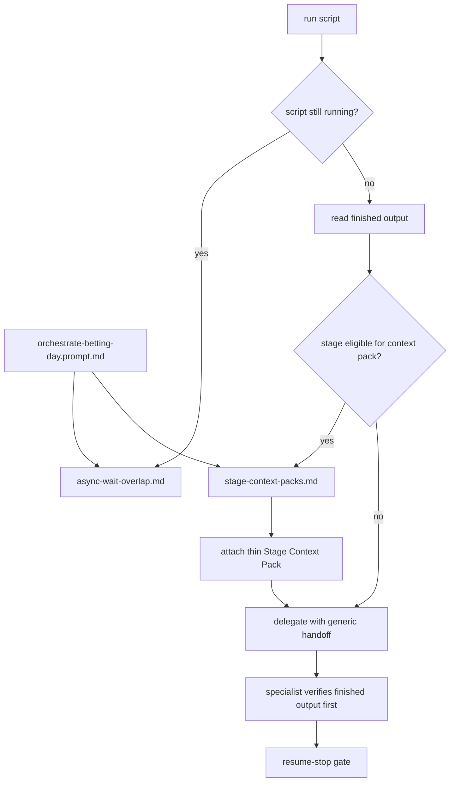

# Orchestrator Brave Search Optimization - Implementation Plan

## Task Details

| Field | Value |
| --- | --- |
| Jira ID | N/A |
| Title | Orchestrator Brave Search Optimization |
| Description | Revise the existing async-wait-only orchestrator customization plan so the customization layer keeps the current wait-window Brave policy and adds a second mandatory stage-level Brave/context-pack mechanism before eligible specialist handoffs, without changing runtime Python pipeline scripts. |
| Priority | Critical |
| Related Research | [orchestrator-brave-search-optimization.research.md](./orchestrator-brave-search-optimization.research.md) |

## Proposed Solution

Keep the current async-wait overlap policy as-is and add a second canonical workflow resource for pre-handoff stage context packs. The current implementation already covers Brave search during qualifying async waits through [async-wait-overlap.md](../../.github/skills/bet-orchestrating-workflows/resources/async-wait-overlap.md); that mechanism should remain the only owner of in-flight wait behavior. The missing behavior is a separate orchestrator step that runs after a finished stage output exists and before the next specialist handoff, but only on stage surfaces where external Brave context materially improves the specialist's judgment.

The new canonical owner should be a sibling workflow resource such as `.github/skills/bet-orchestrating-workflows/resources/stage-context-packs.md`. That resource should own the stage-eligibility matrix, the pre-handoff trigger rules, the pack shape, and the hard scope limits. The daily orchestrator prompt should load both canonical resources. Relevant internal handoff prompts should stay thin by adding a single `Orchestrator Must Provide` bullet for a `Stage Context Pack` when the stage is eligible under the canonical resource. Shared baselines such as [execution-spine.md](../../.github/skills/bet-orchestrating-workflows/resources/execution-spine.md), [resume-stop-gates.md](../../.github/skills/bet-orchestrating-workflows/resources/resume-stop-gates.md), [handoff-contracts.md](../../.github/skills/bet-orchestrating-workflows/resources/handoff-contracts.md), and the thin [bet-orchestrator.agent.md](../../.github/agents/bet-orchestrator.agent.md) must not become second policy owners.

The new stage-level mechanism should be explicit and reviewable instead of open-ended:

| Mechanism | Canonical owner | When it runs | Scope | Hard limit |
| --- | --- | --- | --- | --- |
| Async wait overlap | [async-wait-overlap.md](../../.github/skills/bet-orchestrating-workflows/resources/async-wait-overlap.md) | While a qualifying async script is still running | Active-stage frontier during the wait window | Preserve existing `>120s`, pack, and pause/stop rules |
| Stage context packs | new `stage-context-packs.md` | After finished stage output exists and before specialist handoff for eligible stages | Only picks or topics already surfaced by the finished stage artifact | Max one `Stage Context Pack` per eligible handoff, covering up to two frontier targets or one stage-level topic; each target may use up to three Brave queries (`web`, `news`, `llm-context`) plus read-only local checks |

The stage-eligibility matrix should be part of the new resource and should drive both prompt wiring and test coverage:

| Stage surface | Decision | Why | Wiring target |
| --- | --- | --- | --- |
| S2 tipsters | Exclude from mandatory stage pack | Tipster review is about consensus quality, independence, and argument strength from the finished tipster artifact. External search here risks contaminating the tipster-quality read and duplicates later context work. | No handoff change in [bet-tipsters.prompt.md](../../.github/internal-prompts/bet-tipsters.prompt.md) |
| S2.3 / S2.5 enrichment | Require stage-pack evaluation and pack creation when the finished output exposes material gaps | This is the user's explicit example. Gap-heavy enrichment output is exactly where post-output Brave context can shorten the downstream specialist path. | Thin bullet in [bet-enrich.prompt.md](../../.github/internal-prompts/bet-enrich.prompt.md) |
| S3 deep stats | Require stage-pack evaluation on flagged anomalies, thin context, or advancement candidates | Deep-stats analysis improves when the statistician receives tightly scoped outside context that explains or challenges the statistical edge without reopening the full universe. | Thin bullet in [bet-deep-stats.prompt.md](../../.github/internal-prompts/bet-deep-stats.prompt.md) |
| S4 odds + EV | Require stage-pack evaluation when drift, stale lines, or bookmaker divergence needs explanation | Pricing analysis is stronger when the valuator gets bounded context on why the line moved, not just the movement itself. | Thin bullet in [bet-odds-ev.prompt.md](../../.github/internal-prompts/bet-odds-ev.prompt.md) |
| S5 / S6 context + upset | Require stage-pack evaluation by default for flagged or advancing picks | This stage is context-led by design, so external Brave findings are material rather than incidental. | Thin bullet in [bet-context-upset.prompt.md](../../.github/internal-prompts/bet-context-upset.prompt.md) |
| S7 gate | Require stage-pack evaluation only for borderline, escalated, or evidence-thin picks | Final gate needs targeted bull/bear context on unresolved picks, not a full matrix rescan. | Thin bullet in [bet-gate.prompt.md](../../.github/internal-prompts/bet-gate.prompt.md) |
| S3B time-sensitive recheck | Require stage-pack evaluation by default | Late-breaking lineup, injury, weather, start-time, and drift context is the point of the recheck stage. | Thin bullet in [bet-time-sensitive.prompt.md](../../.github/internal-prompts/bet-time-sensitive.prompt.md) |
| S8 portfolio | Exclude from mandatory stage pack | Coupon construction should not reopen already-approved edges with fresh external browsing unless an earlier stage reopens them first. | No handoff change in [bet-portfolio.prompt.md](../../.github/internal-prompts/bet-portfolio.prompt.md) |
| Final validation | Exclude from mandatory stage pack | Final validation should reconcile the artifact against local ground truth and raw support, not import new outside claims. | No handoff change in [bet-validate.prompt.md](../../.github/internal-prompts/bet-validate.prompt.md) |

The new resource should define one concise `Stage Context Pack` shape that the orchestrator passes alongside the finished stage artifact for eligible stages:

```text
### Stage Context Pack (when required)
- stage: <S2.3/S2.5, S3, S4, S5/S6, S7, or S3B>
- finished-artifact frontier: <candidate subset or stage-level topic already surfaced>
- why Brave is needed now: <material gap, drift explanation, motivation question, etc.>
- Brave sources checked: <web/news/llm-context>
- read-only local checks: <DB/file artifacts consulted>
- findings for specialist verification: <supplemental evidence, not final truth>
- unresolved follow-up: <what the specialist must verify against finished output>
```

This pack is supplemental. It never authorizes early delegation, dependent script execution, or reopening the full candidate universe. The downstream specialist still treats the finished stage output as primary and verifies the pack against that output.



## Current Implementation Analysis

### Already Implemented

- Async wait policy owner - [.github/skills/bet-orchestrating-workflows/resources/async-wait-overlap.md](../../.github/skills/bet-orchestrating-workflows/resources/async-wait-overlap.md) - canonical wait-window Brave policy already exists and should be preserved.
- Workflow skill exposure - [.github/skills/bet-orchestrating-workflows/SKILL.md](../../.github/skills/bet-orchestrating-workflows/SKILL.md) - the workflow skill already exposes the async-wait resource and defines the correct ownership model for reusable orchestration mechanics.
- Daily orchestrator wiring - [.github/prompts/orchestrate-betting-day.prompt.md](../../.github/prompts/orchestrate-betting-day.prompt.md) - the daily prompt already loads the async-wait resource and should be extended, not rewritten.
- Thin orchestrator identity - [.github/agents/bet-orchestrator.agent.md](../../.github/agents/bet-orchestrator.agent.md) - the orchestrator agent is already thin and should remain a role definition rather than a new policy owner.
- Generic shared baselines - [.github/skills/bet-orchestrating-workflows/resources/execution-spine.md](../../.github/skills/bet-orchestrating-workflows/resources/execution-spine.md), [.github/skills/bet-orchestrating-workflows/resources/resume-stop-gates.md](../../.github/skills/bet-orchestrating-workflows/resources/resume-stop-gates.md), and [.github/skills/bet-orchestrating-workflows/resources/handoff-contracts.md](../../.github/skills/bet-orchestrating-workflows/resources/handoff-contracts.md) - these already carry the reusable loop and should stay generic.
- Finished-output-only handoff prompts - [.github/internal-prompts/bet-enrich.prompt.md](../../.github/internal-prompts/bet-enrich.prompt.md), [.github/internal-prompts/bet-deep-stats.prompt.md](../../.github/internal-prompts/bet-deep-stats.prompt.md), [.github/internal-prompts/bet-odds-ev.prompt.md](../../.github/internal-prompts/bet-odds-ev.prompt.md), [.github/internal-prompts/bet-context-upset.prompt.md](../../.github/internal-prompts/bet-context-upset.prompt.md), [.github/internal-prompts/bet-gate.prompt.md](../../.github/internal-prompts/bet-gate.prompt.md), and [.github/internal-prompts/bet-time-sensitive.prompt.md](../../.github/internal-prompts/bet-time-sensitive.prompt.md) - each currently defines `Orchestrator Must Provide`, but none requires Brave findings or a stage-level context pack.
- Intentionally thin non-target prompts - [.github/internal-prompts/bet-tipsters.prompt.md](../../.github/internal-prompts/bet-tipsters.prompt.md), [.github/internal-prompts/bet-portfolio.prompt.md](../../.github/internal-prompts/bet-portfolio.prompt.md), and [.github/internal-prompts/bet-validate.prompt.md](../../.github/internal-prompts/bet-validate.prompt.md) - these currently stay local to their stage purpose and should remain quiet unless the new matrix explicitly says otherwise.
- Targeted validation surface - [tests/test_orchestrator_brave_wait_policy.py](../../tests/test_orchestrator_brave_wait_policy.py) - a focused pytest module already exists and should be extended instead of replaced to keep the acceptance gate narrow.

### To Be Modified

- Workflow skill package - [.github/skills/bet-orchestrating-workflows/SKILL.md](../../.github/skills/bet-orchestrating-workflows/SKILL.md) - add the new stage-level resource to the resource map and clarify the two canonical mechanisms.
- Daily orchestrator prompt - [.github/prompts/orchestrate-betting-day.prompt.md](../../.github/prompts/orchestrate-betting-day.prompt.md) - load the new stage-level resource and distinguish wait-window overlap from pre-handoff context packs.
- Eligible handoff prompts - [.github/internal-prompts/bet-enrich.prompt.md](../../.github/internal-prompts/bet-enrich.prompt.md), [.github/internal-prompts/bet-deep-stats.prompt.md](../../.github/internal-prompts/bet-deep-stats.prompt.md), [.github/internal-prompts/bet-odds-ev.prompt.md](../../.github/internal-prompts/bet-odds-ev.prompt.md), [.github/internal-prompts/bet-context-upset.prompt.md](../../.github/internal-prompts/bet-context-upset.prompt.md), [.github/internal-prompts/bet-gate.prompt.md](../../.github/internal-prompts/bet-gate.prompt.md), and [.github/internal-prompts/bet-time-sensitive.prompt.md](../../.github/internal-prompts/bet-time-sensitive.prompt.md) - add a thin `Stage Context Pack` input requirement without copying the canonical matrix.
- Wait-policy sibling boundary - [.github/skills/bet-orchestrating-workflows/resources/async-wait-overlap.md](../../.github/skills/bet-orchestrating-workflows/resources/async-wait-overlap.md) - optional single-sentence backlink to the new stage-level resource is acceptable if needed to keep ownership crisp, but the existing wait policy must otherwise stay intact.
- Targeted pytest module - [tests/test_orchestrator_brave_wait_policy.py](../../tests/test_orchestrator_brave_wait_policy.py) - extend it to cover the new resource, eligible/ineligible prompt wiring, and touched-file integrity.

### To Be Created

- Stage-level canonical policy - new `.github/skills/bet-orchestrating-workflows/resources/stage-context-packs.md` - sole owner of the mandatory pre-handoff Brave/context-pack workflow.

## Open Questions

| # | Question | Answer | Status |
| --- | --- | --- | --- |
| 1 | Should the new requirement replace the current async-wait policy? | No. The wait-window policy stays intact and remains canonical for in-flight overlap. The task adds a second canonical mechanism for pre-handoff stage context packs. | Resolved |
| 2 | Where should the new stage-level policy live? | In one new workflow resource under `bet-orchestrating-workflows/resources/`, not in shared baselines, the agent body, or runtime scripts. | Resolved |
| 3 | Which stage surfaces should receive mandatory stage-pack wiring? | `bet-enrich`, `bet-deep-stats`, `bet-odds-ev`, `bet-context-upset`, `bet-gate`, and `bet-time-sensitive`, with stage-specific frontier limits defined in the canonical resource. | Resolved |
| 4 | Which stages should stay unchanged to avoid noise? | `bet-tipsters`, `bet-portfolio`, and `bet-validate` stay unchanged and are explicitly listed as excluded in the canonical matrix and the focused tests. | Resolved |
| 5 | Does this task require runtime Python changes? | No. The scope is customization-layer only: prompt, skill-resource, and pytest updates. | Resolved |
| 6 | Where should automated validation live? | Extend the existing narrow pytest module `tests/test_orchestrator_brave_wait_policy.py` so the acceptance gate remains focused on touched customization artifacts. | Resolved |

## Technical Context

Project conventions, coding standards, and patterns discovered during planning. Downstream agents MUST read this section instead of re-discovering the same context.

### Project Instructions

- [.github/copilot-instructions.md](../../.github/copilot-instructions.md) is the repo constitution for the bet workspace. This task must preserve the agent-driven pipeline, DB-first workflow, fish-shell safety, no `pipeline_orchestrator.py`, and no invented facts.
- [.github/instructions/agent-execution-protocol.instructions.md](../../.github/instructions/agent-execution-protocol.instructions.md) owns the generic execution law: async for long-running scripts, finished-output-first delegation, read-only work while waiting, and no specialist script execution.
- [.github/skills/bet-orchestrating-workflows/SKILL.md](../../.github/skills/bet-orchestrating-workflows/SKILL.md) is the canonical owner for reusable orchestration mechanics. If a coordination rule is shared and not constitutional, it belongs in this skill's resources, not in every prompt.
- [.github/skills/bet-navigating-sources/SKILL.md](../../.github/skills/bet-navigating-sources/SKILL.md) already owns source selection, fallback order, and browsing safety. The new resource should reference it instead of copying source-taxonomy detail.
- The task does not target `betting/**/*` runtime code, so the betting methodology instruction files are context for safety and workflow discipline, not direct edit targets.

### Architecture & Patterns

- The live repo already has one canonical Brave mechanism: [async-wait-overlap.md](../../.github/skills/bet-orchestrating-workflows/resources/async-wait-overlap.md). The current plan became stale because it treated that mechanism as the full requirement.
- Internal handoff prompts follow a consistent pattern: each uses an `## Orchestrator Must Provide` section to describe the exact payload expected from the orchestrator. That section is the correct thin-wiring seam for the new stage-level context-pack requirement.
- The right ownership split is two sibling workflow resources, each with one clear job: wait-window overlap versus pre-handoff stage packs.
- [execution-spine.md](../../.github/skills/bet-orchestrating-workflows/resources/execution-spine.md), [resume-stop-gates.md](../../.github/skills/bet-orchestrating-workflows/resources/resume-stop-gates.md), and [handoff-contracts.md](../../.github/skills/bet-orchestrating-workflows/resources/handoff-contracts.md) are already consumed outside the daily orchestrator path, so adding stage-pack details there would leak policy into unrelated consumers.
- [bet-orchestrator.agent.md](../../.github/agents/bet-orchestrator.agent.md) is intentionally thin. The task should not turn it into a second owner of Brave policy.
- Stage eligibility is intentionally asymmetric. The plan should wire only stages where Brave context materially changes downstream specialist value and explicitly keep noise-prone stages quiet.

### Tech Stack

- Customization artifacts are Markdown files with YAML frontmatter under `.github/`.
- Automated validation is Python-based via `pytest` from the repo's `.venv` environment.
- The scope is documentation-like prompt/skill content plus one existing targeted test module. No application runtime, dashboard code, or DB schema changes are part of this task.

### Code Style & Standards

- Keep prompts and agents thin. Put reusable workflow mechanics in skill resources.
- Prefer one canonical owner per policy. Backlinks are acceptable; duplicated policy tables are not.
- Preserve fish-shell-safe execution guidance and the no-inline-python rule.
- Preserve the finished-output-first delegation model. The new stage context pack is supplemental and must not authorize speculative or early analysis.
- Use direct, testable wording instead of vague "when useful" prose. The stage matrix and pack limits should be reviewable by pytest assertions.

### Testing Patterns

- [tests/test_orchestrator_brave_wait_policy.py](../../tests/test_orchestrator_brave_wait_policy.py) already validates the async-wait slice with filesystem and string assertions. Extending this module is lower risk than introducing a second test module.
- The focused test should validate both inclusion and exclusion. It must prove that the eligible prompts gained the new handoff input and that non-eligible prompts stayed untouched.
- The test should also prove ownership boundaries: the new canonical resource exists, the daily orchestrator prompt and workflow skill reference it, and shared baselines do not absorb its stage matrix or pack rules.
- The acceptance command should stay narrow: `.venv/bin/python -m pytest tests/test_orchestrator_brave_wait_policy.py -q`.

### Database Patterns

- The repo is DB-first, but this task must not modify DB code or pipeline scripts.
- Existing runtime constraints still matter for workflow policy: read-only Brave and local inspection are acceptable; concurrent DB-writing or dependent pipeline execution is not.

### Additional Context

- The user's explicit example is post-enrichment Brave research before the specialist handoff. The revised plan must make that path mandatory where material, not merely optional during async waits.
- The current internal prompts are all finished-output-only. That is correct for sequencing, but they currently miss the extra context pack expected by the new requirement.
- The non-target stages are part of the requirement too. Tipster analysis, portfolio building, and final validation should stay focused on their local artifacts instead of inheriting broad Brave-search obligations.

## Implementation Plan

### Phase 1: Add The Second Canonical Workflow Mechanism

#### Task 1.1 - [CREATE] Add `stage-context-packs.md` as the canonical pre-handoff Brave policy owner

**Description**: Create `.github/skills/bet-orchestrating-workflows/resources/stage-context-packs.md` as the sole owner of the new stage-level mechanism. The file should define the stage-eligibility matrix, the trigger for when a `Stage Context Pack` is required, the scope limits, the pack shape, and the hard stop conditions. It should explicitly state that it complements rather than replaces `async-wait-overlap.md`.

**Definition of Done**:

- [x] The new resource exists under `.github/skills/bet-orchestrating-workflows/resources/`.
- [x] The resource states that it governs post-output, pre-handoff context packs and that [async-wait-overlap.md](../../.github/skills/bet-orchestrating-workflows/resources/async-wait-overlap.md) remains the only owner of in-flight wait behavior.
- [x] The resource lists the eligible stages exactly: S2.3/S2.5 enrichment, S3 deep stats, S4 odds and EV, S5/S6 context and upset, S7 gate, and S3B time-sensitive recheck.
- [x] The resource explicitly excludes S2 tipsters, S8 portfolio, and final validation from mandatory stage packs.
- [x] The resource defines `Stage Context Pack` scope as only the finished-artifact frontier, never the full event universe.
- [x] The resource caps each eligible handoff at one pack covering up to two frontier targets or one stage-level topic, with up to three Brave queries per target plus read-only local checks.
- [x] The resource states that the pack is supplemental and never authorizes early delegation, dependent script execution, or shared-state mutation.

#### Task 1.2 - [MODIFY] Expose the new resource through the workflow skill and keep sibling ownership crisp

**Description**: Update `.github/skills/bet-orchestrating-workflows/SKILL.md` to expose the new resource in the resource map and usage guidance. If needed, add one backlink sentence in `async-wait-overlap.md` pointing stage-level behavior to the new resource, but do not restate the stage matrix there.

**Definition of Done**:

- [x] [SKILL.md](../../.github/skills/bet-orchestrating-workflows/SKILL.md) includes `stage-context-packs.md` in the resource map.
- [x] [SKILL.md](../../.github/skills/bet-orchestrating-workflows/SKILL.md) describes the new file as the canonical pre-handoff stage-pack owner.
- [x] Any edit to [async-wait-overlap.md](../../.github/skills/bet-orchestrating-workflows/resources/async-wait-overlap.md) is limited to a sibling-boundary backlink and preserves the current wait policy text.
- [x] [execution-spine.md](../../.github/skills/bet-orchestrating-workflows/resources/execution-spine.md), [resume-stop-gates.md](../../.github/skills/bet-orchestrating-workflows/resources/resume-stop-gates.md), and [handoff-contracts.md](../../.github/skills/bet-orchestrating-workflows/resources/handoff-contracts.md) remain generic and do not absorb the new matrix or pack rules.

#### Task 1.3 - [REUSE] Run prompt-engineering review on the canonical policy wording

**Description**: Delegate the policy wording to `tsh-prompt-engineer` using `tsh-engineer-prompt.prompt.md`. Use case: orchestrator-stage Brave/context-pack policy for betting workflow handoffs. Target model: GPT-5.4-style VS Code customization behavior. Existing drafts: the live `async-wait-overlap.md`, `orchestrate-betting-day.prompt.md`, and the new `stage-context-packs.md` draft.

**Definition of Done**:

- [ ] `tsh-prompt-engineer` reviews the wording of `stage-context-packs.md` and the thin wiring language planned for the touched prompts.
- [ ] The review confirms the policy is explicit, bounded, and does not create contradictory ownership with `async-wait-overlap.md`.
- [ ] The review confirms the wording preserves finished-output-first delegation and does not accidentally authorize full-universe rescans.

### Phase 2: Wire Only The Eligible Handoff Surfaces

#### Task 2.1 - [MODIFY] Update the daily orchestrator prompt to load both canonical mechanisms

**Description**: Extend `.github/prompts/orchestrate-betting-day.prompt.md` so the daily entry point loads both `async-wait-overlap.md` and `stage-context-packs.md`. Keep the prompt thin: one concise rule for wait windows, one concise rule for eligible post-output stage packs, and no duplicated matrix.

**Definition of Done**:

- [x] [orchestrate-betting-day.prompt.md](../../.github/prompts/orchestrate-betting-day.prompt.md) references `stage-context-packs.md` in the workflow contract.
- [x] The prompt distinguishes between in-flight wait behavior and post-output pre-handoff context packs.
- [x] The prompt does not inline the eligible-stage matrix, Brave budget, or pack schema.
- [x] No runtime pipeline script behavior is changed.

#### Task 2.2 - [MODIFY] Add thin `Stage Context Pack` inputs to the eligible internal prompts

**Description**: Update the `## Orchestrator Must Provide` section in the eligible internal prompts so each one requires a thin `Stage Context Pack` when the canonical resource says the stage is eligible. The prompts should not restate the whole matrix or Brave budget; they should only name the additional input.

**Touched prompts**:

- [bet-enrich.prompt.md](../../.github/internal-prompts/bet-enrich.prompt.md)
- [bet-deep-stats.prompt.md](../../.github/internal-prompts/bet-deep-stats.prompt.md)
- [bet-odds-ev.prompt.md](../../.github/internal-prompts/bet-odds-ev.prompt.md)
- [bet-context-upset.prompt.md](../../.github/internal-prompts/bet-context-upset.prompt.md)
- [bet-gate.prompt.md](../../.github/internal-prompts/bet-gate.prompt.md)
- [bet-time-sensitive.prompt.md](../../.github/internal-prompts/bet-time-sensitive.prompt.md)

**Definition of Done**:

- [x] Each eligible prompt adds one thin `Orchestrator Must Provide` bullet for the `Stage Context Pack` or equivalent wording that clearly points back to `stage-context-packs.md`.
- [x] Each eligible prompt keeps the finished stage artifact as the primary input.
- [x] None of the eligible prompts copy the full stage matrix, query budget, or source-selection rules.
- [x] The prompt text stays stage-specific and readable rather than becoming a second policy manual.

#### Task 2.3 - [REUSE] Keep non-eligible prompts, shared baselines, and the orchestrator agent quiet

**Description**: Explicitly preserve the thin existing surfaces that should not own or inherit the new stage-level policy. The excluded prompts should remain unchanged, and the shared baselines plus the orchestrator agent should stay free of the new matrix.

**Definition of Done**:

- [x] [bet-tipsters.prompt.md](../../.github/internal-prompts/bet-tipsters.prompt.md), [bet-portfolio.prompt.md](../../.github/internal-prompts/bet-portfolio.prompt.md), and [bet-validate.prompt.md](../../.github/internal-prompts/bet-validate.prompt.md) remain unchanged for stage-pack purposes.
- [x] [bet-orchestrator.agent.md](../../.github/agents/bet-orchestrator.agent.md) remains role-oriented and does not gain a duplicated Brave-policy block.
- [x] Shared baselines remain backlink-only or untouched.
- [x] The new test coverage proves both the inclusion and exclusion boundaries above.

### Phase 3: Extend The Targeted Acceptance Gate

#### Task 3.1 - [MODIFY] Extend `tests/test_orchestrator_brave_wait_policy.py` for the stage-level policy

**Description**: Extend the existing focused pytest module instead of creating a new suite. The module should continue to validate async-wait ownership and now also validate the new stage-level resource, the eligible-stage matrix, the prompt wiring, the excluded prompts, and the no-second-owner rule for shared baselines.

**Definition of Done**:

- [x] The test module verifies that `stage-context-packs.md` exists and is referenced by both [SKILL.md](../../.github/skills/bet-orchestrating-workflows/SKILL.md) and [orchestrate-betting-day.prompt.md](../../.github/prompts/orchestrate-betting-day.prompt.md).
- [x] The test module verifies the eligible-stage list and the excluded-stage list exactly.
- [x] The test module verifies that the eligible internal prompts include the new `Stage Context Pack` input and that the excluded prompts do not.
- [x] The test module continues to verify that [async-wait-overlap.md](../../.github/skills/bet-orchestrating-workflows/resources/async-wait-overlap.md) remains the wait-policy owner and does not absorb the stage-level matrix.
- [x] The test module verifies that shared baselines and [bet-orchestrator.agent.md](../../.github/agents/bet-orchestrator.agent.md) do not become second policy owners.
- [x] The test module remains filesystem/text based and does not require DB access, network access, or live pipeline execution.

#### Task 3.2 - [REUSE] Run the targeted pytest acceptance command for the touched slice

**Description**: Run only the focused pytest command after the new assertions cover both canonical mechanisms and the touched-file integrity checks.

**Definition of Done**:

- [x] `.venv/bin/python -m pytest tests/test_orchestrator_brave_wait_policy.py -q` passes.
- [x] The passing command covers async-wait preservation, stage-context-pack policy, eligible/ineligible prompt wiring, and touched-file integrity.
- [x] Any unrelated repo-wide customization drift remains out of scope and is documented separately rather than folded into this task.

### Phase 4: Run The Final Review

#### Task 4.1 - [REUSE] Run customization-focused code review with `tsh-code-reviewer`

**Description**: After the focused pytest gate passes, run `tsh-code-reviewer` using `tsh-review.prompt.md`. The review should focus on ownership boundaries, stage eligibility correctness, prompt thinness, and the quality of the targeted acceptance gate.

**Definition of Done**:

- [x] `tsh-code-reviewer` reviews the touched customization files and [tests/test_orchestrator_brave_wait_policy.py](../../tests/test_orchestrator_brave_wait_policy.py).
- [x] The review confirms there are exactly two canonical Brave mechanisms: wait-window overlap and stage-level context packs.
- [x] The review confirms only the approved eligible stages were wired and that the excluded stages stayed quiet.
- [x] The review confirms the implementation remains customization-layer only and does not spill into runtime Python scripts.

## Security Considerations

- Stage-level Brave queries must stay bounded to the finished-artifact frontier. The policy must never encourage querying the entire candidate universe or sending unnecessary context outside the session.
- No secrets, tokens, or private bookmaker/session data should appear in Brave queries or in the `Stage Context Pack` payload.
- External Brave findings remain supplemental and must be verified against the finished stage output plus local artifacts before they influence downstream specialist reasoning.
- The new policy must not reopen final validation with fresh external facts. Final validation should continue to compare the artifact against local ground truth.
- The implementation must preserve the current bans on dependent script execution, concurrent DB-writing work, and Playwright-heavy overlap outside the approved wait-window rules.

## Quality Assurance

- [x] The existing async-wait policy remains intact and still owns only wait-window behavior.
- [x] A new canonical workflow resource owns the pre-handoff stage-level Brave/context-pack policy.
- [x] The stage matrix matches the approved set exactly: enrichment, deep stats, odds and EV, context and upset, gate, and time-sensitive recheck are eligible; tipsters, portfolio, and final validation are excluded.
- [x] The daily orchestrator prompt loads both canonical resources without duplicating their policy tables.
- [x] Only the eligible internal prompts gain a thin `Stage Context Pack` requirement in `Orchestrator Must Provide`.
- [x] Shared baselines and the orchestrator agent remain thin and do not become second policy owners.
- [x] The task remains customization-layer only with no runtime Python pipeline script changes.
- [x] The targeted pytest module passes and covers both feature policy and touched-file integrity.

## Improvements (Out of Scope)

- Runtime Python changes to the betting pipeline, scripts, repositories, or DB schema.
- Generalizing the stage-context-pack policy to other prompts or agents outside the daily orchestrator slice.
- Repo-wide cleanup of unrelated customization drift, including broader model-literal inconsistencies outside the touched artifacts.
- Persisting stage context packs to long-lived storage or turning them into a separate report artifact.
- Adding sport-specific Brave query templates to every stage prompt instead of keeping the reusable policy in one workflow resource.

## Changelog

| Date | Change Description |
| --- | --- |
| 2026-05-27 11:58 Europe/Warsaw | Re-ran `tsh-code-reviewer` after the eligible-prompt wording fix, re-ran `.venv/bin/python -m pytest tests/test_orchestrator_brave_wait_policy.py -q` (11 passed), and confirmed the prior wording concern is resolved with no remaining slice-level findings. |
| 2026-05-27 11:44 Europe/Warsaw | Implemented Tasks 1.1-3.2 from the revised dual-mechanism scope: added `stage-context-packs.md`, wired only the eligible prompt surfaces, extended `tests/test_orchestrator_brave_wait_policy.py`, and passed the focused pytest acceptance command. Task 4.1 remains intentionally out of scope for this pass. |
| 2026-05-27 Europe/Warsaw | Revised the plan from async-wait-only scope to a dual-mechanism design: preserve `async-wait-overlap.md`, add canonical stage-level Brave/context packs, wire only the eligible handoffs, and extend the existing focused pytest gate. |
| 2026-05-26 18:42:30 Europe/Warsaw | Ran `tsh-code-reviewer` for the touched orchestrator slice, re-ran `.venv/bin/python -m pytest tests/test_orchestrator_brave_wait_policy.py -q` (7 passed), and recorded one low-risk targeted-test follow-up in Code Review Findings. |
| 2026-05-26 18:37:54 Europe/Warsaw | Implemented Tasks 1.1-3.3 from the earlier async-wait-only scope: added the canonical async-wait overlap resource, kept prompt/skill wiring thin, added scoped ownership tests, and passed the targeted pytest acceptance command. |
| 2026-05-26 | Initial plan created for orchestrator Brave search optimization customization. |

## Code Review Findings

### Re-review 2026-05-27 - No Remaining Findings

- The eligible prompt wording now uses one explicit shared requirement: `the pre-handoff stage context pack for this stage when required by stage-context-packs.md`.
- That resolves the prior ambiguity risk by tying every eligible handoff back to the canonical owner instead of leaving stage-pack input as optional or interpretive prompt prose.
- The focused pytest module now enforces the exact eligible-prompt wording and still proves the exclusion and ownership boundaries.

### Finding 1 - High - The prior plan no longer matched the actual requirement

- The live plan and prior implementation only covered Brave usage during async waits.
- The current requirement is stricter: the orchestrator must also build mandatory pre-handoff Brave/context packs wherever stage-level value is material.
- Without this plan revision, the implementation checklist would keep shipping the wrong scope even though the async-wait slice itself was correct.

### Finding 2 - Medium - Blanket Brave wiring across every stage would create policy noise

- The internal prompts share the same `Orchestrator Must Provide` shape, so it would be easy to over-apply the new policy.
- That would be a mistake for tipsters, portfolio construction, and final validation, where extra Brave inputs would either contaminate the stage purpose or reopen already-validated artifacts.
- The revised plan therefore treats exclusions as first-class acceptance criteria and adds focused tests for both wired and intentionally quiet stages.

### Finding 3 - Medium - The focused pytest gate must now prove both inclusion and exclusion boundaries

- The current targeted test only proves async-wait ownership and thinness.
- Under the stricter requirement, that is no longer sufficient because the risk is not just missing a new resource; it is also wiring the wrong prompts or turning shared baselines into second owners.
- Extending the existing targeted module is the smallest credible acceptance strategy because it preserves the narrow slice while asserting the full stage-level policy surface.