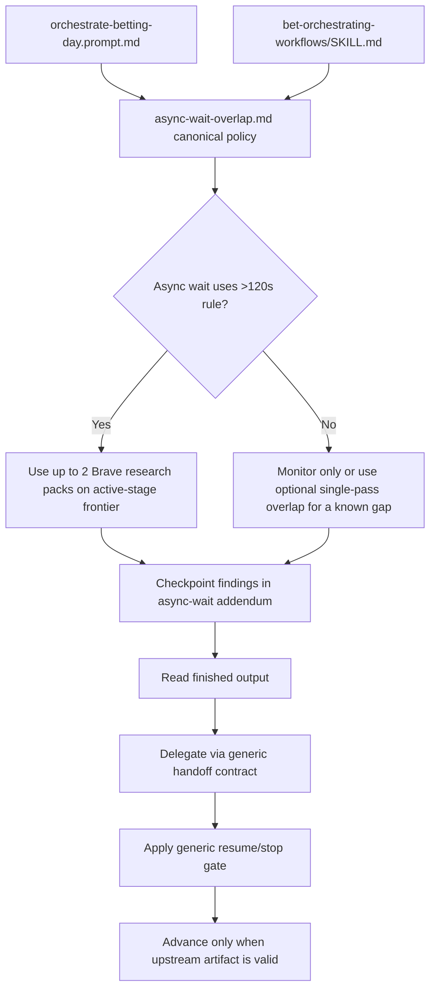

# Orchestrator Brave Search Optimization - Implementation Plan

## Task Details

| Field | Value |
| --- | --- |
| Jira ID | N/A |
| Title | Orchestrator Brave Search Optimization |
| Description | Update the bet orchestrator customization so it proactively uses Brave search during long-running async script waits when that read-only work can shorten the downstream analysis path, while keeping Model A sequencing, fish-shell safety, and existing ownership boundaries intact. |
| Priority | High |
| Related Research | [orchestrator-brave-search-optimization.research.md](./orchestrator-brave-search-optimization.research.md) |

## Proposed Solution

Implement the change as a customization-layer workflow refinement, not as runtime pipeline code. The canonical behavior should live in one new workflow resource under `bet/.github/skills/bet-orchestrating-workflows/resources/async-wait-overlap.md`. That file should be the only owner of orchestrator-specific proactive Brave overlap. The workflow skill exposes it in the resource map, and `orchestrate-betting-day.prompt.md` opts into it directly. Existing generic shared resources such as `execution-spine.md`, `resume-stop-gates.md`, and `handoff-contracts.md` should stay generic baselines; if any of them needs a mention, it should be a single backlink to the canonical file rather than duplicated policy text. This keeps workflow-layer ownership while avoiding leakage into other current consumers such as `bet-scanner.agent.md` and `ask-betting.prompt.md`.

The policy must be bounded by explicit, testable knobs rather than generic “when useful” prose:

| Policy knob | Planned rule | Testable signal |
| --- | --- | --- |
| Trigger threshold | Mandatory whenever the orchestrator launches a step in async mode under the existing `>120s` execution-law threshold. Optional single-pass overlap is allowed for shorter manually async waits only when a known context gap already exists. | `async-wait-overlap.md` states the `>120s` threshold and distinguishes mandatory vs optional use. |
| Aggressive default scope | Search only the active-stage frontier: candidates already present in the current shortlist, gate, or coupon-candidate artifact. Under the user's Aggressive preference, explicit context-gap candidates go first; if no gap list exists, use the top three unresolved candidates or one stage-level topic from that artifact. Never widen to the full scan universe during a wait window. | The canonical resource names `active-stage frontier`, `top three unresolved candidates`, and the prohibition on widening to the full event universe. |
| Query budget | Max two Brave research packs per async wait window. One pack = up to three Brave queries (`web`, `news`, `llm-context`) for one candidate or one stage-level topic. If the budget is exhausted, convert remaining questions into a checkpoint/handoff note for the post-script specialist. | The canonical resource defines both the per-window pack limit and the per-pack query size, plus the checkpoint fallback. |

The new resource should also carry the pause/stop behavior and the short async-wait addendum for specialist handoffs, so those rules remain local to the orchestrator opt-in surface instead of changing shared generic resources. The implementation should not widen into betting methodology or Python script changes. It should reuse the existing source skill for source/fallback guidance, preserve the existing execution-law instruction as the generic async/monitoring baseline, and validate the change with two scoped layers: a feature-level wait-policy test and a touched-file integrity test that mirrors the relevant existing customization contracts without requiring repo-wide cleanup of known model-literal drift.

## Current Implementation Analysis

### Already Implemented

- `bet-orchestrator` - `.github/agents/bet-orchestrator.agent.md` - existing thin orchestrator identity and collaboration contract already exist and should remain thin.
- `orchestrate-betting-day` - `.github/prompts/orchestrate-betting-day.prompt.md` - active daily workflow entry point already owns phase order and can be extended by reference rather than rewritten.
- `bet-orchestrating-workflows` - `.github/skills/bet-orchestrating-workflows/SKILL.md` - existing shared workflow owner already states that reusable coordination detail belongs in skill resources, not in prompts or agents.
- `execution-spine` - `.github/skills/bet-orchestrating-workflows/resources/execution-spine.md` - current run -> read -> delegate -> gate loop already exists and should remain the generic baseline rather than absorb orchestrator-only wait policy.
- `resume-stop-gates` - `.github/skills/bet-orchestrating-workflows/resources/resume-stop-gates.md` - current stop/resume semantics already exist and should remain generic unless a backlink to the canonical wait-policy resource is truly needed.
- `handoff-contracts` - `.github/skills/bet-orchestrating-workflows/resources/handoff-contracts.md` - current subagent payload contract already exists and should remain generic; any async-wait addendum should live in the new canonical wait-policy resource.
- `routing-matrix` - `.github/skills/bet-orchestrating-workflows/resources/routing-matrix.md` - specialist ownership after finished output is already explicit and should be reused unchanged.
- `agent-execution-protocol.instructions.md` - `.github/instructions/agent-execution-protocol.instructions.md` - already provides the generic async execution law, fish-shell restrictions, and Model A rule that specialists analyze only finished outputs.
- `bet-navigating-sources` - `.github/skills/bet-navigating-sources/SKILL.md` - existing source/fallback owner already covers Brave-search-compatible source usage and Playwright safety constraints.
- `pipeline-knowledge-base` - `memories/repo/pipeline-knowledge-base.md` - documents the established inspect -> async run -> think while waiting -> validate -> delegate loop and the repo's anti-parallelism lessons.
- `bet-scanner` - `.github/agents/bet-scanner.agent.md` - already loads `execution-spine.md`, which proves generic execution-spine edits would leak beyond the daily orchestrator.
- `ask-betting` - `.github/prompts/ask-betting.prompt.md` - already loads `handoff-contracts.md`, which proves generic handoff-contract changes would leak beyond the daily pipeline.
- Customization integrity testing - `tests/test_copilot_customizations.py` - existing filesystem/regex-based test patterns can be reused for this feature's acceptance checks.

### To Be Modified

- Workflow skill resource map - `.github/skills/bet-orchestrating-workflows/SKILL.md` - add the new async-wait overlap resource to the package contract and describe it as an opt-in orchestrator add-on.
- Daily orchestrator prompt - `.github/prompts/orchestrate-betting-day.prompt.md` - reference the new resource and make aggressive read-only overlap the default orchestrator behavior without duplicating the detailed policy.

### To Be Created

- Async wait overlap resource - `.github/skills/bet-orchestrating-workflows/resources/async-wait-overlap.md` - canonical opt-in policy for proactive Brave-search-while-waiting, including explicit trigger/scope/budget knobs, safe overlap boundaries, pause/stop rules, and the optional async-wait handoff addendum.
- Focused wait-policy and touched-file integrity test - `tests/test_orchestrator_brave_wait_policy.py` - narrow automated checks that combine feature assertions with the relevant baseline integrity invariants for only the touched customization artifacts.

## Open Questions

| # | Question | Answer | Status |
| --- | --- | --- | --- |
| 1 | Where should the proactive Brave-search-during-wait policy live? | In `bet-orchestrating-workflows/resources/async-wait-overlap.md` as the sole canonical owner, with thin references from `SKILL.md` and `orchestrate-betting-day.prompt.md` and no duplicated policy in the agent. | ✅ Resolved |
| 2 | What exact trigger threshold, search scope, and Brave budget apply? | Mandatory at the existing `>120s` async threshold; Aggressive scope is the active-stage frontier with explicit gap candidates first, else the top three unresolved candidates or one stage-level topic from the current artifact; budget is max two Brave research packs per wait window, one pack = up to three queries. | ✅ Resolved |
| 3 | Should shared generic resources become owners of this behavior? | No. `execution-spine.md`, `resume-stop-gates.md`, and `handoff-contracts.md` stay generic baselines; if touched at all, they may only point back to `async-wait-overlap.md` without duplicating its policy. | ✅ Resolved |
| 4 | How should findings gathered during async waits surface downstream? | The canonical wait-policy resource should define a short optional `Async Wait Addendum` appended by reference to the generic handoff payload; specialist verdicts on finished script output remain authoritative. | ✅ Resolved |
| 5 | What validation proves the touched artifacts fit the live customization baseline? | Use two scoped automated layers: feature assertions for the new wait policy and touched-file integrity assertions derived from `tests/test_copilot_customizations.py`; do not treat repo-wide model-literal cleanup as part of this task. | ✅ Resolved |
| 6 | Which source of truth wins if live `.github` wording and current task framing conflict? | Follow the repo constitution and user-requested ownership split captured in the active task context; keep changes local to the orchestrator slice and document broader drift as out of scope. | ✅ Resolved |

## Technical Context

Project conventions, coding standards, and patterns discovered during planning. Downstream agents MUST read this section instead of re-discovering the same context.

### Project Instructions

- `.github/copilot-instructions.md` is the repo-level workflow constitution for the bet workspace. The current task should follow the intended ownership split restated by the user: permanent rules remain in instructions, reusable mechanics belong in workflow skills/resources, and prompts/agents stay thin.
- `.github/instructions/agent-execution-protocol.instructions.md` is the always-on execution-law owner for bet agents. Key rules relevant here: fish shell only, no inline multiline Python, run pipeline scripts with `run_in_terminal` and `--verbose`, use async mode for scripts longer than 120 seconds, think while waiting, and never let subagents run scripts or analyze unfinished output.
- `.github/skills/bet-orchestrating-workflows/SKILL.md` is the canonical owner for shared orchestration HOW content. It explicitly says reusable coordination details belong in resources under this skill instead of being duplicated in prompts or agents.
- `.github/skills/bet-navigating-sources/SKILL.md` owns source selection, fallback chains, blocked sources, and Playwright/HTTP safety notes. It already documents that Playwright-driven tipster work stays sequential and that DB-first/source-fallback discipline is mandatory.
- `memories/no-inline-python-terminal.md` reinforces the terminal rule: no multiline `python3 -c`, no complex compound fish commands, and prefer tools or dedicated files over inline inspection hacks.
- `memories/repo/project-structure.md` confirms core repo facts that matter here: agent-driven pipeline, DB-first workflow, root memory as the long-lived memory layer, and the expectation that active bet agents use `GPT-5.4`.
- When live `.github` wording and the current task framing conflict, this plan should follow the repo constitution and the user-requested ownership split captured in the active session, then keep any broader cleanup explicitly out of scope.

### Architecture & Patterns

- The implementation scope is the `bet` workspace only. `copilot-collections` is reference material for plan structure, not the modification target.
- The relevant customization surfaces are `.github/agents/`, `.github/prompts/`, `.github/instructions/`, and `.github/skills/bet-orchestrating-workflows/resources/`.
- The current execution model is Model A: inspect inputs, run the script async when appropriate, think while waiting, read finished output, validate artifacts, delegate to the mapped specialist, then apply resume/stop gates before advancing.
- The current workflow skill already separates reusable concerns into resource files: `execution-spine.md`, `routing-matrix.md`, `resume-stop-gates.md`, and `handoff-contracts.md`. Adding a new `async-wait-overlap.md` sibling resource follows the established progressive-disclosure pattern better than inflating the prompt or agent.
- `bet-scanner.agent.md` already loads `execution-spine.md`, and `ask-betting.prompt.md` already loads `handoff-contracts.md`. Those live consumers make the existing shared resources poor owners for orchestrator-only wait behavior because generic changes there would leak.
- The new wait policy should therefore be opt-in within the workflow layer: `async-wait-overlap.md` is canonical, `SKILL.md` exposes it, and `orchestrate-betting-day.prompt.md` loads it directly. Existing generic resources remain baseline HOW layers rather than becoming secondary policy owners.
- The routing matrix already defines specialist ownership after a script completes. This task should not change who owns S0-S10 analysis; it only changes how the orchestrator uses otherwise idle async wait windows.
- The current gap is specific: the repo encodes "think while waiting" but does not encode a bounded proactive Brave policy with explicit trigger, scope, and budget values.
- The new policy should be reviewable as data, not vibe: `>120s` trigger, active-stage-frontier scope, and max two Brave research packs per async wait window.
- The prompt should stay thin. It can reference the new resource and state the aggressive default, but it should not copy the safe/unsafe matrix or the capture contract inline.

### Tech Stack

- Customization artifacts are Markdown files with YAML frontmatter under `.github/`.
- Repo validation is Python-based. `pyproject.toml` requires Python `>=3.11` and exposes `pytest` through the dev dependency set.
- Existing customization validation is filesystem/regex based and does not require DB access, network access, or live pipeline execution.
- The workspace also contains a Next.js dashboard, but it is out of scope for this task.
- Brave search is a tool surface available to the orchestrator; this task is about encoding when to use that tool in customization artifacts, not about integrating a new library or SDK.

### Code Style & Standards

- Preserve the `bet-` naming convention and existing directory layout.
- Keep agents role-focused and prompts task-focused. Shared orchestration mechanics should move into workflow skill resources, not into duplicated prompt or agent prose.
- Preserve fish-shell-safe execution guidance and the no-inline-python rule. This task must not introduce bash-oriented examples or compound shell recipes.
- Preserve the agent-driven pipeline contract: scripts are data producers, specialists analyze finished outputs, and the orchestrator manages sequencing and gates.
- Aggressive overlap must stay read-only. It must not launch the next pipeline step, delegate analysis before completion, or start any work that writes shared DB state.
- Do not move betting methodology, market ranking rules, or sport-specific analysis logic into the new resource. When source-selection detail is needed, reference `bet-navigating-sources` instead of copying its source tables.

### Testing Patterns

- Existing customization testing style is in `tests/test_copilot_customizations.py`: filesystem assertions, regex-based frontmatter checks, and no DB/network/live pipeline dependencies.
- Repo-wide customization green status is not currently a credible gate for this slice because unrelated bet agents in `.github/agents/` still declare non-`GPT-5.4` model literals, so `TestModelLiterals` is already known-red outside this task.
- A focused validation strategy for this task should therefore use two scoped layers inside one dedicated module: feature assertions for the new wait policy and touched-file integrity assertions that mirror the relevant existing customization checks only for the modified artifacts.
- The narrow automated validation target after implementation should still be `.venv/bin/python -m pytest tests/test_orchestrator_brave_wait_policy.py -q`, but that module must cover both the new behavior and the touched-file baseline expectations.
- If implementers later choose to fold the assertions into the generic customization suite, they should do so only after confirming the broader suite baseline is clean. This plan intentionally avoids coupling the task to unrelated global customization drift.

### Database Patterns

- The repo is DB-first, but this task should not change schema, repositories, or script-level DB writes.
- `src/bet/db/repositories.py` documents that some pipeline writes, especially around shared enrichment data such as `team_form`, must remain serialized.
- `src/bet/stats/enrichment.py` also preserves sequential execution to avoid concurrent writes on a shared SQLite connection.
- These runtime constraints are the technical basis for the non-overlap rules in the customization layer: read-only inspection is safe during async waits, but concurrent DB-writing pipeline work is not.

### Additional Context

- `memories/repo/pipeline-knowledge-base.md` records the repo's settled orchestration lesson: earlier guidance drifted toward parallel subagents and broader overlap, but the adopted model is run -> think while waiting -> validate -> delegate -> decide. This task extends the middle wait window without weakening that sequence.
- `bet-navigating-sources/SKILL.md` and repo memory both state that Playwright-driven tipster or browser-heavy work stays sequential because Playwright is not thread-safe in this workflow.
- The research file already identified the core acceptance boundary: safe overlap includes Brave web/news/context search, read-only file or DB inspection, and checkpoint preparation; unsafe overlap includes dependent script execution, specialist delegation before completion, concurrent DB-writing steps, and parallel Playwright-heavy browsing.
- The user's Aggressive preference supports proactive wait-window search, but this plan still bounds it to the active-stage frontier and a fixed per-window query budget so the behavior stays reviewable and testable.
- There is an existing customization-integrity suite, but current repo state contains broader customization drift unrelated to this task. A dedicated test module that also mirrors touched-file baseline checks is the narrowest credible acceptance strategy.

## Implementation Plan

### Phase 1: Canonicalize the Opt-In Wait Policy

#### Task 1.1 - [CREATE] Add `async-wait-overlap.md` as the canonical opt-in wait-window owner

**Description**: Create `.github/skills/bet-orchestrating-workflows/resources/async-wait-overlap.md` to hold the entire orchestrator-specific policy: activation threshold, aggressive default scope, Brave query budget, allowed/prohibited overlap work, pause/stop behavior, and the optional async-wait handoff addendum. The file should state that only prompts or agents that reference it inherit the behavior; the first consumer is the daily orchestrator prompt.

**Definition of Done**:

- [x] The new resource exists under `.github/skills/bet-orchestrating-workflows/resources/` and declares itself the canonical owner of orchestrator-specific async-wait overlap.
- [x] The resource states that the policy activates mandatorily when a script is launched async under the existing `>120s` execution rule and only optionally for shorter manually async waits with a known context gap.
- [x] The resource defines Aggressive default scope as the active-stage frontier: explicit gap candidates first, else the top three unresolved candidates or one stage-level topic from the current artifact, never the full scan universe.
- [x] The resource defines the Brave budget as max two research packs per async wait window, one pack = up to three Brave queries (`web`, `news`, `llm-context`) for one candidate or one stage-level topic, with checkpoint fallback after budget exhaustion.
- [x] The resource explicitly lists allowed overlap work and prohibited overlap work.
- [x] The resource defines a short optional `Async Wait Addendum` that appends to the generic handoff payload by reference instead of rewriting `handoff-contracts.md`.
- [x] The resource references existing owners instead of duplicating them, especially `bet-navigating-sources` for source policy and `agent-execution-protocol.instructions.md` for generic async execution law.

#### Task 1.2 - [MODIFY] Expose the new resource through the workflow skill package

**Description**: Update `.github/skills/bet-orchestrating-workflows/SKILL.md` so the new resource appears in the resource map and usage guidance as an opt-in add-on for orchestrator entry points. The skill must make the ownership split explicit: canonical policy lives in `async-wait-overlap.md`, while existing shared baselines stay generic.

**Definition of Done**:

- [x] `bet-orchestrating-workflows/SKILL.md` lists `async-wait-overlap.md` in the resource map.
- [x] `bet-orchestrating-workflows/SKILL.md` describes the resource as an opt-in orchestrator add-on rather than a new default for every consumer.
- [x] `bet-orchestrating-workflows/SKILL.md` explicitly keeps `execution-spine.md`, `resume-stop-gates.md`, and `handoff-contracts.md` as generic baselines rather than new owners of the wait policy.
- [x] No trigger, scope, or budget table is duplicated in the skill body.

### Phase 2: Wire Only the Daily Orchestrator Entry Point

#### Task 2.1 - [MODIFY] Update `orchestrate-betting-day.prompt.md` to opt into the canonical wait policy

**Description**: Extend the daily orchestrator prompt so it directly references `async-wait-overlap.md` alongside the existing workflow resources. The prompt should express the aggressive default in one concise rule, then defer all details to the canonical resource.

**Definition of Done**:

- [x] `orchestrate-betting-day.prompt.md` references `bet-orchestrating-workflows/resources/async-wait-overlap.md` in the workflow contract.
- [x] The prompt tells the orchestrator to use proactive read-only overlap during qualifying async waits and to preserve finished-output-first delegation.
- [x] The prompt stays thin and phase-oriented; it does not repeat the policy table or the safe/unsafe overlap matrix.
- [x] No runtime betting script behavior is changed by this prompt wiring.

#### Task 2.2 - [REUSE] Keep generic shared resources and the orchestrator agent thin

**Description**: Reuse `execution-spine.md`, `resume-stop-gates.md`, `handoff-contracts.md`, and `bet-orchestrator.agent.md` as generic/shared framing. If any of those files need to mention the new behavior, the edit must be a single backlink sentence to `async-wait-overlap.md`, not duplicated policy content.

**Definition of Done**:

- [x] No shared baseline file absorbs the trigger, scope, or budget table or the orchestrator-only wait behavior as its own rule.
- [x] Any shared-resource edit is limited to a backlink that points to `async-wait-overlap.md`.
- [x] `bet-scanner.agent.md` and `ask-betting.prompt.md` do not inherit the new policy implicitly through copied wording.
- [x] `bet-orchestrator.agent.md` remains role-oriented and does not become a second policy owner.

### Phase 3: Add Scoped Validation That Covers the Touched Baseline

#### Task 3.1 - [CREATE] Add feature-level wait-policy assertions

**Description**: Create `tests/test_orchestrator_brave_wait_policy.py` using the same filesystem/regex approach as `tests/test_copilot_customizations.py`. The first assertion group should validate the new feature surface: canonical resource existence, prompt/skill wiring, explicit knob values, safe/prohibited overlap cases, and the async-wait handoff addendum.

**Definition of Done**:

- [x] The test module verifies that `async-wait-overlap.md` exists and is referenced by both `bet-orchestrating-workflows/SKILL.md` and `orchestrate-betting-day.prompt.md`.
- [x] The test module verifies the explicit `>120s` trigger rule, active-stage-frontier scope rule, and two-pack/three-query budget rule.
- [x] The test module verifies that the canonical resource contains the required allowed and prohibited overlap cases.
- [x] The test module verifies that the optional async-wait addendum exists and stays supplemental to finished-output analysis.
- [x] The test module does not require network access, DB state, or live pipeline execution.

#### Task 3.2 - [CREATE] Add touched-file integrity assertions derived from the existing customization suite

**Description**: In the same test module, add a second assertion group that mirrors the relevant existing customization-contract checks for only the touched artifacts. This makes validation credible even while the repo-wide customization suite has unrelated baseline drift.

**Definition of Done**:

- [x] The test module validates that touched-file workflow resource references resolve correctly.
- [x] The test module validates that the touched prompt and skill bodies stay thin and do not duplicate the canonical policy table.
- [x] The test module validates that any touched shared resource remains backlink-only rather than becoming a second policy owner.
- [x] The module or docstring records that repo-wide model-literal drift is known outside this slice and intentionally excluded from this task's acceptance gate.
- [x] The assertions stay scoped to the touched artifacts rather than silently expanding into repo-wide cleanup.

#### Task 3.3 - [REUSE] Run targeted automated acceptance for the touched slice

**Description**: Use a single targeted pytest command only after the new module covers both feature behavior and touched-file baseline integrity. This keeps validation scoped but credible for the live customization tree.

**Definition of Done**:

- [x] `.venv/bin/python -m pytest tests/test_orchestrator_brave_wait_policy.py -q` passes.
- [x] The passing command covers both the feature assertions and the touched-file integrity assertions described above.
- [x] Any unrelated repo-wide customization failures, including known model-literal drift elsewhere in `.github`, are documented separately and not folded into this task.
- [x] The implementation evidence names the exact command used for acceptance.

### Phase 4: Review the Final Ownership Split

#### Task 4.1 - [REUSE] Run final artifact review with `tsh-code-reviewer`

**Description**: After the targeted acceptance command passes, run a customization-focused review using `tsh-code-reviewer` with `tsh-review.prompt.md`. The review should verify that the new policy stayed canonical and opt-in, that explicit knobs are present, and that validation coverage matches the scoped acceptance story.

**Definition of Done**:

- [x] `tsh-code-reviewer` reviews the touched customization artifacts and the targeted test module.
- [x] The review explicitly checks that `async-wait-overlap.md` is the only policy owner and that prompt/skill wiring stays thin.
- [x] The review explicitly checks that aggressive Brave overlap remains read-only and does not authorize unsafe script or Playwright parallelism.
- [x] The review explicitly checks that the scoped validation story is credible despite known global customization drift.

## Security Considerations

- Overlap work must remain read-only. The customization must never encourage concurrent DB-writing steps, background state mutation, or launching dependent pipeline steps before the current async script resolves.
- The explicit active-stage scope and fixed query budget are also security controls: they bound what leaves the session as external search context and reduce unnecessary query sprawl.
- The policy must preserve the repo's ban on scraping Betclic and must not encourage sending secrets, tokens, or private data into Brave queries.
- Brave findings gathered during async waits should be treated as traceable external context, not as authoritative facts that override DB/script outputs or specialist verification.
- Playwright and thread-safety constraints are part of safety here: the policy must not normalize parallel browser work in the main orchestrator wait window.

## Quality Assurance

Acceptance criteria checklist to verify the implementation meets the defined requirements:

- [x] Proactive Brave-search-while-waiting behavior is encoded in `async-wait-overlap.md` as the canonical opt-in workflow resource, not duplicated across agent and prompt bodies.
- [x] The explicit `>120s` trigger, active-stage-frontier scope, and two-pack/three-query budget are documented and covered by automated assertions.
- [x] Safe overlap boundaries and explicit non-overlap cases are documented in the canonical wait-policy resource without turning shared generic resources into new owners.
- [x] Wait-window findings can be surfaced through a concise optional addendum without weakening the finished-output-first rule.
- [x] `orchestrate-betting-day.prompt.md` references the new behavior but remains thin and phase-oriented, while shared baselines and the orchestrator agent stay generic/backlink-only.
- [x] The implementation preserves fish-shell safety, no-inline-python rules, Model A sequencing, and the agent-driven pipeline discipline.
- [x] Focused automated validation covers both the new feature invariants and the touched-file customization baseline invariants relevant to the modified artifacts.

## Improvements (Out of Scope)

- Repo-wide cleanup of broader customization drift, including any unrelated model-literal inconsistencies or older constitution text outside the touched orchestrator slice.
- Generalizing the async-wait overlap policy to other prompts or agents beyond the orchestrator if future workflows need the same behavior.
- Persisting wait-window findings into long-lived memory or DB-backed artifacts; the current task only needs short-lived workflow handoff surfacing.
- Adding stage-specific betting heuristics or sport-specific search playbooks to the new resource; those belong in domain skills if needed later.

## Changelog

| Date | Change Description |
| --- | --- |
| 2026-05-26 18:42:30 Europe/Warsaw | Ran `tsh-code-reviewer` for the touched orchestrator slice, re-ran `.venv/bin/python -m pytest tests/test_orchestrator_brave_wait_policy.py -q` (7 passed), and recorded one low-risk targeted-test follow-up in Code Review Findings. |
| 2026-05-26 18:37:54 Europe/Warsaw | Implemented Tasks 1.1-3.3: added the canonical async-wait overlap resource, kept prompt/skill wiring thin, added scoped ownership/integrity tests, and passed the targeted pytest acceptance command. |
| 2026-05-26 | Revised after plan review: made async-wait overlap opt-in and canonical, added explicit trigger/scope/budget knobs, and strengthened scoped validation for touched files. |
| 2026-05-26 | Initial plan created for orchestrator Brave search optimization customization. |

## Code Review Findings

### Finding 1 - Low - Targeted test leaves two guardrails implicit

- `tests/test_orchestrator_brave_wait_policy.py` asserts only the substring `Optional for shorter manually async waits`, so the stronger `known context gap` and `single-pass overlap` guardrails in the canonical policy can drift without failing the targeted slice test.
- The same module does not mirror the touched prompt's frontmatter agent/skill reference integrity checks from `tests/test_copilot_customizations.py`, so the scoped integrity story is slightly narrower than the plan describes.
- The implementation itself still matches the approved ownership split, keeps the prompt and skill thin, and passes the targeted pytest gate; this is a follow-up hardening item rather than a behavioral defect.