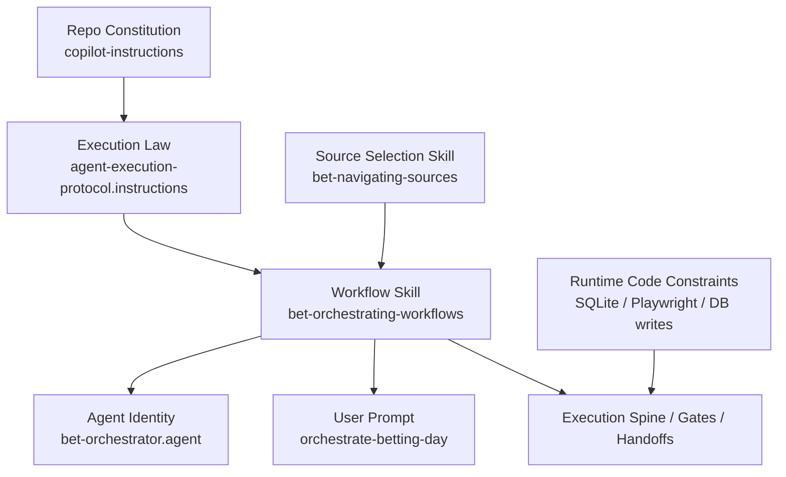

# Orchestrator Brave Search Optimization - Analysis Result

## Task Details

| Field | Value |
|---|---|
| Jira ID | N/A |
| Title | Orchestrator Brave Search Optimization |
| Description | Research a customization change so the bet orchestrator proactively uses Brave search during long-running script execution, overlaps safe read-only research while async scripts run, and makes safe parallelization expectations explicit without weakening existing betting workflow rules. |
| Priority | Not specified |
| Reporter | User prompt |
| Created Date | 2026-05-26 |
| Due Date | N/A |
| Labels | customization, orchestration, brave-search, async-wait, workflow-ownership |
| Estimated Effort | Research only - implementation effort not estimated in this document |

## Business Impact

This change targets end-to-end session time and analysis quality at the same time. The user has already seen that proactive web context gathering during script runtime can surface high-value information that would otherwise be missed or discovered late. Encoding that behavior into the orchestrator reduces idle waiting, removes reliance on ad hoc user nudges, and keeps the pipeline aligned with the repo's core model: scripts produce data, agents add judgment.

The business value is operational, not cosmetic. A better orchestrator should shorten sessions by overlapping safe read-only work with long-running steps, while still preserving the repo's non-negotiable rules: no blind script running, no uncontrolled parallel writes, no breaking phase order, no fish-shell violations, and no bypassing specialist analysis after a script finishes.

## Gathered Information

### Knowledge Base & Task Management Tools

- No Jira, Confluence, Figma, or PDF source was provided for this task.
- Primary source of truth is the user request plus the inspected bet customization artifacts.
- Supporting repo evidence came from repo memory and code comments that document current orchestration, async-wait behavior, Playwright constraints, and concurrent DB write hazards.
- No external product-management system was queried because no task IDs or links were provided.

### Codebase

#### Current runtime owners of orchestrator behavior

- `.github/agents/bet-orchestrator.agent.md` defines the orchestrator identity, responsibility split, and tool availability. It exposes Brave search tools, but it does not tell the orchestrator when to use them during async waits.
- `.github/prompts/orchestrate-betting-day.prompt.md` is the workflow entry point. It defines phase order and points to the workflow skill resources, but it does not define a proactive read-only overlap policy, a Brave-search expectation, or a safe/unsafe parallelism matrix.
- `.github/skills/bet-orchestrating-workflows/SKILL.md` explicitly says reusable coordination detail belongs in the workflow skill resources rather than being duplicated in prompts and agents. This is the strongest ownership signal for the requested behavior.
- `.github/skills/bet-orchestrating-workflows/resources/execution-spine.md` currently stops at run -> read output -> delegate -> gate -> advance. It has no explicit "during async wait" work menu.
- `.github/skills/bet-orchestrating-workflows/resources/resume-stop-gates.md` defines when to stop or resume, but not what the orchestrator should proactively do while a long-running step is still in progress.
- `.github/skills/bet-orchestrating-workflows/resources/handoff-contracts.md` defines the subagent payload shape, but there is no explicit slot for research gathered during the wait period.
- `.github/instructions/agent-execution-protocol.instructions.md` is the current global execution law for bet agents. It already requires async execution for scripts longer than 120s and says the agent should use sequential thinking plus read-only inspection while waiting. Brave search is available as a tool, but the protocol does not say to use it proactively.
- `.github/copilot-instructions.md` preserves the repo-wide constraints that must not change: agent-driven pipeline, DB-first workflow, async script execution, fish-shell safety, and no `pipeline_orchestrator.py`.
- `.github/skills/bet-navigating-sources/SKILL.md` already owns source selection, fallback chains, and source-specific access rules. It also documents that Playwright-driven tipster fetching is sequential, while HTTP fallback can be parallelized.

#### Existing async-wait patterns already present

- `agent-execution-protocol.instructions.md` says scripts over 120s should run async and, while waiting, the agent should use sequential thinking plus `pylanceRunCodeSnippet` before checking output again.
- `.github/prompts/test-run-then-delegate.prompt.md` is a concrete example of the same pattern: start async, think while waiting, monitor terminal output, then delegate analysis only after the script completes.
- `memories/repo/pipeline-knowledge-base.md` documents the adopted Model A loop: inspect, run async, think while waiting, monitor, extract output, validate, delegate, then decide.

#### Gap in the current state

- The repo already encodes "do not sit idle while waiting," but it does not encode "perform proactive Brave search while waiting when that shortens the downstream analysis path."
- Brave search is currently a capability, not a prescribed orchestrator behavior.
- Safe overlap boundaries are implicit and fragmented across instructions, skill docs, repo memory, and code comments instead of being presented as one canonical expectation for the orchestrator.

#### Safe parallelism evidence found in the repo

- `src/bet/db/repositories.py` documents a concurrent write hazard for `team_form` and explicitly says the pipeline must serialize these writes.
- `src/bet/stats/enrichment.py` runs its enrichment tasks sequentially to avoid concurrent writes to a shared SQLite connection.
- `memories/repo/pipeline-knowledge-base.md` records that previous orchestration guidance about parallel subagents was incorrect and was fixed back to the Model A run-then-delegate flow.
- `memories/repo/pipeline-knowledge-base.md` and `.github/skills/bet-navigating-sources/SKILL.md` both document that Playwright-driven tipster fetching is sequential because Playwright is not thread-safe in this workflow.
- `memories/repo/playwright-and-scraping.md` says not to add live-scraping Playwright work into the main pipeline.
- The same knowledge base also records a narrower safe case: some HTTP or `curl_cffi` internals can parallelize safely, but that does not justify orchestrator-level parallel launching of pipeline steps that write DB state or depend on ordered gates.

#### Draft acceptance criteria extracted from the research task

- The orchestrator should proactively use Brave search during long-running script execution when that work is read-only, stage-relevant, and likely to reduce end-to-end session time.
- The behavior must be encoded in canonical customization owners, not rely on user reminders.
- The customization must explicitly distinguish safe overlap work from prohibited sequential boundaries.
- The implementation must preserve Model A: the orchestrator runs the script, waits with useful read-only work, then delegates specialist analysis only after finished output exists.
- Repo-wide betting rules remain intact: DB-first, fish-shell-safe commands, no blind script running, no `pipeline_orchestrator.py`, and no auto-bypassing of user decision gates.

### Relevant Links

Any relevant links to documentation, designs, or other resources:
- [../../.github/agents/bet-orchestrator.agent.md](../../.github/agents/bet-orchestrator.agent.md) - current orchestrator identity, responsibility split, and tool access
- [../../.github/prompts/orchestrate-betting-day.prompt.md](../../.github/prompts/orchestrate-betting-day.prompt.md) - current workflow entry point and phase ordering
- [../../.github/skills/bet-orchestrating-workflows/SKILL.md](../../.github/skills/bet-orchestrating-workflows/SKILL.md) - ownership boundary for reusable orchestration mechanics
- [../../.github/skills/bet-orchestrating-workflows/resources/execution-spine.md](../../.github/skills/bet-orchestrating-workflows/resources/execution-spine.md) - canonical execution loop today
- [../../.github/skills/bet-orchestrating-workflows/resources/resume-stop-gates.md](../../.github/skills/bet-orchestrating-workflows/resources/resume-stop-gates.md) - stop/resume semantics today
- [../../.github/skills/bet-orchestrating-workflows/resources/handoff-contracts.md](../../.github/skills/bet-orchestrating-workflows/resources/handoff-contracts.md) - subagent handoff payload today
- [../../.github/instructions/agent-execution-protocol.instructions.md](../../.github/instructions/agent-execution-protocol.instructions.md) - async run/monitor/wait law
- [../../.github/copilot-instructions.md](../../.github/copilot-instructions.md) - repo-wide workflow constraints that must be preserved
- [../../.github/skills/bet-navigating-sources/SKILL.md](../../.github/skills/bet-navigating-sources/SKILL.md) - source ownership and Playwright/HTTP constraints
- [../../memories/repo/pipeline-knowledge-base.md](../../memories/repo/pipeline-knowledge-base.md) - verified orchestration history and parallelism lessons
- [../../memories/repo/agent-protocol-and-config.md](../../memories/repo/agent-protocol-and-config.md) - current async-wait model summary
- [../../memories/repo/playwright-and-scraping.md](../../memories/repo/playwright-and-scraping.md) - Playwright safety boundaries
- [../../src/bet/db/repositories.py](../../src/bet/db/repositories.py) - concrete concurrent write hazard in runtime code
- [../../src/bet/stats/enrichment.py](../../src/bet/stats/enrichment.py) - concrete sequentialization due to SQLite write/thread safety

### Relevant Charts & Diagrams

The current ownership picture is already mostly correct. The missing piece is a canonical workflow rule that turns idle async wait time into explicit, safe, read-only research work.

## Current Implementation Status

### Existing Components

- `bet-orchestrator` - `.github/agents/bet-orchestrator.agent.md` - can be reused; currently too thin to own this behavior directly and should remain thin
- `orchestrate-betting-day` - `.github/prompts/orchestrate-betting-day.prompt.md` - needs extension by reference; currently names phase order but not proactive wait-time work
- `bet-orchestrating-workflows` skill - `.github/skills/bet-orchestrating-workflows/SKILL.md` - canonical reusable owner; best place to centralize this behavior
- `execution-spine` resource - `.github/skills/bet-orchestrating-workflows/resources/execution-spine.md` - needs extension or a sibling resource for explicit async-wait overlap work
- `resume-stop-gates` resource - `.github/skills/bet-orchestrating-workflows/resources/resume-stop-gates.md` - may need small extension to define when proactive overlap must stop or pause
- `handoff-contracts` resource - `.github/skills/bet-orchestrating-workflows/resources/handoff-contracts.md` - likely needs extension if overlap findings should be passed forward explicitly
- `agent-execution-protocol` instruction - `.github/instructions/agent-execution-protocol.instructions.md` - reusable baseline already present; may need clarification only if the team wants a repo-wide read-only overlap rule beyond the orchestrator
- `bet-navigating-sources` skill - `.github/skills/bet-navigating-sources/SKILL.md` - reusable source/Brave guidance owner; should not own orchestration timing
- `pipeline-knowledge-base` memory - `memories/repo/pipeline-knowledge-base.md` - evidence source only; not a runtime customization owner
- `test-run-then-delegate` prompt - `.github/prompts/test-run-then-delegate.prompt.md` - evidence/example only; not the canonical workflow owner

### Key Files and Directories

- `.github/agents/` - active agent identities and tool surfaces
- `.github/prompts/` - user-facing workflow entry points
- `.github/skills/bet-orchestrating-workflows/` - reusable orchestration mechanics and resource files
- `.github/skills/bet-navigating-sources/` - reusable source selection rules and access constraints
- `.github/instructions/` - always-on execution and methodology rules
- `memories/repo/` - verified repo lessons that explain why some parallelism is safe and some is not
- `src/bet/db/` - runtime DB repository layer, including explicit concurrent write hazards
- `src/bet/stats/` - runtime enrichment logic with sequentialization due to SQLite/threading constraints

## Gap Analysis

### Question 1
#### Which artifacts currently control the orchestrator behavior relevant to this change?

The active runtime behavior is currently controlled by these customization artifacts:

- `.github/agents/bet-orchestrator.agent.md`
- `.github/prompts/orchestrate-betting-day.prompt.md`
- `.github/skills/bet-orchestrating-workflows/SKILL.md`
- `.github/skills/bet-orchestrating-workflows/resources/execution-spine.md`
- `.github/skills/bet-orchestrating-workflows/resources/resume-stop-gates.md`
- `.github/skills/bet-orchestrating-workflows/resources/handoff-contracts.md`
- `.github/instructions/agent-execution-protocol.instructions.md`
- `.github/copilot-instructions.md`

Supporting but non-owning evidence comes from:

- `.github/skills/bet-navigating-sources/SKILL.md`
- `memories/repo/pipeline-knowledge-base.md`
- `memories/repo/agent-protocol-and-config.md`
- `memories/repo/playwright-and-scraping.md`
- `src/bet/db/repositories.py`
- `src/bet/stats/enrichment.py`

### Question 2
#### Where should the proactive Brave-search policy belong?

The best ownership split is:

- Canonical owner: `bet-orchestrating-workflows` resource layer.
- Preferred implementation surface: extend `resources/execution-spine.md` or add a sibling resource dedicated to async-wait overlap work and safe parallelization expectations.
- Prompt role: reference the canonical workflow resource, not re-explain the full policy inline.
- Agent role: stay thin and responsibility-oriented; do not duplicate workflow mechanics in `bet-orchestrator.agent.md`.
- Source/navigation role: keep Brave-search source selection, fallback types, and source-specific constraints in `bet-navigating-sources`.
- Repo constitution role: keep `.github/copilot-instructions.md` focused on permanent rules, not workflow detail.
- Execution-law role: keep `agent-execution-protocol.instructions.md` focused on generic async/monitoring law. Only update it if the team wants a repo-wide rule that all relevant bet agents should use read-only overlap work, not just the orchestrator.

Reasoning:

- The workflow skill explicitly says reusable coordination detail belongs in the skill resources instead of being duplicated in prompts and agents.
- The requested behavior is orchestration timing and workflow mechanics, not constitutional policy and not source taxonomy.
- The repo has already been cleaned up to reduce duplicated rules, so adding this logic directly to both the prompt and the agent would repeat the mistake the repo has been actively undoing.

### Question 3
#### What kinds of parallelism are safe, and what must remain sequential?

| Work type | Safe to overlap with a long-running async script? | Evidence |
|---|---|---|
| Read-only file reads, config/journal/source-registry reads, protocol loads | Yes | No write hazard; aligns with current think-while-waiting rule |
| Read-only DB inspection and output inspection | Yes | Already prescribed by current async-wait pattern |
| Brave web/news/context search targeted to active-stage context gaps | Yes | Read-only, time-saving, and not currently forbidden; missing only canonical policy text |
| Sequential thinking and draft checkpoint notes | Yes | Already part of current wait behavior |
| Delegating specialist analysis before the script finishes | No | Model A requires finished output before delegation |
| Launching the next dependent pipeline script before the current step resolves | No | Violates execution spine and resume/stop gates |
| Concurrent DB-writing pipeline steps, especially `team_form` writers | No | `repositories.py` explicitly warns these writes must be serialized |
| Parallel Playwright-driven tipster or browser scraping work | No | Source skill and knowledge base both say Playwright is not thread-safe in this workflow |
| Adding new live-scraping Playwright work into the main pipeline wait window | No | `playwright-and-scraping.md` says not to add live-scraping Playwright into the main pipeline |
| Internal HTTP or `curl_cffi` concurrency inside a script that already owns its own safeguards | Conditionally yes, but inside the script owner only | Knowledge base documents this as an implementation detail, not permission for orchestrator-level parallel step launching |

Important nuance:

- This research supports overlapping read-only research while a script runs.
- It does not support broad orchestrator-level parallel execution of pipeline scripts.
- A historical note in repo memory says some phases were once considered independent, but the active runtime model and code-level hazards still favor explicit sequential gates unless a specific pair is separately proven safe.

### Question 4
#### What async-wait patterns already exist, and where are the gaps?

Existing patterns:

- Async run + monitor + think-while-waiting is already present in `agent-execution-protocol.instructions.md`.
- The same pattern is reinforced by `.github/prompts/test-run-then-delegate.prompt.md`.
- `memories/repo/pipeline-knowledge-base.md` documents the adopted Model A loop and explains why script execution was removed from subagents.

Gaps:

- No canonical artifact says the orchestrator should proactively use Brave search during the wait.
- No artifact defines a "safe overlap work menu" that distinguishes allowed read-only overlap from forbidden sequential work.
- No artifact gives phase-aware guidance on when proactive search is worthwhile versus unnecessary.
- No artifact defines how findings gathered during the wait should be carried into the next specialist handoff.
- No explicit budget or query-discipline guidance exists for Brave-search use in this orchestration context.

### Question 5
#### What acceptance criteria should guide the future implementation?

1. The orchestrator customization explicitly instructs proactive read-only research during long-running async scripts when that work is relevant to the active stage and can reduce end-to-end session time.
2. The canonical owner for this behavior is a shared workflow resource, not duplicated policy text across both agent and prompt.
3. The documented safe overlap work explicitly includes Brave web/news/context search, read-only DB and file inspection, protocol/source loading, and checkpoint note preparation.
4. The documented prohibited overlap work explicitly includes dependent script execution, specialist delegation before finished output exists, concurrent DB-writing pipeline steps, and parallel Playwright-heavy browsing/scraping.
5. The resulting workflow preserves Model A exactly: orchestrator runs the script, monitors it, performs safe read-only overlap work, reads the finished output, delegates analysis only after completion, then applies gates before advancing.
6. The resulting customization preserves repo betting rules: DB-first workflow, fish-shell-safe execution, no `pipeline_orchestrator.py`, no blind script running, and no bypass of user decision boundaries.
7. The resulting guidance makes the behavior proactive and default. The orchestrator should not need a user reminder to use Brave search when the conditions are already satisfied.
8. If no meaningful read-only overlap work exists for a given async step, the orchestrator guidance should default to monitoring and preparation rather than forcing unnecessary search activity.
9. Any overlapped findings that matter downstream can be handed off or summarized cleanly without inventing facts or replacing the specialist's post-script analysis.

### Question 6
#### What ambiguities or product decisions still need to be resolved?

- Trigger threshold: should proactive Brave overlap apply to every async script, only scripts above a longer duration threshold, or only named stages such as tipsters, enrichment, deep stats, context, gate, and coupon build?
- Search scope: should the orchestrator research all active candidates, only the top shortlist or gate candidates, or only candidates with known missing context?
- Budget policy: the repo exposes Brave tools, but no per-session or per-step query ceiling is defined for orchestrator-driven proactive search.
- Persistence model: should wait-time findings be stored as a checkpoint note, added to specialist handoffs, or remain ephemeral unless they materially affect the next step?
- Ownership breadth: should the generic idea of read-only overlap work become repo-wide execution law in `agent-execution-protocol.instructions.md`, or stay orchestrator-specific in workflow resources?

Current recommendation on ambiguity severity:

- Planning can proceed immediately because ownership boundaries, current-state gaps, and safe/unsafe concurrency boundaries are already clear enough.
- User clarification is still recommended before implementation details are finalized, especially for trigger thresholds, search scope, and query-budget expectations.