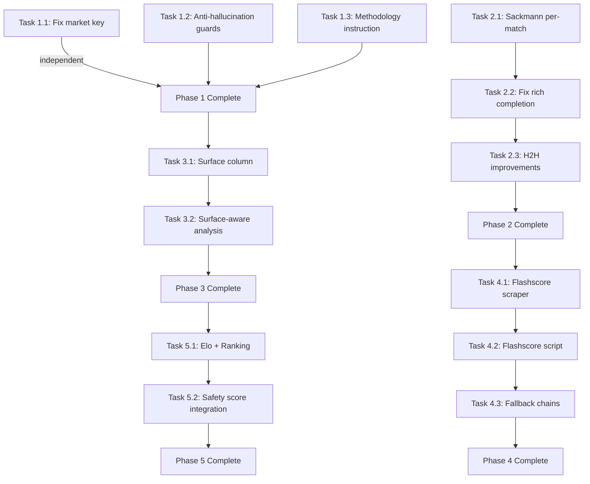

# tennis-pipeline-deep-fix - Implementation Plan

## Task Details

| Field            | Value |
| ---------------- | ----- |
| Jira ID          | N/A |
| Title            | Tennis pipeline deep fix — market definitions, per-match data, surface awareness, and anti-hallucination |
| Description      | Fix seven critical gaps in the tennis analysis pipeline: a broken market definition, fragile per-match data integration, missing surface-aware analysis, unreliable H2H warmup, hallucination risks from thin data, absent Flashscore match-level scraping, and unused Elo/ranking data. These gaps cause tennis candidates to receive incomplete analysis, incorrect safety scores, and fabricated statistics in coupon reports. |
| Priority         | Critical |
| Related Research | `specifications/tennis-rich-stat-enrichment/tennis-rich-stat-enrichment.plan.md`, `specifications/flashscore-match-stats-token/flashscore-match-stats-token.plan.md`, `memories/repo/pipeline-knowledge-base.md` |

## Proposed Solution

Fix the tennis pipeline through five progressive phases — from instant bug fixes through core data integration to strength modeling — ensuring each phase produces independently testable improvements without breaking existing enrichment contracts.

Key architectural decisions:

- **DB-first (R2):** All new data flows persist through `match_stats` → `team_form` via established `_store_in_cache()` or direct repository writes. No JSON-only paths.
- **Stats-first (R4):** Per-match L10 arrays are the primary deliverable — safety scores and market rankings depend on actual distribution data, not averages.
- **Self-healing (R6):** New sources slot into `FALLBACK_CHAINS["tennis"]` at defined positions with explicit degradation behavior when unavailable.
- **Existing contracts preserved:** `scripts/enrich_tennis_stats.py` remains baseline owner. `scripts/data_enrichment_agent.py` remains rich-completion orchestrator. `scripts/_helpers/tennis_rich_completion.py` remains the bounded helper. Branch B settlement unchanged.

Source hierarchy after all phases:
```
L1: ESPN scoreboard (baseline: sets_won, total_sets, games_won, total_games)
L2: Tennis Abstract (primary rich: aces, df, 1st_serve_pct, hold_pct, break_pct, etc.)
L3: Flashscore Tennis (NEW — per-match serve stats, aces, df, bp_won, bp_saved)
L4: Sackmann CSVs (per-match serve stats from GitHub ATP/WTA match data)
L5: Web search (injuries, motivation, surface info)
```

## Current Implementation Analysis

### Already Implemented

- `src/bet/stats/market_ranking.py` — TENNIS_MARKETS dict with market→stat_key mappings; SPORT_STAT_KEYS["tennis"] defining valid keys
- `scripts/_helpers/tennis_rich_completion.py` — bounded helper merging baseline + rich (from tennis-rich-stat-enrichment plan, DONE)
- `src/bet/api_clients/tennis_abstract.py` — TennisAbstract scraper returning per-match serve/return stats
- `src/bet/api_clients/tennis_sackmann.py` — Sackmann ATP data client (currently aggregates only via `get_player_stats()`)
- `scripts/tennis_h2h_warmup.py` — Pre-caches H2H for tennis before S3
- `src/bet/stats/ddg_h2h_search.py` — DuckDuckGo H2H search with budget limits
- `scripts/deep_stats_report.py` — S3 per-candidate analysis with `extract_team_stats()` + `extract_h2h_stats()`
- `scripts/compute_safety_scores.py` — Safety score calculation with tennis Elo boolean check
- `scripts/fetch_tennis_elo.py` — Elo rating fetcher (exists, stores ratings)
- `src/bet/scrapers/flashscore.py` — `FlashscoreScraper` base + empty `TennisFlashscoreScraper` subclass
- `src/bet/stats/fallback_chains.py` — `FALLBACK_CHAINS["tennis"]` and `RICH_COMPLETION_POLICY["tennis"]`
- `src/bet/db/repositories.py::StatsRepo` — stable persistence for `match_stats` and `team_form`

### To Be Modified

- `src/bet/stats/market_ranking.py` — fix broken `break_points_won` key in TENNIS_MARKETS
- `src/bet/api_clients/tennis_sackmann.py` — add `get_player_match_history()` returning per-match L10 arrays
- `scripts/_helpers/tennis_rich_completion.py` — improve name matching (fuzzy), direct player lookup instead of fixture-key matching
- `scripts/tennis_h2h_warmup.py` — increase DDG budget, add fuzzy matching, store serve-specific H2H stats
- `src/bet/stats/ddg_h2h_search.py` — increase budget constant from 20 to 50
- `scripts/deep_stats_report.py` — add hallucination risk markers, surface display, explicit data/no-data markers
- `scripts/compute_safety_scores.py` — integrate Elo differential as safety factor, surface-aware filtering
- `scripts/fetch_tennis_elo.py` — ensure surface-specific Elo caching, add ranking lookup
- `src/bet/scrapers/flashscore.py` — implement tennis match-level stat scraping in `TennisFlashscoreScraper`
- `src/bet/stats/fallback_chains.py` — add `flashscore-tennis` at position L3

### To Be Created

- `scripts/enrich_tennis_flashscore.py` — new script fetching L10 match-by-match stats per player from Flashscore
- DB migration adding `surface` column to `fixtures` table

## Open Questions

| #   | Question | Answer | Status |
| --- | -------- | ------ | ------ |
| 1   | Should `break_points_won` be replaced with `break_pct` or a new market using `hold_pct`? | Replace with `break_pct` — already produced by tennis-abstract and listed in `required_rich_keys`. | ✅ Resolved |
| 2   | Should surface filtering be hard (exclude different-surface matches) or soft (weight reduction)? | Soft — same-surface weight 1.0, different-surface weight 0.5, unknown surface weight 0.7. | ✅ Resolved |
| 3   | Does Flashscore tennis integration reuse the existing `curl_cffi` pattern from football? | Yes — same internal JSON API pattern, different URL paths for tennis match detail. | ✅ Resolved |
| 4   | Should ATP/WTA ranking come from tennis-abstract or a separate feed? | Tennis-abstract first (already scraped), Sackmann CSV as fallback. | ✅ Resolved |
| 5   | Does §3.2G wildcard blowout rule apply only to Grand Slams? | Yes — only GS R1/R2 where WC/Q/LL face seeded players. | ✅ Resolved |

## Technical Context

### DB Schema (relevant tables)

```sql
-- team_form: per-player stat arrays
CREATE TABLE team_form (
    team_id INTEGER, sport_id INTEGER, stat_key TEXT,
    l10_avg REAL, l5_avg REAL, l10_values TEXT,  -- JSON array of 10 values
    h2h_values TEXT, h2h_opponent_id INTEGER,
    source TEXT, updated_at TEXT
);

-- fixtures: match schedule
CREATE TABLE fixtures (
    id INTEGER PRIMARY KEY, sport_id INTEGER,
    home_team_id INTEGER, away_team_id INTEGER,
    kickoff TEXT, status TEXT, external_id TEXT, league_id INTEGER
    -- NOTE: no 'surface' column currently
);

-- match_stats: per-fixture normalized stats
CREATE TABLE match_stats (
    fixture_id INTEGER, stat_key TEXT,
    home_value REAL, away_value REAL, source TEXT
);
```

### Key Architecture Rules

- **R2 (DB-first):** Always `from bet.db.connection import get_db`. Never raw `sqlite3.connect()`.
- **R4 (Stats-first):** Statistical markets evaluated BEFORE outcomes.
- **R6 (Self-healing):** 7 fallback layers; never leave data gaps unfilled.
- **R10 (Fish shell):** No inline python, no bash syntax in terminal commands.

### Tech Stack

- Python ≥3.11, SQLite at `betting/data/betting.db`
- Libraries: `requests`, `beautifulsoup4`, `curl_cffi`, `rapidfuzz` (for fuzzy matching), `pydantic`, `sqlalchemy`
- Tests: `pytest`
- Shell: fish (no bash syntax)

### Testing Patterns

- Narrow pytest modules with mocked HTTP/DB responses
- Source-specific test files under `tests/scrapers/tennis/` and `tests/api_clients/`
- Integration tests use temporary SQLite DBs

## Implementation Plan

### Phase 1: Quick Wins (P0 + P5)

Immediate fixes that can be deployed independently — a broken market key and hallucination guards.

#### Task 1.1 - [MODIFY] Fix broken `break_points_won` market definition

**Description:** Replace the non-existent `break_points_won` stat key in TENNIS_MARKETS with `break_pct`, which is already produced by tennis-abstract and declared in `RICH_COMPLETION_POLICY["tennis"]["required_rich_keys"]`.

**Files:**
- `src/bet/stats/market_ranking.py` (~line 103)

**Changes:**
- In `TENNIS_MARKETS` dict: change `"break_points_won"` → `"break_pct"` (or rename the market entry to reflect break percentage semantics)
- Verify SPORT_STAT_KEYS["tennis"] includes `break_pct` (it should from tennis-rich-stat-enrichment)
- If there's a market description string, update it to reflect "Break Point Conversion %" rather than "Break Points Won"

**Definition of Done:**
- [x] `TENNIS_MARKETS` contains no reference to `break_points_won`
- [x] The replacement key (`break_pct`) exists in `SPORT_STAT_KEYS["tennis"]`
- [x] The replacement key is produced by at least one source in `FALLBACK_CHAINS["tennis"]`
- [x] `pytest tests/ -k "market_ranking"` passes
- [x] No other file references `break_points_won` as a tennis stat key

---

#### Task 1.2 - [MODIFY] Add anti-hallucination guards to deep_stats_report.py

**Description:** When tennis data quality is PARTIAL (< 5 real stat keys), add explicit markers that prevent downstream LLM agents from inventing serve/return statistics.

**Files:**
- `scripts/deep_stats_report.py` — per-candidate report section

**Changes:**
1. After computing available stat keys for a tennis candidate, add a `"hallucination_risk"` field:
   - `"HIGH"` when `data_quality_score < 5`
   - `"MEDIUM"` when `data_quality_score` is 5-6
   - `"LOW"` when `data_quality_score >= 7`
2. In the per-candidate markdown/JSON section, explicitly list:
   - `"real_data_keys": [...]` — keys with actual L10 values
   - `"empty_keys": [...]` — keys with no data (marked `"NO DATA - DO NOT ANALYZE"`)
3. For `hallucination_risk: HIGH`, add inline marker: `⚠️ THIN DATA — Only analyze markets with real L10 arrays below. DO NOT invent serve/return numbers.`

**Definition of Done:**
- [ ] Tennis candidates with < 5 stat keys show `hallucination_risk: HIGH` in the S3 report
- [ ] Each candidate's report section lists `real_data_keys` and `empty_keys` explicitly
- [ ] Empty market slots show `"NO DATA - DO NOT ANALYZE"` text
- [ ] No functional change to non-tennis candidates
- [ ] Existing `deep_stats_report.py` tests pass

---

#### Task 1.3 - [MODIFY] Add hallucination rule to analysis-methodology instructions

**Description:** Add an explicit rule preventing agents from analyzing tennis markets without real data.

**Files:**
- `.github/instructions/analysis-methodology.instructions.md`

**Changes:**
- Add rule in the tennis analysis section: "For tennis candidates with `hallucination_risk=HIGH`, ONLY analyze markets with real L10 data present. DO NOT invent serve/return numbers. If a market has no data, mark it SKIP with reason 'no data' rather than guessing."

**Definition of Done:**
- [ ] Rule is present in analysis-methodology instructions
- [ ] Rule references the `hallucination_risk` field from Task 1.2
- [ ] Rule is scoped to tennis only (does not affect other sports)

---

### Phase 2: Core Enrichment (P1 + P2 + P4)

Critical data pipeline fixes — per-match L10 arrays from multiple sources with fuzzy matching.

#### Task 2.1 - [MODIFY] Add per-match history to Sackmann client

**Description:** Extend `tennis_sackmann.py` with a `get_player_match_history()` method that returns individual match rows (not aggregates) for the last N matches, providing per-match serve stats as L10 arrays.

**Files:**
- `src/bet/api_clients/tennis_sackmann.py`

**Changes:**
1. Add method: `get_player_match_history(player_name: str, last_n: int = 10) -> list[dict]`
2. Each dict contains: `date`, `opponent`, `surface`, `aces`, `double_faults`, `first_serve_in_pct`, `first_serve_won_pct`, `second_serve_won_pct`, `bp_saved`, `bp_faced`, `result`
3. Implementation: parse the per-match CSV rows (which already have these columns) from the Sackmann GitHub ATP/WTA match data, filter by player name, sort by date descending, take `last_n`
4. Use fuzzy matching (rapidfuzz, threshold 85%) for player name lookup in CSVs

**Definition of Done:**
- [ ] `get_player_match_history("Novak Djokovic", last_n=10)` returns a list of up to 10 dicts with per-match serve stats
- [ ] Each dict contains all specified keys with numeric values (not aggregates)
- [ ] Fuzzy matching handles name variants (e.g., "Alejandro Davidovich Fokina" vs "Davidovich Fokina A.")
- [ ] Returns empty list (not error) when player not found
- [ ] Unit test with mocked CSV data covers happy path + name variant + empty result
- [ ] Existing `get_player_stats()` behavior unchanged

---

#### Task 2.2 - [MODIFY] Fix tennis_rich_completion.py name matching and data integration

**Description:** Replace fragile exact-match fixture-key lookups with fuzzy matching and direct player-based queries. Stop depending on `(date, opponent)` key matching for tennis-abstract results.

**Files:**
- `scripts/_helpers/tennis_rich_completion.py`

**Changes:**
1. Replace `_normalize_name()` (line ~65) with a fuzzy normalization using `rapidfuzz.fuzz.ratio` (threshold 80%)
2. Change the primary lookup strategy from fixture-key matching to direct player lookup:
   - Call tennis-abstract's `get_player_matches(player_name)` directly for each shortlisted player
   - Fall back to Sackmann's new `get_player_match_history()` when tennis-abstract returns < 5 matches
3. Store raw L10 per-match values in `team_form` rows via `_store_in_cache()`:
   - stat_keys: `aces`, `double_faults`, `first_serve_pct`, `first_serve_win_pct`, `second_serve_win_pct`, `break_points_saved_pct`, `hold_pct`, `break_pct`
   - `l10_values` field: JSON array of 10 individual match values
   - `l10_avg` / `l5_avg` computed from those arrays
4. Add `rapidfuzz` as dependency (already available for other fuzzy matching in the project)

**Definition of Done:**
- [ ] Name matching uses Levenshtein/fuzzy ratio with ≥80% threshold
- [ ] Player lookup does not depend on fixture-key matching
- [ ] `team_form` rows contain `l10_values` as JSON arrays (not just averages)
- [ ] Fallback chain: tennis-abstract → sackmann per-match → report gap
- [ ] Eastern European / Asian player names that previously failed now match (test with known examples)
- [ ] Existing tests in `tests/test_tennis_rich_completion.py` updated and passing

---

#### Task 2.3 - [MODIFY] Improve H2H warmup reliability

**Description:** Increase DDG search budget, add fuzzy matching to tennis-abstract H2H lookups, and store serve-specific H2H stats when available.

**Files:**
- `scripts/tennis_h2h_warmup.py`
- `src/bet/stats/ddg_h2h_search.py`

**Changes:**
1. In `ddg_h2h_search.py`: change `MAX_DDG_SEARCHES` constant from 20 → 50
2. In `tennis_h2h_warmup.py`:
   - Replace exact name matching in `get_h2h()` with fuzzy matching (Levenshtein distance ≤ 2 OR ratio ≥ 90%)
   - When tennis-abstract returns H2H match data, extract and store serve-specific stats:
     - `h2h_aces_avg`, `h2h_break_pct_avg` in addition to existing `total_games`, `total_sets`
   - Store in `team_form.h2h_values` as extended JSON: `{"total_games": X, "total_sets": Y, "aces_avg": Z, "break_pct_avg": W}`

**Definition of Done:**
- [ ] DDG budget is 50 (verified in code, no hardcoded 20 remaining)
- [ ] H2H lookup matches "del Potro" to "Del Potro" (case-insensitive fuzzy)
- [ ] H2H data includes serve-specific stats when available from source
- [ ] `team_form.h2h_values` JSON schema extended (backward-compatible — old entries still valid)
- [ ] Test covers fuzzy H2H matching and extended H2H value storage
- [ ] No regression in non-tennis H2H paths

---

### Phase 3: Surface Intelligence (P3)

Surface-aware analysis — filter and weight L10 data by playing surface.

#### Task 3.1 - [MODIFY] Add `surface` column to fixtures table

**Description:** Add a `surface` column to the `fixtures` table and populate it during discovery/enrichment for tennis events.

**Files:**
- DB migration (inline in a script or via `scripts/db_migrations/`)
- `scripts/discover_events.py` or tennis discovery path
- `scripts/enrich_tennis_stats.py` (populate surface from source data)
- `scripts/_helpers/tennis_rich_completion.py` (populate surface from tennis-abstract)

**Changes:**
1. Add column: `ALTER TABLE fixtures ADD COLUMN surface TEXT DEFAULT NULL`
2. During tennis event discovery/enrichment, populate `surface` from:
   - Tennis-abstract match data (already extracts surface in `NormalizedMatchStats`)
   - SofaScore event data (if available)
   - Default: `NULL` (unknown)
3. Valid values: `'hard'`, `'clay'`, `'grass'`, `'carpet'`, `NULL`

**Definition of Done:**
- [ ] `fixtures` table has `surface` column (nullable TEXT)
- [ ] Tennis fixtures populated during enrichment have surface set when source provides it
- [ ] Non-tennis fixtures unaffected (`surface` remains NULL)
- [ ] Migration script is idempotent (can run multiple times safely)
- [ ] Existing fixture queries still work (column is nullable, no NOT NULL constraint)

---

#### Task 3.2 - [MODIFY] Surface-aware L10 filtering in analysis

**Description:** When evaluating tennis candidates, filter/weight L10 matches by surface relevance to the upcoming match surface.

**Files:**
- `scripts/deep_stats_report.py` — tennis candidate analysis section
- `scripts/compute_safety_scores.py` — optional surface-weight factor

**Changes:**
1. In `deep_stats_report.py`, when building tennis L10 arrays:
   - Query the surface of the upcoming fixture
   - If surface is known: weight same-surface matches 1.0, different-surface 0.5, unknown-surface 0.7
   - Compute `surface_adjusted_avg` alongside raw `l10_avg`
   - Display surface in report: "Surface: Clay" in the §3.2M table
2. In `compute_safety_scores.py`:
   - If ≥6 of 10 recent matches are on the same surface as upcoming → +0.5 safety bonus
   - If <3 of 10 matches on same surface → -0.5 safety penalty (surface unfamiliarity)

**Definition of Done:**
- [ ] Tennis S3 report shows the surface of the upcoming match
- [ ] L10 analysis distinguishes same-surface vs cross-surface performance when surface data is available
- [ ] Safety score incorporates surface familiarity factor for tennis
- [ ] Graceful degradation: when surface is unknown, no weighting applied (raw averages used)
- [ ] Test with mocked fixture data covers surface-weighted calculation
- [ ] Non-tennis safety scores unaffected

---

### Phase 4: Flashscore Enrichment (P6)

New data source — match-by-match serve stats from Flashscore for tennis.

#### Task 4.1 - [MODIFY] Implement tennis match-stats scraping in FlashscoreScraper

**Description:** Add tennis-specific match stat fetching to the existing `TennisFlashscoreScraper` class using Flashscore's internal JSON API (same `curl_cffi` pattern as football enricher).

**Files:**
- `src/bet/scrapers/flashscore.py` — `TennisFlashscoreScraper` class

**Changes:**
1. Implement `fetch_match_stats(match_id: str) -> dict | None`:
   - Hit Flashscore internal JSON API: `d.flashscore.com/x/feed/d_st_{match_id}` (or current stable endpoint)
   - Parse tennis-specific stats: aces, double_faults, first_serve_pct, break_points_won, break_points_saved, winners, unforced_errors
   - Return normalized dict or None on failure
2. Implement `fetch_player_recent_matches(player_id: str, last_n: int = 10) -> list[dict]`:
   - Hit player results page on Flashscore
   - Extract match_ids from recent results
   - For each match, call `fetch_match_stats()` to get per-match serve data
   - Return list of per-match stat dicts with: `date`, `opponent`, `surface`, `aces`, `double_faults`, `first_serve_pct`, `bp_won`, `bp_saved`, `result`
3. Use same `curl_cffi` session pattern and rate limiting as football Flashscore enricher
4. Handle: 403/429 responses gracefully (return None, log warning)

**Definition of Done:**
- [ ] `TennisFlashscoreScraper.fetch_match_stats(match_id)` returns parsed stats or None
- [ ] `TennisFlashscoreScraper.fetch_player_recent_matches(player_id)` returns up to 10 match dicts
- [ ] Rate limiting: max 2 requests/second to Flashscore
- [ ] Error handling: 403/429 → None (not crash), logged at WARNING level
- [ ] Unit tests with mocked Flashscore JSON responses cover happy path + error cases
- [ ] Football Flashscore functionality unchanged

---

#### Task 4.2 - [CREATE] Build tennis Flashscore enrichment script

**Description:** Create a pipeline script that uses `TennisFlashscoreScraper` to fetch L10 match-by-match stats for players in today's tennis fixtures and store results in `team_form`.

**Files:**
- `scripts/enrich_tennis_flashscore.py` (NEW)

**Changes:**
1. Create script with CLI: `--date YYYY-MM-DD --verbose --limit N`
2. Logic:
   - Query today's tennis fixtures from DB
   - For each player (home + away): resolve Flashscore player_id (via entity search)
   - Call `fetch_player_recent_matches(player_id, last_n=10)`
   - Normalize results to `NormalizedMatchStats` format
   - Persist via `_store_in_cache()` with `source='flashscore-tennis'`
3. AGENT_SUMMARY output: `eligible`, `completed`, `failed`, `skipped` counts
4. Budget: max 100 Flashscore requests per run (configurable via `--budget`)

**Definition of Done:**
- [ ] Script runs: `PYTHONPATH=src .venv/bin/python scripts/enrich_tennis_flashscore.py --date 2026-05-26 --verbose`
- [ ] Stores per-match L10 values in `team_form` with `source='flashscore-tennis'`
- [ ] Respects rate limiting (2 req/s) and budget cap (default 100)
- [ ] AGENT_SUMMARY JSON printed at end with counts
- [ ] Graceful degradation: player not found → skip (not crash)
- [ ] Integration test with mocked Flashscore responses

---

#### Task 4.3 - [MODIFY] Add flashscore-tennis to fallback chains

**Description:** Register `flashscore-tennis` as a source in the tennis fallback chain at position L3 (after tennis-abstract, before sackmann).

**Files:**
- `src/bet/stats/fallback_chains.py`

**Changes:**
1. Insert `'flashscore-tennis'` into `FALLBACK_CHAINS["tennis"]` at index 2 (after `tennis-abstract`)
2. Add `'flashscore-tennis'` to `RICH_COMPLETION_POLICY["tennis"]["supporting_sources"]`
3. Define expected stat keys from flashscore-tennis: `aces`, `double_faults`, `first_serve_pct`, `break_points_won_pct`, `break_points_saved_pct`

**Definition of Done:**
- [ ] `FALLBACK_CHAINS["tennis"]` lists flashscore-tennis at correct position
- [ ] `RICH_COMPLETION_POLICY["tennis"]["supporting_sources"]` includes `flashscore-tennis`
- [ ] `_helpers/tennis_rich_completion.py` can use flashscore-tennis as a fallback source
- [ ] Existing tests for fallback chains pass with new entry

---

### Phase 5: Elo / Ranking Integration (P7)

Strength modeling — use Elo differentials and ATP/WTA rankings in safety scores.

#### Task 5.1 - [MODIFY] Enhance Elo fetcher with surface-specific ratings and ranking

**Description:** Ensure `fetch_tennis_elo.py` caches surface-specific Elo ratings and adds ATP/WTA ranking lookup capability.

**Files:**
- `scripts/fetch_tennis_elo.py`
- `src/bet/api_clients/tennis_abstract.py` (if ranking data comes from here)

**Changes:**
1. In `fetch_tennis_elo.py`:
   - Store surface-specific Elo (overall, hard, clay, grass) — tennis-abstract provides these
   - Cache in DB table (likely `player_ratings` or extend existing storage)
   - Add `--surface` filter option to CLI
2. Add ranking lookup:
   - Primary: extract from tennis-abstract player pages (already scraped)
   - Fallback: Sackmann rankings CSV
   - Store: `current_ranking` field alongside Elo
3. Detect qualifier/wildcard/lucky loser status from draw data when available

**Definition of Done:**
- [ ] Surface-specific Elo ratings stored (overall + per-surface)
- [ ] ATP/WTA ranking stored alongside Elo
- [ ] `fetch_tennis_elo.py --date 2026-05-26 --verbose` produces ratings + rankings
- [ ] WC/Q/LL status detection for Grand Slam draws (when data available)
- [ ] Test covers storage and retrieval of surface Elo + ranking

---

#### Task 5.2 - [MODIFY] Integrate Elo differential into safety score calculation

**Description:** Use Elo differential as a quantitative factor in tennis safety scores, replacing the current boolean `has_elo` check.

**Files:**
- `scripts/compute_safety_scores.py`

**Changes:**
1. Replace boolean `has_elo` → quantitative Elo differential factor:
   - Elo gap > 200: strong favorite → +1.0 safety for favorite markets, -1.5 for upset markets
   - Elo gap 100-200: moderate favorite → +0.5 / -0.5
   - Elo gap < 100: competitive match → no adjustment
2. Add ranking-based factor:
   - Top 10 vs Top 10: competitive → no adjustment
   - Top 10 vs 50+: significant mismatch → adjust accordingly
   - Unranked vs ranked: flag as upset-risky
3. Implement §3.2G wildcard blowout rule:
   - Grand Slam R1/R2: WC/Q/LL vs seeded (top 32) → auto-flag Total Games > O22.5 as HIGH RISK
   - Logic: detect draw position from fixture metadata or ranking differential

**Definition of Done:**
- [ ] Safety score uses Elo differential (not just boolean presence)
- [ ] Larger Elo gaps produce stronger safety adjustments in the correct direction
- [ ] Ranking differential contributes to safety score
- [ ] §3.2G implemented: GS R1/R2 WC/Q/LL vs seeded → O22.5 games flagged HIGH RISK
- [ ] Test covers: large gap (adjust), small gap (no adjust), missing Elo (graceful skip)
- [ ] Non-tennis safety scores completely unaffected

---

## Dependencies Between Tasks



**Cross-phase dependencies:**
- Phase 1 is fully independent — can be deployed immediately
- Phase 2 is independent of Phase 1 (but Phase 1 should go first for clean market definitions)
- Phase 3 depends on Phase 1 (market key fix ensures surface analysis references correct keys)
- Phase 4 depends on Phase 2 (rich completion helper must support multi-source before adding flashscore)
- Phase 5 depends on Phase 3 (surface Elo requires surface column in fixtures)

## Security Considerations

- **Rate limiting:** All new scraping (Flashscore, tennis-abstract) must respect rate limits (2 req/s max) to avoid IP bans
- **Input validation:** Fuzzy matching thresholds prevent false positives (80-90% minimum ratio)
- **No credential exposure:** Flashscore scraping uses no API keys (public endpoints only)
- **SQL injection prevention:** All DB queries via repository pattern with parameterized queries (R2 compliance)
- **Graceful degradation:** All new data sources return None/empty on failure — never crash the pipeline

## Quality Assurance

Automated testing strategy (no manual QA steps):

- [ ] **Unit tests per task:** Each task adds/updates tests covering the specific code change
- [ ] **Integration tests:** Tasks 2.2, 4.2 include integration tests with mocked external responses + real DB writes to temp SQLite
- [ ] **Regression suite:** Full `pytest tests/` must pass after each phase
- [ ] **Data flow verification (R9/R18):** Each script's output keys verified to match next script's expected input keys via existing `validate_phase.py`
- [ ] **Coverage gate:** New code must have ≥80% line coverage in its test module
- [ ] **Contract preservation:** `match_stats` → `team_form` flow tested end-to-end for new sources
- [ ] **Backward compatibility:** Old `team_form` entries with `source='tennis-abstract'` or `source='sackmann'` remain valid and readable

## Improvements (Out of Scope)

- WTA-specific source paths (different CSV structure in Sackmann)
- Live in-match serve stats during ongoing matches
- Tournament draw bracket visualization
- Retirement/walkover prediction from fitness data
- Branch B settlement changes for tennis stat markets
